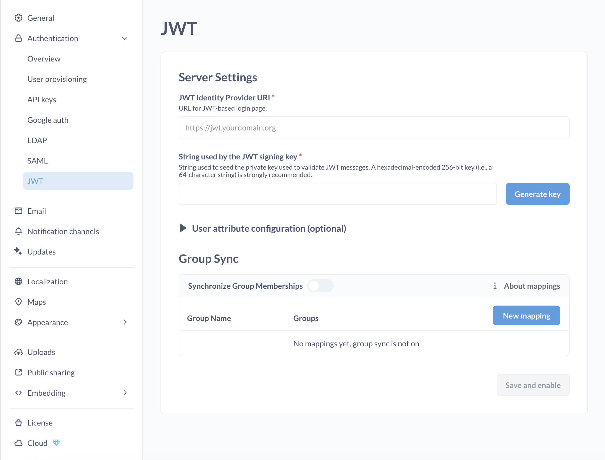
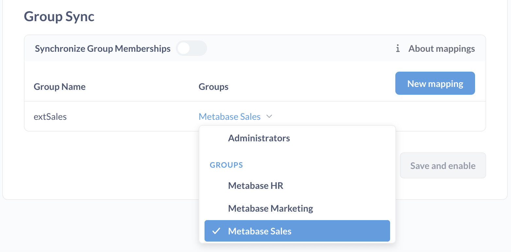

# JWT-based authentication



You can connect Metabase to your identity provider using JSON Web Tokens (JWT) to authenticate people.

## Typical flow for a JWT-based SSO interaction with Metabase

Assuming your site is localhost serving on port 3000:

1. Person attempts to view a question, e.g., `http://localhost:3000/question/1-superb-question`.
2. If the person isn't logged in, Metabase redirects them to `http://localhost:3000/auth/sso`.
3. Retaining the original `/question/1-superb-question` URI, Metabase redirects the person to the SSO provider (the authentication app).
4. Person logs in using the basic form.
5. In the event of a successful sign-in, your authentication app should issue a GET request to your Metabase endpoint with the token and the "return to" URI: `http://localhost:3000/auth/sso?jwt=TOKEN_GOES_HERE&return_to=/question/1-superb-question`.
6. Metabase verifies the JSON Web Token, logs the person in, then redirects the person to their original destination, `/question/1-superb-question`.

## Set up JWT authentication

Navigate to the **Admin**>**Settings** section of the Admin area, then click on the **Authentication > JWT** tab.



Here's a breakdown of each of the settings:

- **JWT Identity Provider URI**: This is where Metabase will redirect login requests. It's where your users go to log in through your identity provider.

- **String Used by the JWT Signing Key**: The string used to seed the private key used to validate JWT messages. Both Metabase and the authentication app should have the same JWT signing key.

## User attribute configuration (optional)

These are additional settings you can fill in to pass user attributes to Metabase.

- **Email attribute:** the key to retrieve each JWT user's email address.
- **First name attribute:** the key to retrieve each JWT user's first name.
- **Last name attribute:** if you guessed that this is the key to retrieve each JWT user's last name, well then you have been paying attention.
- **Group assignment attribute:** the key to retrieve each JWT user's group assignments.
- **Tenant attribute:** the key to retrieve each JWT user's tenant. Default is `@tenant`. See [Tenants](../embedding/tenants.md).

You can send additional user attributes to Metabase by adding the attributes as key/value pairs to your JWT. These attributes will be synced on every login.

## Configure group mappings

You can use your JWT to assign Metabase users to custom Metabase [groups](./managing.md#groups) based on their attributes, e.g. automatically assign everyone with a certain JWT attribute to the `Sales` group in Metabase. This can be helpful for [permissions management](../permissions/introduction.md#key-points-regarding-permissions) at scale.

You can configure JWT group assignments through Metabase's Admin interface, or by setting environment variables.

### Configure group mapping in Metabase

1. Add groups to your JWT: `groups: ["group_name"]`. The attribute key (e.g. `groups`) should match the **Group assignment attribute** in Metabase.
1. In Metabase JWT settings, under **Group Sync**, toggle on **Synchronize Group Memberships**
1. If the group names in your JWT match the Metabase group names, they will be synced automatically, and you don't need to set up mappings manually.

1. Otherwise, click **New mapping** and add the name of a JWT group.
1. In the row that appears, click the dropdown to pick the Metabase group(s) that this should map to.
   
1. Repeat this for each of the groups you want to map.

### Configure group mapping through environment variables

You can use the following environment variables to configure JTW group mappings instead of configuring them in Metabase's Admin settings:

- [`MB_JWT_ATTRIBUTE_GROUPS`](../configuring-metabase/environment-variables.md#mb_jwt_attribute_groups) to specify the key to retrieve the JWT user's groups;

- [`MB_JWT_GROUP_SYNC`](../configuring-metabase/environment-variables.md#mb_jwt_group_sync) to turn group sync on or off (sync is off by default).

  ```
  MB_JWT_GROUP_SYNC=true
  ```

- [`MB_JWT_GROUP_MAPPINGS`](../configuring-metabase/environment-variables.md#mb_jwt_group_mappings) to configure group mapping. It accepts a JSON object where the keys are JWT groups and the values are lists of Metabase groups IDs. For example:

  ```
  MB_JWT_GROUP_MAPPINGS='{"extHR":[7], "extSales":[3,4]}'
  ```

  where `extHR`, `extSales` are names of JWT groups and 3,4,7 are IDs of Metabase groups.

  You can find Metabase Group ID in the URL for the group page, like `http://your-metabase-url/admin/people/groups/<ID>`. "All Users" group has ID 1 and "Administrators" group has ID 2.

### If group mappings are not specified, Metabase will match groups by name

If you don't specify any group mappings in Metabase's Admin settings or via `MB_JWT_GROUP_MAPPINGS` environment variables, then Metabase will try to assign Metabase groups to users based on the matching names. If the names of groups in the JWT group attribute array match Metabase group names exactly (e.g. both are `"Sales"`), then the groups will be mapped automatically.

If you add group mappings manually, Metabase will _not_ try to also match groups by names.

## Creating Metabase accounts with SSO

> Paid plans [charge for each additional account](../cloud/how-billing-works.md#what-counts-as-a-user-account).

A new SSO login will automatically create a new Metabase account.

Metabase accounts created with an external identity provider login don't have passwords. People who sign up for Metabase using an IdP must continue to use the IdP to log into Metabase.

## Disabling password logins

> **Avoid locking yourself out of your Metabase!** This setting will apply to all Metabase accounts, _including your Metabase admin account_. We recommend that you keep password authentication **enabled**. This will safeguard you from getting locked out of Metabase in case of any problems with SSO.

To require people to log in with SSO, disable password authentication from **Admin settings** > **Authentication**.


## Assigning tenant users to tenants

If you're running a multi-tenant application, you can use JWT to automatically assign users to tenants based on a claim in the JWT token. See [Tenants](../embedding/tenants.md) for details.

## Note about Azure

If you're using Azure, you may need to use Azure AD B2C. Check out their [tokens overview](https://docs.microsoft.com/en-us/azure/active-directory-b2c/tokens-overview).

## Example code using JWT-based authentication

You can find example code that uses JWT authentication in the [SSO examples repository](https://github.com/metabase/sso-examples).

- [JWT example in a Clojure app](https://github.com/metabase/sso-examples/tree/master/clj-jwt-example)
- [JWT example in JavaScript (Node) app](https://github.com/metabase/sso-examples/tree/master/nodejs-jwt-example)
