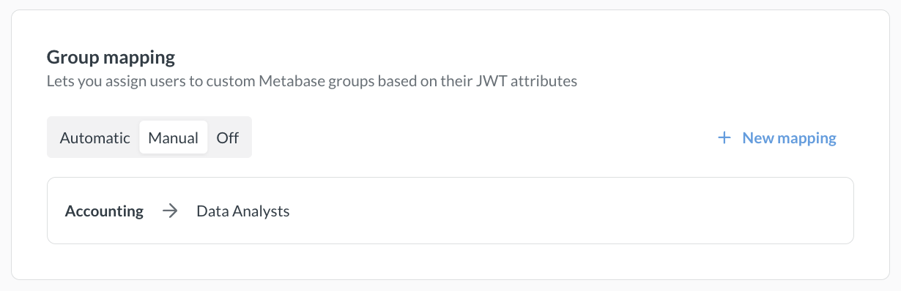

# JWT-based authentication



You can connect Metabase to your identity provider using JSON Web Tokens (JWT) to authenticate people.

## Typical flow for a JWT-based SSO interaction with Metabase

Assuming your site is localhost serving on port 3000:

1. Person attempts to view a question, e.g., `http://localhost:3000/question/1-superb-question`.
2. If the person isn't logged in, Metabase redirects them to `http://localhost:3000/auth/sso`.
3. Retaining the original `/question/1-superb-question` URI, Metabase redirects the person to the SSO provider (the authentication app).
4. Person logs in using the basic form.
5. In the event of a successful sign-in, your authentication app should issue a GET request to your Metabase endpoint with the token and the "return to" URI: `http://localhost:3000/auth/sso?jwt=TOKEN_GOES_HERE&return_to=/question/1-superb-question`.
6. Metabase verifies the JSON Web Token, logs the person in, then redirects the person to their original destination, `/question/1-superb-question`.

- For full app embeds, use a `GET` request.
- For modular embeds use a `POST` request with a JSON body (to avoid putting the JWT in the URL). You'll also want to use `POST` requests in contexts that log or cache URLs, such as server-side integrations or testing.

In both cases the login behavior is the same, and you can pass `return_to` as a query parameter in both `GET` and `POST` requests.

An example `POST` request with curl:

```bash
curl -X POST "http://localhost:3000/auth/sso?return_to=/question/1-superb-question" \
  -H "Content-Type: application/json" \
  -d '{"jwt": "TOKEN_GOES_HERE"}'
```

Or with JavaScript:

```js
await fetch(`${METABASE_URL}/auth/sso?return_to=/question/1-superb-question`, {
  method: "POST",
  headers: { "Content-Type": "application/json" },
  body: JSON.stringify({ jwt: token }),
  credentials: "include",
});
```

## Set up JWT authentication

Go to **Admin** > **Settings** > **Authentication** > **JWT**. Fill out the form, then click **Save and enable**.

Here's a breakdown of each of the settings:

- **JWT Identity Provider URI**: This is where Metabase will redirect login requests. It's where your users go to log in through your identity provider.

- **String used by the JWT signing key**: The string used to seed the private key used to validate JWT messages. Both Metabase and your authentication app must use the same key. Click **Set up key**, then generate a key or paste your own.

The **User provisioning**, **User attribute configuration**, and **Group mapping** sections are disabled until you save your settings.

## User attribute configuration (optional)

These are additional settings you can fill in to pass user attributes to Metabase.

- **Email attribute:** the key to retrieve each JWT user's email address.
- **First name attribute:** the key to retrieve each JWT user's first name.
- **Last name attribute:** if you guessed that this is the key to retrieve each JWT user's last name, well then you have been paying attention.
- **Group assignment attribute:** the key to retrieve each JWT user's group assignments. [Group mapping](#configure-group-mappings) uses this key.
- **Tenant attribute:** the key to retrieve each JWT user's tenant. Default is `@tenant`. See [Tenants](../embedding/tenants.md).

You can send additional user attributes to Metabase by adding the attributes as key/value pairs to your JWT. These attributes will be synced on every login.

## Configure group mappings

You can use your JWT to assign Metabase users to custom Metabase [groups](./managing.md#groups) based on their attributes, e.g. automatically assign everyone with a certain JWT attribute to the `Sales` group in Metabase. This can be helpful for [permissions management](../permissions/introduction.md#key-points-regarding-permissions) at scale.

You can configure JWT group assignments through Metabase's Admin interface, or by setting environment variables.

### Configure group mapping in Metabase

To add groups to your JWT, use the syntax `groups: ["group_name"]`, where `groups` is the attribute key. The key must match the **Group assignment attribute** in your JWT settings.

The **Group mapping** section has three options:

- **Automatic**: Metabase adds people to the Metabase groups whose names match the group names in their JWT.
- **Manual**: Metabase adds people to groups using only the mappings you create.
- **Off**: Metabase ignores your saved mappings and doesn't add people to groups.

When you first set up JWT, Metabase sets the group mapping to **Automatic**.

To create manual mappings:

1. Select **Manual**.
2. Click **New mapping**.
3. In the **JWT group name** field, enter the name of a group from your JWT.
4. From **Metabase groups**, select the groups to add people in this JWT group to.
5. Click **Add mapping**.
6. Repeat steps 2 to 5 for each group you want to map.

Metabase saves each mapping as soon as you add, edit, or remove it.



To edit or remove a mapping, hover over it and click the pencil or trash icon.

Switching from **Manual** to **Automatic** deletes all of your mappings. Removing your last mapping switches group mapping to **Off**.

#### Remove a group mapping

To remove a mapping, hover over it and click the trash icon. Choose what to do with the groups in the mapping:

- **Nothing, just remove the mapping**
- **Also remove all members from this group** (Metabase keeps their accounts)
- **Also delete the group** (the Administrators group isn't affected)

Removing members or deleting groups takes effect immediately and can't be undone.

### Configure group mapping through environment variables

You can use the following environment variables to configure JWT group mappings instead of configuring them in Metabase's Admin settings:

- [`MB_JWT_ATTRIBUTE_GROUPS`](../configuring-metabase/environment-variables.md#mb_jwt_attribute_groups) to specify the key to retrieve the JWT user's groups;

- [`MB_JWT_GROUP_SYNC`](../configuring-metabase/environment-variables.md#mb_jwt_group_sync) to turn group sync on or off (sync is off by default).

  ```
  MB_JWT_GROUP_SYNC=true
  ```

- [`MB_JWT_GROUP_MAPPINGS`](../configuring-metabase/environment-variables.md#mb_jwt_group_mappings) to configure group mapping. It accepts a JSON object where the keys are JWT groups and the values are lists of Metabase group IDs. For example:

  ```
  MB_JWT_GROUP_MAPPINGS='{"extHR":[7], "extSales":[3,4]}'
  ```

  where `extHR`, `extSales` are names of JWT groups and 3,4,7 are IDs of Metabase groups.

  You can find Metabase Group ID in the URL for the group page, like `http://your-metabase-url/admin/people/groups/<ID>`. "All Users" group has ID 1 and "Administrators" group has ID 2.

If you set either `MB_JWT_GROUP_SYNC` or `MB_JWT_GROUP_MAPPINGS`, the **Group mapping** section becomes read-only. `MB_JWT_GROUP_SYNC=true` with no mappings gives you automatic mapping. With mappings, Metabase uses only those mappings.

## Creating Metabase accounts with SSO

> Paid plans [charge for each additional account](https://www.metabase.com/how-billing-works#what-counts-as-a-user-account).

User provisioning is enabled by default. When someone logs in via JWT SSO, Metabase creates an account for them if they don't have one, and reactivates their account if it is deactivated.

If you disable user provisioning, users without accounts or with deactivated accounts will not be able to log in via JWT SSO.

Metabase accounts created with an external identity provider login don't have passwords. People who sign up for Metabase using an IdP must continue to use the IdP to log into Metabase, [even if their account previously had a password login](./managing.md#signing-in-via-sso-disables-your-password-login).

## Disabling password logins

> **Avoid locking yourself out of your Metabase!** This setting will apply to all Metabase accounts, _including your Metabase admin account_. We recommend that you keep password authentication **enabled**. This will safeguard you from getting locked out of Metabase in case of any problems with SSO.

To require people to log in with SSO, go to **Admin** > **Settings** > **Authentication** > **Overview** and disable the **Enable password authentication** toggle.


## Assigning tenant users to tenants

If you're running a multi-tenant application, you can use JWT to automatically assign users to tenants based on a claim in the JWT token. See [Tenants](../embedding/tenants.md) for details.

## Note about Azure

If you're using Azure, you may need to use Azure AD B2C. Check out their [tokens overview](https://learn.microsoft.com/en-us/azure/active-directory-b2c/tokens-overview).

## Example code using JWT-based authentication

You can find example code that uses JWT authentication in the [SSO examples repository](https://github.com/metabase/sso-examples).

- [JWT example in a Clojure app](https://github.com/metabase/sso-examples/tree/master/clj-jwt-example)
- [JWT example in JavaScript (Node) app](https://github.com/metabase/sso-examples/tree/master/nodejs-jwt-example)
