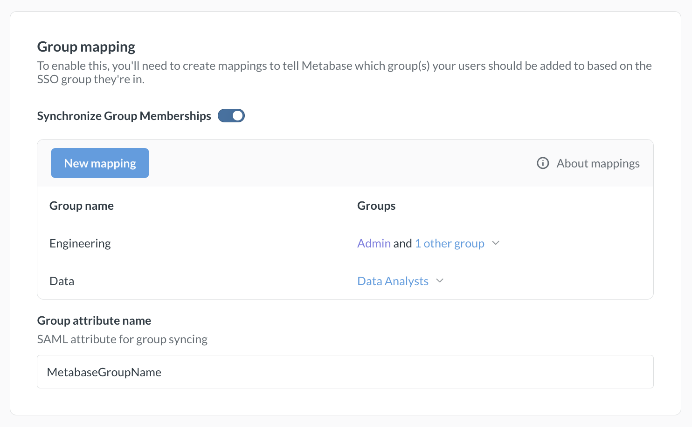
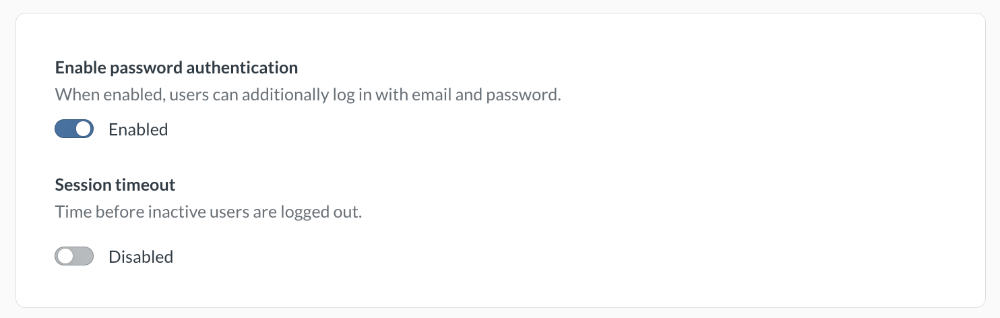

# SAML-based authentication



Integrating your SSO with Metabase allows you to:

- Provision a Metabase account when someone logs in to Metabase.
- Automatically pass user attributes from your SSO to Metabase to power [row and column security](../permissions/row-and-column-security.md).
- Let people access Metabase without re-authenticating.

## Confirm the password for your Metabase admin account

Before setting up SAML, make sure you know the password for your Metabase admin account. If you encounter any issues during the setup process, you can login via the "Admin backup login" option on the sign-in screen.

## Setting up SAML with your IdP in Metabase

After you [confirm the password for your Metabase admin account](#confirm-the-password-for-your-metabase-admin-account), go to **Admin** > **Settings** > **Authentication**. In the **SAML** section, click **Set up**. You can also click **SAML** in the sidebar under **Authentication**.

The form includes the following sections:

1. [Configure your identity provider (IdP)](#generic-saml-configuration)
2. [Tell Metabase about your identity provider](#enabling-saml-authentication-in-metabase)
3. [User provisioning](#user-provisioning)
4. [Signing SSO requests (optional)](#settings-for-signing-sso-requests-optional)
5. [Group mapping](#group-mapping)

## SAML guides

First you'll need to make sure things are configured correctly with your IdP. Each IdP handles SAML setup differently.

We've written up some guides for the most common providers:

- [Auth0](saml-auth0.md)
- [Microsoft Entra ID](saml-azure.md)
- [Google](saml-google.md)
- [Keycloak](saml-keycloak.md)
- [Okta](saml-okta.md)

If you don't see your IdP listed here:

- Refer to your IdP's reference docs on configuring SAML. You'll be looking for something like this [OneLogin SAML guide](https://onelogin.service-now.com/support?id=kb_article&sys_id=83f71bc3db1e9f0024c780c74b961970).
- Using the information found on the Metabase SAML form, fill out your IdP's SAML form.
- For more information, see the next section on [Generic SAML configuration](#generic-saml-configuration).

## User provisioning

User provisioning is enabled by default. Metabase will create accounts for people who don't yet have a Metabase account but who are able to log in via SAML SSO.

If you disable user provisioning, users without accounts or with deactivated accounts will not be able to log in.

If you manage user provisioning with [SCIM](./user-provisioning.md), you can't turn on SAML user provisioning.

## Generic SAML configuration

The top portion of the SAML form in Metabase has the information you'll need to fill out your IdP's SAML form, with buttons to make copying the information easy.

The names of the fields in the Metabase SAML form won't always match the names used by your IdP. We've provided a description of each field below to help you map information from one place to another.

### URL the IdP should redirect back to

The redirect URL is the web address that people will be sent to after signing in with your IdP. To redirect people to your Metabase, your redirect URL should be your Metabase [Site URL](../configuring-metabase/settings.md#site-url), with `/auth/sso` at the end.

For example, if your Metabase Site URL is `https://metabase.yourcompany.com`, you'll use

```
https://metabase.yourcompany.com/auth/sso
```

as the redirect URL in your IdP's SAML form.

Different IdPs use different names for the redirect URL. Here are some common examples:

| Provider               | Name                     |
| ---------------------- | ------------------------ |
| [Auth0](saml-auth0.md) | Application Callback URL |
| [Okta](saml-okta.md)   | Single Sign On URL       |
| OneLogin               | ACS (Consumer) URL       |

### SAML attributes

Metabase will automatically log in people who've been authenticated by your SAML identity provider. To do so, the first assertion returned in the identity provider's SAML response _must_ contain attributes for each person's first name, last name, and email.

Most IdPs already include these assertions by default, but some (such as [Okta](./saml-okta.md)) must be configured to include them.

Generally you'll need to paste these user attributes (first name, last name, and email) into fields labelled "Name", "Attributes" or "Parameters".

> If you allow people to edit their email addresses: make sure to update the corresponding account emails in Metabase. Keeping email addresses in sync will protect people from losing access to their accounts.

## Enabling SAML authentication in Metabase

Metabase will now need to know some things about your IdP. Here's a breakdown of each of the settings:

### SAML identity provider URL

Metabase will redirect login requests to the Identity Provider URL, where people will go to log in with SSO.

Different IdPs use different names for the Identity Provider URL. Here are some common examples:

| Provider               | Name                                 |
| ---------------------- | ------------------------------------ |
| [Auth0](saml-auth0.md) | Identity Provider Login URL          |
| [Okta](saml-okta.md)   | Identity Provider Single-Sign On URL |
| OneLogin               | SAML 2.0 Endpoint (HTTP)             |

### SAML identity provider certificate

The SAML identity provider certificate is an encoded certificate that Metabase will use when connecting to the IdP URI. The certificate will look like a big blob of text that you'll want to copy and paste carefully — the spacing is important!

Your IdP might have you download this certificate as a file (usually `.cer` or `.pem`), which you'll then need to open up in a text editor to copy the contents to then paste into the box in Metabase.

Note that your certificate text may include header and footer comments that look like `-----BEGIN CERTIFICATE-----` and `-----END CERTIFICATE-----`. These comments should be included when pasting your certificate text into Metabase.

| Provider               | Name                |
| ---------------------- | ------------------- |
| [Auth0](saml-auth0.md) | Signing Certificate |
| [Okta](saml-okta.md)   | X.509 Certificate   |
| OneLogin               | X.509 Certificate   |

### SAML application name

Metabase uses the application name in requests to your IdP. The default is `Metabase`.

### SAML identity provider issuer

The SAML identity provider issuer is a required unique identifier for the IdP. You might also see the issuer called "Entity ID." Assertions from the IdP include the issuer, and Metabase verifies that it matches the value you enter.

| Provider               | Name                        |
| ---------------------- | --------------------------- |
| [Auth0](saml-auth0.md) | Identity Provider Login URL |
| [Okta](saml-okta.md)   | Identity Provider Issuer    |
| OneLogin               | Issuer URL                  |

### Settings for signing SSO requests (optional)

To sign requests so that they can't be tampered with, you'll need to provide additional settings.

If your IdP encrypts SAML responses, you'll need to ensure this section is filled out.

> If you change any of these settings, either during initial setup or after editing an existing value, you will need to restart Metabase due to the way the keystore file is read.

- **SAML keystore path:** the absolute path to the keystore file to use for signing SAML requests.
- **SAML keystore password:** the magic spell that will open the keystore.
- **SAML keystore alias:** the alias for the key that Metabase should use for signing SAML requests.

## SAML Single logout (SLO)

Metabase supports single logout (SLO) for SAML.

The endpoint for SLO: `/auth/sso/handle_slo`

So if your Metabase is served at `metabase.example.com` the logout service POST binding URL would be:

```
https://metabase.example.com/auth/sso/handle_slo
```

### Enable SAML SLO

SLO isn’t configurable from the Metabase interface. To enable it, you’ll need to set the following options using environment variables or your Metabase configuration file:

- [`MB_SAML_SLO_ENABLED`](../configuring-metabase/environment-variables.md#mb_saml_slo_enabled) to `true`;
- [`MB_SAML_IDENTITY_PROVIDER_URI`](../configuring-metabase/environment-variables.md#mb_saml_identity_provider_uri) to your IdP’s SLO endpoint;
- [`MB_SESSION_COOKIE_SAMESITE`](../configuring-metabase/environment-variables.md#mb_session_cookie_samesite) to `none`.

For the `MB_SESSION_COOKIE_SAMESITE` setting to work with `none`, Metabase must be served over HTTPS. Browsers like Chrome will block cookies in cross-site requests if SSL is not enabled. Without HTTPS, logout requests from your IdP (such as Okta) won’t include the session cookie, which means Metabase won’t be able to end the session properly.

## Group mapping

Group mapping lets you assign people to Metabase groups based on an attribute of your users in your IdP. This setting may not correlate to group functionality provided by your IdP; you may need to create a separate user attribute to set people's Metabase groups, like `metabaseGroups`.

First, you will need to create a SAML user attribute that you will use to indicate which Metabase groups the person should be a part of. This created user attribute can be an XML string or a list of XML strings. Different IdPs have different ways of handling this, but you will likely need to edit your user profiles or find a way to map a user's groups to a list of Metabase group names.

## Configuring the group schema in Metabase

After you set up the group attribute in your IdP, configure group mappings:

1. In the **Group mapping** section, enable the **Synchronize Group Memberships** toggle.
2. Click **New mapping**.
3. In the **Group name** field, enter one of the values from your `metabaseGroups` attribute, then click **Add**.
4. Select the Metabase groups that people with this value should be added to.
5. Repeat steps 2 to 4 for each group you want to map.
6. In **Group attribute name**, enter the name of the SAML attribute that contains the group names. For example, if you named the attribute `MetabaseGroupName` in Okta, enter `MetabaseGroupName`.
7. Click **Save and enable**.

Metabase saves each mapping as soon as you add, edit, or remove it. The **Synchronize Group Memberships** toggle and the **Group attribute name** field save only when you click **Save and enable**.



### Remove a group mapping

To remove a mapping, click the **X** next to it. Choose what to do with the groups in the mapping:

- **Nothing, just remove the mapping**
- **Also remove all members from this group** (Metabase keeps their accounts)
- **Also delete the group** (the Administrators group isn't affected)

Removing members or deleting groups takes effect immediately and can't be undone.

## Creating Metabase accounts with SSO

> Paid plans [charge for each additional account](https://www.metabase.com/how-billing-works#what-counts-as-a-user-account).

A new SSO login will automatically create a new Metabase account.

Metabase accounts created with an external identity provider login don't have passwords. People who sign up for Metabase using an IdP must continue to use the IdP to log into Metabase, [even if they previously had a password login](./managing.md#signing-in-via-sso-disables-your-password-login).

## Disabling password logins

> **Avoid locking yourself out of your Metabase!** Turning off password logins applies to all Metabase accounts, _including your Metabase admin account_. Before turning off password logins, make sure you can log in to your admin account using SSO.

To require people to log in with SSO, go to **Admin** > **Settings** > **Authentication** > **Overview** and disable the **Enable password authentication** toggle.



## New account notification emails

When people log in to Metabase for the first time via SSO, Metabase will automatically create an account for them, which will trigger an email notification to Metabase administrators. If you don't want these notifications to be sent, go to **Admin** > **Settings** > **Authentication** > **User provisioning**, and toggle off **"Notify admins of new users provisioned from SSO"**

## Example code using SAML

You can find example code that uses SAML authentication in the [SSO examples repository](https://github.com/metabase/sso-examples).

## Troubleshooting SAML issues

- [Troubleshooting SAML](../troubleshooting-guide/saml.md).
