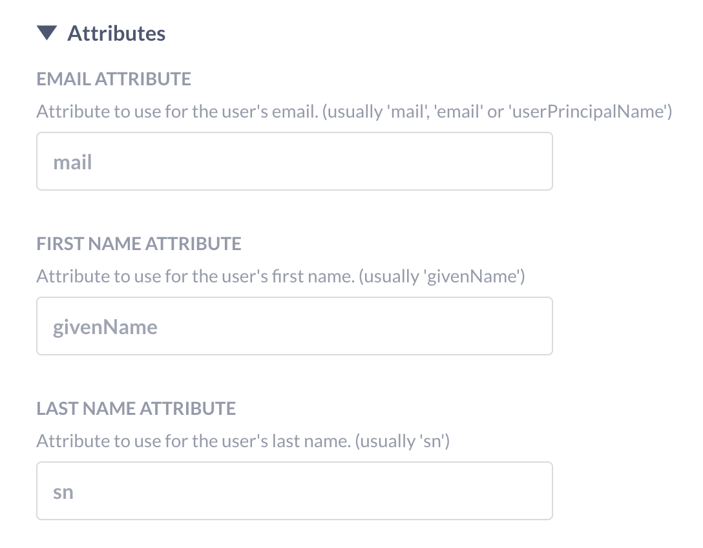
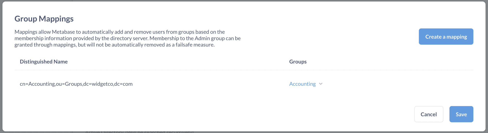

# Google Sign-In or LDAP

Enabling [Google Sign-In](https://developers.google.com/identity/sign-in/web/sign-in) or [LDAP](https://www.metabase.com/glossary/ldap) for single sign-on (SSO) lets your team log in with a click instead of using email and password. SSO can also be used to let people create Metabase accounts without asking an admin to add each person manually. You can find SSO options under **Settings** > **Admin settings** > **Authentication**.

If you'd like to have people authenticate with [SAML][saml-docs] or [JWT][jwt-docs], Metabase's [Pro and Enterprise](https://www.metabase.com/pricing) let you do just that. As time goes on we may add other auth providers. If you have a service you’d like to see work with Metabase, please let us know by [filing an issue](http://github.com/metabase/metabase/issues/new).

## Enabling Google Sign-In

Google Sign-In is a good option for SSO if:

- Your team is already using Google Workspace, or
- You'd like to use Google's 2-step or multi-factor authentication (2FA or MFA) to secure your Metabase.

## Get your Client ID from the Google developer console

To let your team start signing in with Google, you’ll first need to create an application through Google’s [developer console](https://console.developers.google.com/projectselector2/apis/library).

Next, you'll have to create authorization credentials and [get a Google API Client ID](https://developers.google.com/identity/gsi/web/guides/get-google-api-clientid):

- In the `Authorized JavaScript origins` section, specify the URI of your Metabase instance.
- Leave the `Authorized Redirect URIs` section blank.
- Copy your Client ID, which you'll paste into Metabase when setting up Google Sign-in.

## Setting up Google Sign-in in Metabase

Once you have your Google API `Client ID` (ending in `.apps.googleusercontent.com`), visit your Metabase and:

1. Click on the settings **Gear** icon in the upper right.
2. Select **Admin settings**.
3. In the **Settings** tab, click on **Authentication**.
4. On the **Sign in with Google** card, click **Set up**.
5. In the **Client ID** field, paste your Google API Client ID.

### Creating Metabase accounts with Google Sign-in

> On [paid plans](https://www.metabase.com/pricing), you're [charged for each active account](https://www.metabase.com/docs/latest/cloud/how-billing-works#what-counts-as-a-user-account).

If people's Google account email addresses are from a specific domain, and you want to allow them to sign up on their own, you can enter that domain in the **Domain** field.

Once set up, existing Metabase users signed in to a Google account that matches the email they used to set up their Metabase account will be able to sign in with just a click.

Note that Metabase accounts _created_ with Google Sign-In will not have passwords; they must use Google to sign in to Metabase.

### Multiple domains for Google Sign-in



If you're on a [pro](https://www.metabase.com/product/pro) or [Enterprise](https://www.metabase.com/product/enterprise) plan, you can specify multiple domains in the **Domain** field, separated by a comma. For example, `mycompany.com,example.com.br,otherdomain.co.uk`.

## Required LDAP attributes

Make sure to set up your LDAP directory with these attributes:

- email (defaulting to the `mail` attribute)
- first name (defaulting to the `givenName` attribute)
- last name (defaulting to the `sn` attribute).

If your LDAP setup uses other attributes for these, you can edit this under the "Attributes" portion of the form.



Your LDAP directory must have the email field populated for each entry that will become a Metabase user, otherwise Metabase won't be able to create the account, nor will that person be able to log in. If either name field is missing, Metabase will use a default of "Unknown," and the person can change their name in their [account settings](./account-settings.md).

## Enabling LDAP authentication

In the **Admin** > **Authentication** tab, go to the LDAP section and click **Configure**. Click the toggle at the top of the form to enable LDAP, then fill out the form with the following information about your LDAP server:

- hostname
- port
- security settings
- LDAP admin username
- LDAP admin password

Then save your changes. Metabase will automatically pull the [required attributes](#required-ldap-attributes) from your LDAP directory.

### LDAP user schema

The **User Schema** section on this same page is where you can adjust settings related to where and how Metabase connects to your LDAP server to authenticate users.

The **User search base** field should be completed with the _distinguished name_ (DN) of the entry in your LDAP server that is the starting point when searching for users.

For example, let's say you're configuring LDAP for your company, WidgetCo, where your base DN is `dc=widgetco,dc=com`. If entries for employees are all stored within an organizational unit in your LDAP server named `People`, you'll want to supply the user search base field with the DN `ou=People,dc=widgetco,dc=com`. This tells Metabase to begin searching for matching entries at that location within the LDAP server.

You'll see the following grayed-out default value in the **User filter** field:

```
(&(objectClass=inetOrgPerson)(|(uid={login})(mail={login})))
```

When a person logs into Metabase, this command confirms that the login they supplied matches either a UID _or_ email field in your LDAP server, _and_ that the matching entry has an objectClass of `inetOrgPerson`.

This default command will work for most LDAP servers, since `inetOrgPerson` is a widely-adopted objectClass. But if your company for example uses a different objectClass to categorize employees, this field is where you can set a different command for how Metabase finds and authenticates an LDAP entry upon a person logging in.

### LDAP group mapping

Manually assigning people to [groups](./managing.md#groups) in Metabase after they've logged in via SSO can get tedious. Instead, you can take advantage of the groups that already exist in your LDAP directory by enabling [group mappings](https://www.metabase.com/learn/metabase-basics/administration/permissions/ldap-auth-access-control#group-management).

Scroll to **Group Schema** on the same LDAP settings page, and click the toggle to enable group mapping. Selecting **Edit Mapping** will bring up a modal where you can create and edit mappings, specifying which LDAP group corresponds to which Metabase group.

As you can see below, if you have an **Accounting** group in both your LDAP server and Metabase instance, you'll just need to supply the Distinguished Name from your LDAP server (in the example, it's `cn=Accounting,ou=Groups,dc=widgetco,dc=com`) and select its match from the dropdown of your existing Metabase groups.



#### Notes on group mapping

- The Administrator group works like any other group.
- Updates to a person's group membership based on LDAP mappings are not instantaneous; the changes will take effect only after people log back in.
- People are only ever added to or removed from mapped groups; the sync has no effect on groups in your Metabase that don't have an LDAP mapping.

### LDAP group membership filter



Group membership lookup filter. The placeholders {dn} and {uid} will be replaced by the user's Distinguished Name and UID, respectively.

## Syncing user attributes at login



### Syncing user attributes with LDAP

You can manage [user attributes][user-attributes-def] such as names, emails, and roles from your LDAP directory. When you set up [data sandboxing][data-sandboxing-docs], your LDAP directory will be able to [pass these attributes][user-attributes-docs] to Metabase.

### Syncing user attributes with Google

User attributes can't be synced with regular Google Sign-In. You'll need to set up [Google SAML][google-saml-docs] or [JWT][jwt-docs] instead.

## Disabling password logins



On Pro and Enterprise plans, you can require people to log in with SSO by disabling password authentication from **Admin settings** > **Authentication**.

## Troubleshooting login issues

- [Can't log in](../troubleshooting-guide/cant-log-in.md).
- [Troubleshooting LDAP](../troubleshooting-guide/ldap.md)

## Further reading

- [Using LDAP for authentication and access control](https://www.metabase.com/learn/permissions/ldap-auth-access-control).
- [Permissions overview](../permissions/start.md).

[data-sandboxing-docs]: ../permissions/data-sandboxes.md
[google-saml-docs]: ./saml-google.md
[jwt-docs]: ./authenticating-with-jwt.md
[saml-docs]: ./authenticating-with-saml.md
[user-attributes-docs]: ../permissions/data-sandboxes.md#choosing-user-attributes-for-data-sandboxes
[user-attributes-def]: https://www.metabase.com/glossary/attribute#user-attributes-in-metabase
