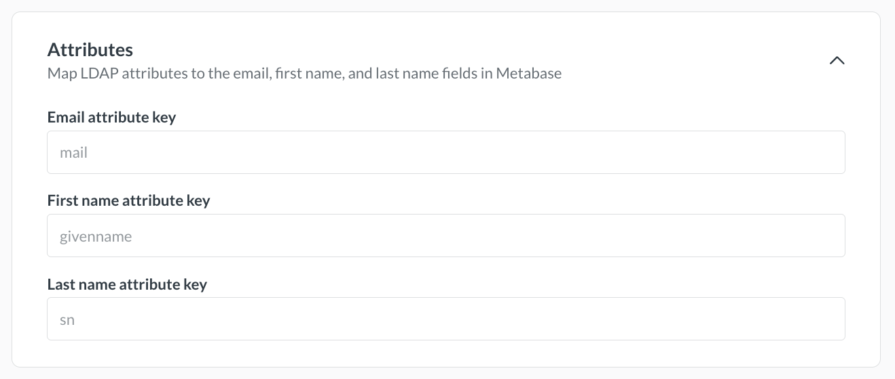
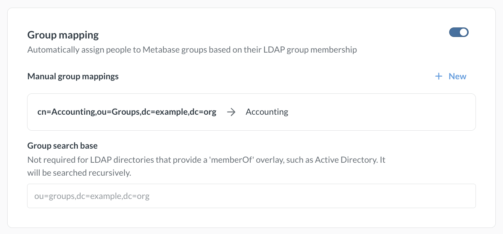

# LDAP

Metabase supports authentication with Lightweight Directory Access Protocol (LDAP).

## Required LDAP attributes

You need to set up your LDAP directory with these attributes:

- email (defaulting to the `mail` attribute)
- first name (defaulting to the `givenname` attribute)
- last name (defaulting to the `sn` attribute).

If your LDAP setup uses other attributes for these, you can change them in the **Attributes** section of the LDAP settings page. The section becomes available after you save your server settings.



Your LDAP directory must have the email field populated for each entry that will become a Metabase user, otherwise Metabase won't be able to create the account, nor will that person be able to log in. If either name field is missing, Metabase will use a default of "Unknown," and the person can change their name in their [account settings](./account-settings.md).

## Enabling LDAP authentication

To enable LDAP authentication, go to **Admin** > **Settings** > **Authentication** > **LDAP** and click **Set up**. Fill out the form, then click **Save and enable**.

## User provisioning

User provisioning is enabled by default. When someone logs in via LDAP, Metabase creates an account for them if they don't have one, and reactivates their account if it is deactivated.

If you disable user provisioning, users without accounts or with deactivated accounts will not be able to log in.

## Server settings

- **LDAP host** (required): Your server hostname. For example, `ldap.yourdomain.org`.
- **LDAP port**: The server port, usually 389, or 636 if you use SSL.
- **LDAP security**: None, SSL, or StartTLS.
- **Username or DN**: The distinguished name to bind as, if any. Metabase uses this name to look up information about other users.
- **Password**: The password to bind with for the lookup user.

Then save your changes. Metabase will automatically pull the [required attributes](#required-ldap-attributes) from your LDAP directory.

## User schema

The **User schema** section on this same page is where you can adjust settings related to where and how Metabase connects to your LDAP server to authenticate users.

### User search base

**User search base** is required. Enter the _distinguished name_ (DN) of the entry in your LDAP server that Metabase should use as the starting point when searching for users.

For example, let's say you're configuring LDAP for your company, WidgetCo, where your base DN is `dc=widgetco,dc=com`. If entries for employees are all stored within an organizational unit in your LDAP server named `People`, you'll want to supply the user search base field with the DN `ou=People,dc=widgetco,dc=com`. This tells Metabase to begin searching for matching entries at that location within the LDAP server.

### User filter

You'll see the following grayed-out default value in the **User filter** field:

```
(&(objectClass=inetOrgPerson)(|(uid={login})(mail={login})))
```

When a person logs into Metabase, this command confirms that the login they supplied matches either a UID _or_ email field in your LDAP server, _and_ that the matching entry has an objectClass of `inetOrgPerson`.

This default command will work for most LDAP servers, since `inetOrgPerson` is a widely-adopted objectClass. But if your company for example uses a different objectClass to categorize employees, this field is where you can set a different command for how Metabase finds and authenticates an LDAP entry upon a person logging in.

## Group mapping

Instead of manually assigning people to [groups](./managing.md#groups), use [group mappings](https://www.metabase.com/learn/metabase-basics/administration/permissions/ldap-auth-access-control#group-management) to assign them based on their LDAP groups.

To map an LDAP group to a Metabase group:

1. In the **Group mapping** section, turn on the toggle.
2. Next to **Manual group mappings**, click **New**.
3. Enter the distinguished name for the LDAP group, such as `cn=Accounting,ou=Groups,dc=example,dc=org`.
4. From **Pick Metabase group**, select the Metabase groups that people in this LDAP group should be added to.
5. Click **Add mapping**.
6. Repeat steps 2 to 5 for each group you want to map.

Some LDAP directories list each person's groups on their own entry. If yours does, leave **Group search base** empty. Otherwise, enter the DN where your group entries live.



Some things to keep in mind regarding group mapping:

- The Administrators group works like any other group.
- Updates to a person's group membership based on LDAP mappings are not instantaneous; the changes will take effect only _after_ people log back in.
- People are only ever added to or removed from mapped groups. The sync has no effect on Metabase groups that don't have an LDAP mapping.

## LDAP group membership filter



Group membership lookup filter. The placeholders {dn} and {uid} will be replaced by the user's Distinguished Name and UID, respectively.

## Syncing user attributes with LDAP



You can manage [user attributes][user-attributes-def] such as names, emails, and roles from your LDAP directory. When you set up [row and column security][row-and-column-security], your LDAP directory will be able to [pass these attributes][user-attributes-docs] to Metabase.

## Troubleshooting login issues

- [Can't log in](../troubleshooting-guide/cant-log-in.md).
- [Troubleshooting LDAP](../troubleshooting-guide/ldap.md)

## Further reading

- [Using LDAP for authentication and access control](https://www.metabase.com/learn/metabase-basics/administration/permissions/ldap-auth-access-control).
- [Permissions overview](../permissions/start.md).

[row-and-column-security]: ../permissions/row-and-column-security.md
[google-saml-docs]: ./saml-google.md
[jwt-docs]: ./authenticating-with-jwt.md
[saml-docs]: ./authenticating-with-saml.md
[user-attributes-docs]: ../permissions/row-and-column-security.md#choosing-user-attributes-for-row-and-column-security
[user-attributes-def]: https://www.metabase.com/glossary/attribute#user-attributes-in-metabase
