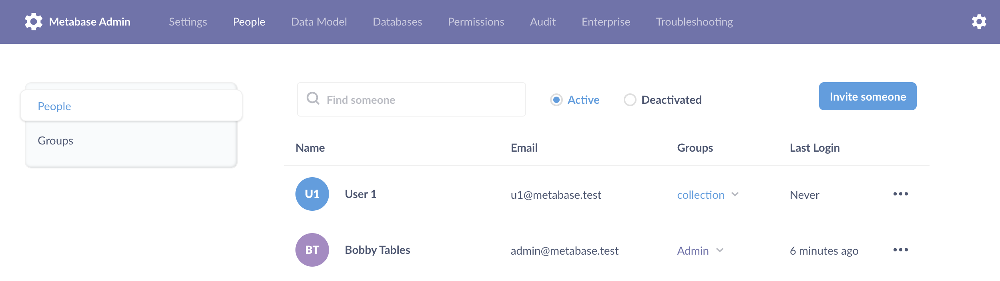
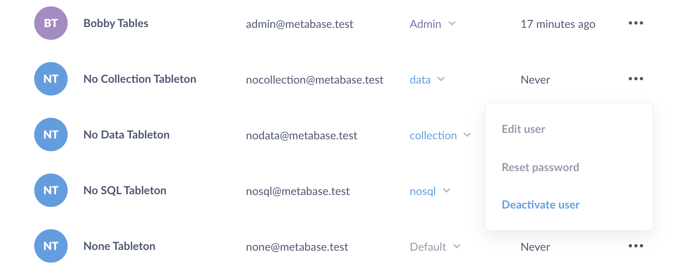
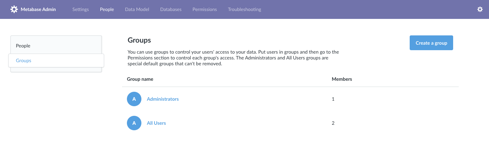

# Managing people and groups

To start managing people:

Hit Cmd/Ctrl + K to bring up the command palette and search for "People". Click on the **People** settings result.

Or

Click on the **gear** icon > **Admin settings** > **People**. You'll see a list of all the people in your organization.



## Creating an account

To add a new person, click **Invite someone** in the upper right corner. You’ll be prompted to enter their email, and optionally their first and last names–only the email is required.

Click **Create** to activate an account. An account becomes active once you click **Create**, even if the person never signs into the account. The account remains active until you [deactivate the account](#deactivating-an-account). If you're on a Pro or Enterprise Metabase plan, all active accounts will count toward your user account total. If one person has more than one account, each account will count toward the total (see [how billing works](https://www.metabase.com/pricing/how-billing-works)).

If you’ve already [configured Metabase to use email](../configuring-metabase/email.md), Metabase will send the person an email inviting them to log into Metabase. If you haven't yet setup email for your Metabase, Metabase will give you a temporary password that you’ll have to manually send to the person.

## Editing an account

You can edit someone's name and email address by clicking the three dots icon and choosing **Edit user**.

> Be careful: changing an account's email address _will change the address the person will use to log in to Metabase_.

## Adding a user attribute



To add a user attribute manually:

1. Go to **Admin settings** > **People**.
2. Find the person's account and click the **three dot** (...) menu.
3. Click **Edit user**.
4. Click **+ Add an attribute**.
5. Add the name of the user attribute under "Key". For example, "Department".
6. Add the value that applies to the specific person. For example, "Engineering".
7. Optional: if a group for sandboxed people doesn't exist, [create a group](#creating-a-group) to organize people who will get sandboxed table permissions, such as "Sandboxed people".
8. Add the person to the group.

You can also sync user attributes from your identity provider [via SSO](./start.md#authentication).

User attributes are required for [data sandbox](../permissions/data-sandboxes.md) permissions.

You can also employ user attributes to specify what database role Metabase should use when that person queries a database. Check out [impersonation access](../permissions/data.md#impersonated-view-data-permission).

## Deactivating an account

To deactivate someone's account, click on the three dots icon on the right of a person’s row and select **Deactivate** from the dropdown. Deactivating an account will mark it as inactive and prevent the user from logging in - but it _won’t_ delete that person's saved questions or dashboards.

If you're using SSO, you should deactivate the account in Metabase as well as your IdP (that is, deactivation doesn't get applied from Metabase to your IdP, and vice versa).



To reactivate a deactivated account, click the **Deactivated** radio button at the top of the people list to see the list of deactivated accounts. Click on the icon on the far right to reactivate that account, allowing them to log in to Metabase again.

## Deleting an account

Metabase doesn't explicitly support account deletion. Instead, Metabase deactivates accounts so people can't log in to them, while it preserves any questions, models, dashboards, and other items created by those accounts.

If you want to delete an account because the account information was set up incorrectly, you can deactivate the old account and create a new one instead.

1. Change the name and email associated with the old account.
2. [Deactivate](#deactivating-an-account) the old account.
3. [Create a new account](#creating-an-account) with the person's correct information.

## Checking someone's auth method

Search for a person and look for an icon beside their name.

- If they log in using Google credentials, Metabase displays a Google icon.
- If they log in using an email address and password stored in Metabase, no icon is shown.

Note that the type of user is set when the account is first created: if you create a user in Metabase, but that person then logs in via Google or some other form of SSO, the latter's icon will _not_ show up next to their name.

## Resetting someone’s password

If you've already [configured your email settings](../configuring-metabase/email.md), people can reset their passwords using the "forgot password" link on the login screen. If you haven't yet configured your email settings, they will see a message telling them to ask an admin to reset their password for them.

To reset a password for someone, just click the three dots icon next to their account and choose **Reset Password**. If you haven’t [configured your email settings](../configuring-metabase/email.md) yet, you’ll be given a temporary password that you’ll have to share with that person. Otherwise, they’ll receive a password reset email.

## Resetting the admin password

If you're using Metabase Cloud, [contact support](https://www.metabase.com/help-premium) to reset your admin password.

If you're a Metabase admin and have access to the server console, you can get Metabase to send you a password reset token:

1.  Stop the running Metabase application.
2.  Restart Metabase with `reset-password email@example.com`, where "email@example.com" is the email associated with the admin account:
    ```
    java -jar metabase.jar reset-password email@example.com
    ```
3.  Metabase will print out a random token like this:

    ```
    ...
    Resetting password for email@example.com...

    OK [[[1_7db2b600-d538-4aeb-b4f7-0cf5b1970d89]]]
    ```

4.  Start Metabase normally again (_without_ the `reset-password` option).
5.  Navigate to it in your browser using the path `/auth/reset_password/:token`, where ":token" is the token that was generated from the step above. The full URL should look something like this:
    ```
    https://metabase.example.com/auth/reset_password/1_7db2b600-d538-4aeb-b4f7-0cf5b1970d89
    ```
6.  You should now see a page where you can input a new password for the admin account.

## Unsubscribe from all subscriptions / alerts

This action will delete any dashboard subscriptions or alerts the person has created, and remove them as a recipient from any other subscriptions or alerts.

This action doesn't affect email distribution lists that are managed outside of Metabase.

## Default user accounts

Metabase includes default user accounts to handle various tasks. We're documenting these accounts here so you know they're legitimate accounts and not someone trying to spy on your Metabase. Some things to know about them:

- Customers are not charged for these accounts.
- No one can log in to these user accounts.
- Metabase excludes these user accounts from the **Admin settings** > **People** tab.

### Anonymous user account

- ID: 0
- First name: External
- Last name: User
- Email: null

Metabase uses this anonymous user account to identify anonymous views, for example views of a [public question or dashboard](../questions/sharing/public-links.md). This account is a virtual user: the account doesn't exist in the application database. You'll see this account show up in [usage analytics](../usage-and-performance-tools/usage-analytics.md).

### Metabase internal account

- ID: 13371338
- First name: Internal
- Last name: Metabase
- Email: internal@metabase.com

Metabase uses this account to load content into Metabase (like the [Metabase analytics](../usage-and-performance-tools/usage-analytics.md) collection). You may see this `internal@metabase.com` account in the logs.

## Groups

To determine [who has access to what](../permissions/start.md), you’ll need to

- Create one or more groups.
- Choose which level of access that group has to different databases, collections, and so on.
- Then add people to those groups.
- (Optional) promote people to [group managers](#group-managers).

To view and manage your groups, go to the **Admin Panel** > **People** tab, and then click on **Groups** from the side menu.



### Special default groups

Every Metabase has two default groups: Administrators and All Users. These are special groups that can’t be removed.

#### Administrators

To make someone an admin of Metabase, you just need to add them to the Administrators group. Metabase admins can log into the Admin Panel and make changes there, and they always have unrestricted access to all data that you have in your Metabase instance. So be careful who you add to the Administrator group!

#### All users

The **All Users** group is another special one. Every Metabase user is always a member of this group, though they can also be a member of as many other groups as you want. We recommend using the All Users group as a way to set default access levels for new Metabase users. If you have [Google single sign-on](./google-and-ldap.md) enabled, new users who join that way will be automatically added to the All Users group.

It's important that your All Users group should never have _greater_ access for an item than a group for which you're trying to restrict access — otherwise the more permissive setting will win out. See [Setting permissions](../permissions/start.md).

## Creating a group

Go to **Admin settings** > **People** > **Groups**, and click the **Add a group** button.

We recommend creating groups that correspond to the teams your company or organization has, such as Human Resources, Engineering, Finance, and so on. By default, newly created groups don’t have access to anything.

To remove a group, click the X icon to the right of a group in the list to remove it (remember, you can’t remove the special default groups).

## Adding people to groups

To add people to that group, click into a group and then click **Add members**.

To remove someone from that group, click on the **X** to the right of the group member.

You can also add or remove people from groups from the **People** list using the dropdown in the **Groups** column.

## Group managers



**Group managers** can manage other people within their group.

Group managers can:

- Add or remove people from their group (that is, people who already have accounts in your Metabase).
- View all people in the **Admin settings** > **People** tab.
- Promote other people to group manager, or demote them from group manager to member.
- Rename their group.

Group managers are not admins, so their powers are limited. They cannot create new groups or invite new people to your Metabase.

## Promoting/demoting group managers

To promote someone to become a group manager:

1. At the top right of the screen, click the **gear** icon > **Admin settings** > **People** > **Groups**.
2. Select the group you want the person to manage. If the person isn't already in the group, you'll need to add that person to the group.
3. Find the person you want to promote, hover over their member type, and click the up arrow to promote them to group manager. If you want to demote them, click on the down arrow.

## Further reading

- [Configure Single Sign-On (SSO)](./start.md#authentication).
- [Permissions strategies](https://www.metabase.com/learn/permissions/strategy).
- [Multi-tenant permissions](https://www.metabase.com/learn/permissions/multi-tenant-permissions).
