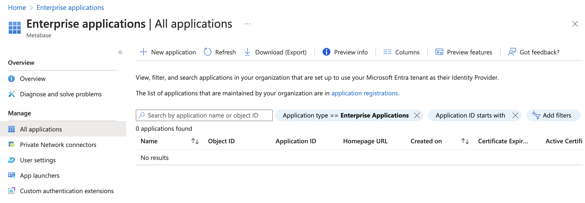
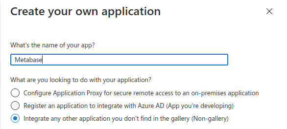
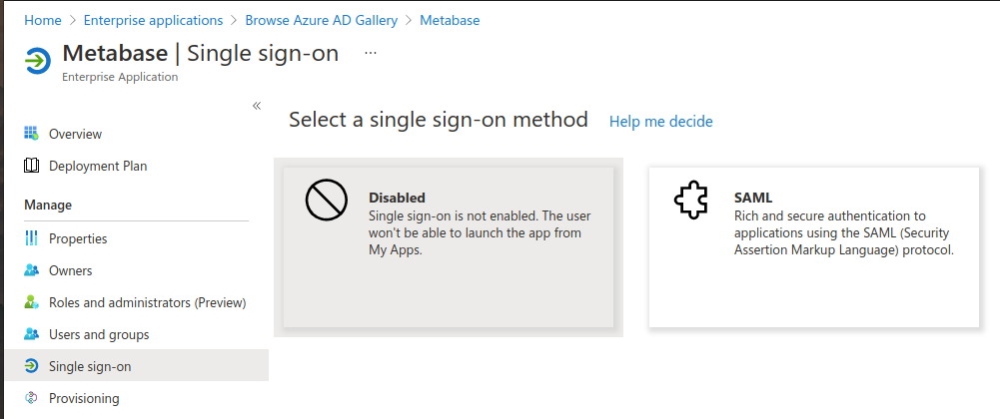
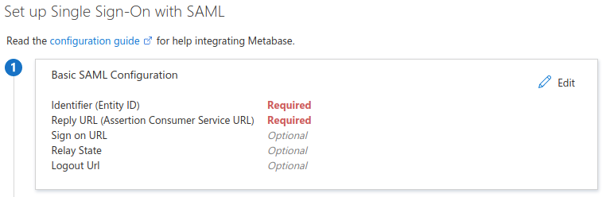

# SAML with Microsoft Entra ID



## Enable SAML in Metabase

First, follow our guide to [enable SAML authentication](authenticating-with-saml.md).

## Add an Enterprise Application in Microsoft Entra ID

Go to Mircrosoft Entra admin center and click on **Enterprise Applications** under Applications from the side bar. Once there, click on **+ New Application** in the bar on the top of the page.

In the new page click on **+ Create your own application** and a bar will open in the right side of the page. Enter "Metabase" as the name of the application, select `Integrate any other application you don't find in the gallery (Non-gallery)` as the option and click the **Create** button on the bottom of the bar.

On the application page, under **Manage**, select **Single Sign-on**, then click on the "SAML" button.

When the "Set up Single Sign-On with SAML" page appears, you'll see an option for "Basic SAML configuration". Click on the **Edit** button to enter the required info.

Fill out the following fields as follows and click "Save":

- **Identifier (Entity ID)**: `Metabase`
- **Reply URL (Assertion Consumer Service URL)**: go to your Metabase instance in Settings -> Admin-> Authentication -> SAML and insert the value that your Metabase instance reports in the "Configure your identity provider (IdP)" box.

In a new tab, visit the "App Federation Metadata URL" found in step 3, "SAML Certificates". On the Metadata page, note the:

- "Login URL"
- "Microsoft Entra Identifier"

You'll need these URLs to complete the SSO setup in Metabase.

To finish the Microsoft Entra side of the configuration, click on the **Users and groups** button on the Manage tab and add the users or groups that should have access to Metabase.

## Configure the Enterprise Application with Metabase SSO information

Log in to Metabase as an administrator and go to **Admin** -> **Settings** -> **Authentication** -> **SAML**.

Under "Tell Metabase about your identity provider", enter the following:

- **SAML Identity Provider URL**: the "Login URL" you got on Step 4 on the Microsoft Entra ID SAML SSO configuration
- **SAML Identity Provider Certificate**: copy and paste the super long string under the `<X509Certificate>` tag in the "App Federation Metadata Url". Make sure you copy and paste the whole string; if you miss any character, the integration won't work.
- **SAML Application Name**: "Metabase"
- **SAML Identity Provider Issuer**: the "Microsoft Entra Identifier" URL you got from the Microsoft Entra ID SAML SSO configuration.

Click on **Save Changes** below, and you should now be able to log in via Microsoft Entra ID.
