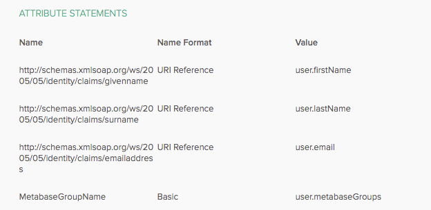

# SAML with Okta



## Configuring SAML settings in Okta

| Metabase SAML                       | Okta SAML                                                                                                                    |
| ----------------------------------- | ---------------------------------------------------------------------------------------------------------------------------- |
| URL the IdP should redirect back to | Single sign-on URL. This is your Metabase [Site URL][site-url] -- it should start with `https://` and end with `/auth/sso/`.  |
| SAML Application Name               | Audience URI (SP Entity ID)                                                                                                  |

### Setting attribute statements

Metabase needs you to set the first name (given name), last name (surname), and email address attributes in Okta. These attributes will be passed from Okta to Metabase during authentication to automatically log people into their Metabase accounts.

Fill out the **Attribute statements (optional)** section in Okta using the information from your Metabase **SAML attributes** (found under **Admin panel** > **Authentication** > **SAML**).

| Name                                                                 | Value          |
| -------------------------------------------------------------------- | -------------- |
| `http://schemas.xmlsoap.org/ws/2005/05/identity/claims/givenname`    | user.firstName |
| `http://schemas.xmlsoap.org/ws/2005/05/identity/claims/emailaddress` | user.email     |
| `http://schemas.xmlsoap.org/ws/2005/05/identity/claims/surname`      | user.lastName  |

**End-users should not be able to edit the email address attribute**. Your IdP will pass the email address attribute to Metabase in order to log people into their Metabase accounts (or to create an account on the first login). If a person can change the email address attribute, they'll potentially be able to access Metabase accounts other than their own.

### Example of an Okta assertion

You can click **Preview SAML assertion** to view the XML file generated by Okta. It should look something like this:

```
<saml2:Assertion
    xmlns:saml2="urn:oasis:names:tc:SAML:2.0:assertion" ID="id4170618837332381492734749" IssueInstant="2019-03-27T17:56:11.067Z" Version="2.0">
    <saml2:Issuer Format="urn:oasis:names:tc:SAML:2.0:nameid-format:entity">http://www.okta.com/Issuer</saml2:Issuer>
    <saml2:Subject>
        <saml2:NameID Format="urn:oasis:names:tc:SAML:1.1:nameid-format:emailAddress">userName</saml2:NameID>
        <saml2:SubjectConfirmation Method="urn:oasis:names:tc:SAML:2.0:cm:bearer">
            <saml2:SubjectConfirmationData NotOnOrAfter="2019-03-27T18:01:11.246Z" Recipient="https://metabase.mycompany.com/auth/sso"/>
        </saml2:SubjectConfirmation>
    </saml2:Subject>
    <saml2:Conditions NotBefore="2019-03-27T17:51:11.246Z" NotOnOrAfter="2019-03-27T18:01:11.246Z">
        <saml2:AudienceRestriction>
            <saml2:Audience>my-metabase-app</saml2:Audience>
        </saml2:AudienceRestriction>
    </saml2:Conditions>
    <saml2:AuthnStatement AuthnInstant="2019-03-27T17:56:11.067Z">
        <saml2:AuthnContext>
            <saml2:AuthnContextClassRef>urn:oasis:names:tc:SAML:2.0:ac:classes:PasswordProtectedTransport</saml2:AuthnContextClassRef>
        </saml2:AuthnContext>
    </saml2:AuthnStatement>
    <saml2:AttributeStatement>
        <saml2:Attribute Name="http://schemas.xmlsoap.org/ws/2005/05/identity/claims/givenname" NameFormat="urn:oasis:names:tc:SAML:2.0:attrname-format:uri">
            <saml2:AttributeValue xmlns:xs="http://www.w3.org/2001/XMLSchema" xmlns:xsi="http://www.w3.org/2001/XMLSchema-instance" xsi:type="xs:string">
              Cam
            </saml2:AttributeValue>
        </saml2:Attribute>
        <saml2:Attribute Name="http://schemas.xmlsoap.org/ws/2005/05/identity/claims/surname" NameFormat="urn:oasis:names:tc:SAML:2.0:attrname-format:uri">
            <saml2:AttributeValue xmlns:xs="http://www.w3.org/2001/XMLSchema" xmlns:xsi="http://www.w3.org/2001/XMLSchema-instance" xsi:type="xs:string">
              Saul
            </saml2:AttributeValue>
        </saml2:Attribute>
        <saml2:Attribute Name="http://schemas.xmlsoap.org/ws/2005/05/identity/claims/emailaddress" NameFormat="urn:oasis:names:tc:SAML:2.0:attrname-format:uri">
            <saml2:AttributeValue xmlns:xs="http://www.w3.org/2001/XMLSchema" xmlns:xsi="http://www.w3.org/2001/XMLSchema-instance" xsi:type="xs:string">
              cam@metabase.com
            </saml2:AttributeValue>
        </saml2:Attribute>
    </saml2:AttributeStatement>
</saml2:Assertion>
```

## Managing signing certificates in Okta

From your Okta Admin console, go to **SAML Setup** > **View SAML setup instructions**.

Put the following information in your Metabase SAML form (**Admin panel** > **Authentication** > **SAML**):

| Metabase SAML                       | Okta SAML                              |
| ----------------------------------- | -------------------------------------- |
| SAML Identity Provider URL          | Identity Provider Single Sign-On URL   |
| SAML Identity Provider Certificate  | X.509 Certificate                      |
| SAML Identity Provider Issuer       | Identity Provider Issuer               |

For more information, see [Enabling SAML authentication in Metabase][enabling-saml-in-metabase].

## Configuring group mappings

### Example of mapping a single group to Metabase

Let's say that you've created a User Profile attribute named `metabaseGroups`. Once you've created your `metabaseGroups` attribute, you'll need to update it for each user that needs to be automatically added to a Metabase group. For ease of use, we recommend using the same name for the groups you would use in Metabase.

After that, you'll need to add an additional SAML attribute to the ones we added above.



### Example of mapping multiple groups to Metabase

If you'd like to leverage Okta User Groups, you can [create an `Attribute Statement`][okta-create-attribute-statement] with the `Name` of `metabaseGroups` and the `Value` of an Okta Language Expression such as `getFilteredGroups({"groupId1", "groupId2"}, "group.name", 100)`.

This expression will return a list of strings containing User Group names that the user logging in is part of. The Group IDs in `{"groupId1", "groupId2"}` are the groups that you would like to map to in Metabase.

## Troubleshooting SAML issues

For common issues, go to [Troubleshooting SAML][troubleshooting-saml].

[enabling-saml-in-metabase]: ./authenticating-with-saml.md#enabling-saml-authentication-in-metabase
[okta-saml-docs]: https://help.okta.com/en-us/Content/Topics/Apps/Apps_App_Integration_Wizard_SAML.htm
[okta-create-attribute-statement]: https://support.okta.com/help/s/article/How-to-define-and-configure-a-custom-SAML-attribute-statement
[saml-doc]: ./authenticating-with-saml.md
[site-url]: ../configuring-metabase/settings.md#site-url
[troubleshooting-saml]: ../troubleshooting-guide/saml.md
