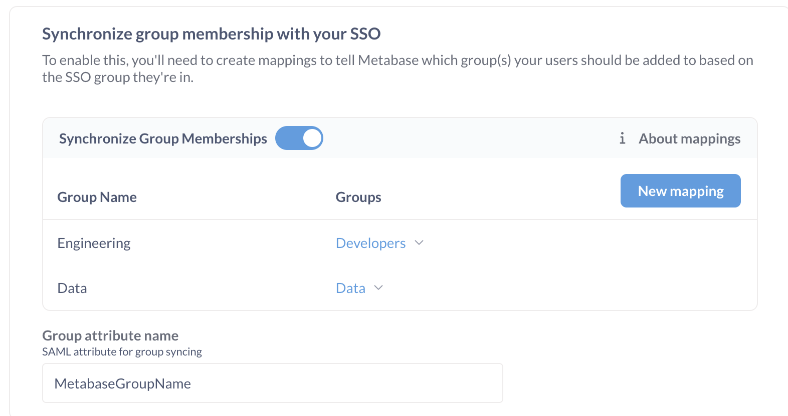

# SAML with Okta



1. [Turn on SAML-based SSO in Metabase](#turn-on-saml-based-sso-in-metabase)
2. [Set up SAML in Okta](#set-up-saml-in-okta).
3. [Set up SAML up in Metabase](#set-up-saml-in-metabase).

You can also optionally [configure group mappings](#configure-group-mappings) to automatically assign Okta users to Metabase groups.

See [authenticating with SAML](./authenticating-with-saml.md) for general SAML info.

## Turn on SAML-based SSO in Metabase

In the **Admin**>**Settings** section of the Admin area, go to the **Authentication** tab and click on **Set up** under **SAML**.

You'll see a SAML configuration form like this:


You'll need to use the information in this form to set up SAML in Okta.

## Set up SAML in Okta

Before configuring SAML authentication in Metabase, you'll need to create a new SAML app integration in Okta.

### Create an app integration in Okta

From the Okta **Admin** console, [create a new SAML app integration][okta-saml-docs] to use with Metabase.

### Configure Okta SAML settings

To configure Okta app integration with Metabase, you'll need to use the information found in Metabase in the **Admin panel** > **Authentication** > **SAML** section.

#### General settings

| Okta SAML                       | Metabase SAML                                                                                                                               |
| ------------------------------- | ------------------------------------------------------------------------------------------------------------------------------------------- |
| **Single sign-on URL**          | **URL the IdP should redirect to**. This is your Metabase [Site URL][site-url] -- it should start with `https://` and end with `/auth/sso`. |
| **Audience URI (SP Entity ID)** | **SAML Application Name** ("Metabase" by default)                                                                                           |

#### Attribute statements

In the **Attribute statements (optional)** section of the Okta application SAML setting, create the following attribute statements:

- email address
- first name (given name)
- last name (surname)

Even though Okta says these are optional, Metabase requires them. Okta will pass these attributes to Metabase during authentication to automatically log people in to Metabase.

| Name                                                                 | Value          |
| -------------------------------------------------------------------- | -------------- |
| `http://schemas.xmlsoap.org/ws/2005/05/identity/claims/emailaddress` | user.email     |
| `http://schemas.xmlsoap.org/ws/2005/05/identity/claims/givenname`    | user.firstName |
| `http://schemas.xmlsoap.org/ws/2005/05/identity/claims/surname`      | user.lastName  |

The names of attribute statement in Okta should match the attribute names in Metabase (names are case sensitive). If you want to use non-default attribute names in you Okta app configuration, you will also need to change the names for the attribute fields in Metabase in **Admin panel** > **Authentication** > **SAML**.

> **Make sure that people [cannot edit their email address attribute](https://help.okta.com/oie/en-us/content/topics/users-groups-profiles/usgp-user-edit-attributes.htm)**. To log people in to your Metabase (or to create a Metabase account on first login), your IdP will pass the email address attribute to Metabase. If a person can change the email address attribute, they'll potentially be able to access Metabase accounts other than their own.

### Example of an Okta assertion

You can click **Preview SAML assertion** to view the XML file generated by Okta. It should look something like this:

```
<saml2:Assertion
    xmlns:saml2="urn:oasis:names:tc:SAML:2.0:assertion" ID="id4170618837332381492734749" IssueInstant="2019-03-27T17:56:11.067Z" Version="2.0">
    <saml2:Issuer Format="urn:oasis:names:tc:SAML:2.0:nameid-format:entity">http://www.okta.com/Issuer</saml2:Issuer>
    <saml2:Subject>
        <saml2:NameID Format="urn:oasis:names:tc:SAML:1.1:nameid-format:emailAddress">userName</saml2:NameID>
        <saml2:SubjectConfirmation Method="urn:oasis:names:tc:SAML:2.0:cm:bearer">
            <saml2:SubjectConfirmationData NotOnOrAfter="2019-03-27T18:01:11.246Z" Recipient="https://metabase.mycompany.com/auth/sso"/>
        </saml2:SubjectConfirmation>
    </saml2:Subject>
    <saml2:Conditions NotBefore="2019-03-27T17:51:11.246Z" NotOnOrAfter="2019-03-27T18:01:11.246Z">
        <saml2:AudienceRestriction>
            <saml2:Audience>my-metabase-app</saml2:Audience>
        </saml2:AudienceRestriction>
    </saml2:Conditions>
    <saml2:AuthnStatement AuthnInstant="2019-03-27T17:56:11.067Z">
        <saml2:AuthnContext>
            <saml2:AuthnContextClassRef>urn:oasis:names:tc:SAML:2.0:ac:classes:PasswordProtectedTransport</saml2:AuthnContextClassRef>
        </saml2:AuthnContext>
    </saml2:AuthnStatement>
    <saml2:AttributeStatement>
        <saml2:Attribute Name="http://schemas.xmlsoap.org/ws/2005/05/identity/claims/givenname" NameFormat="urn:oasis:names:tc:SAML:2.0:attrname-format:uri">
            <saml2:AttributeValue xmlns:xs="http://www.w3.org/2001/XMLSchema" xmlns:xsi="http://www.w3.org/2001/XMLSchema-instance" xsi:type="xs:string">
              Cam
            </saml2:AttributeValue>
        </saml2:Attribute>
        <saml2:Attribute Name="http://schemas.xmlsoap.org/ws/2005/05/identity/claims/surname" NameFormat="urn:oasis:names:tc:SAML:2.0:attrname-format:uri">
            <saml2:AttributeValue xmlns:xs="http://www.w3.org/2001/XMLSchema" xmlns:xsi="http://www.w3.org/2001/XMLSchema-instance" xsi:type="xs:string">
              Saul
            </saml2:AttributeValue>
        </saml2:Attribute>
        <saml2:Attribute Name="http://schemas.xmlsoap.org/ws/2005/05/identity/claims/emailaddress" NameFormat="urn:oasis:names:tc:SAML:2.0:attrname-format:uri">
            <saml2:AttributeValue xmlns:xs="http://www.w3.org/2001/XMLSchema" xmlns:xsi="http://www.w3.org/2001/XMLSchema-instance" xsi:type="xs:string">
              cam@metabase.com
            </saml2:AttributeValue>
        </saml2:Attribute>
    </saml2:AttributeStatement>
</saml2:Assertion>
```

## Set up SAML in Metabase

Once you set up your SAML app in Okta, you'll need to configure SAML in Metabase. You'll need some information from Okta:

1. In Okta, go to the page for your Metabase app integration.
2. Go to the **Sign On** tab.
3. Click on **View SAML setup instructions**.

Use the information from Okta SAML instructions to fill the Metabase SAML form in **Admin panel** > **Authentication** > **SAML**:

| Metabase SAML                      | Okta SAML                            |
| ---------------------------------- | ------------------------------------ |
| SAML Identity Provider URL         | Identity Provider Single Sign-On URL |
| SAML Identity Provider Certificate | X.509 Certificate\*                  |
| SAML Identity Provider Issuer      | Identity Provider Issuer             |

\*Make sure to include any header and footer comments, like `---BEGIN CERTIFICATE---` and `---END CERTIFICATE---`.

## Configure group mappings

You can configure Metabase to automatically assign people to Metabase groups when they log in. You'll need to create a SAML attribute statement that will pass the groups information to Metabase, and then configure Metabase to read this attribute and map its contents to Metabase groups.

You can use either:

- [A custom user profile attribute](#use-a-user-profile-attribute-to-assign-groups) that contains user's Metabase groups.
- [Okta User Groups](#map-okta-user-groups-to-metabase-groups).

### Use a user profile attribute to assign groups

You can create a custom user profile attribute and fill it with the Metabase groups for each user.

1. In Okta **Profile Editor**, [create a new User Profile attribute](https://help.okta.com/en-us/content/topics/users-groups-profiles/usgp-add-custom-user-attributes.htm) called `metabaseGroups`, which can be a `string` or a `string array`.
   
2. For each user in Okta, fill the `metabaseGroups` attribute with their Metabase group(s).

   

   We recommend that you use the same names for the groups in Okta as you would use in Metabase.

   Metabase groups don't have to correspond to Okta User Groups. If you'd like to use Okta User Groups to set up Metabase Groups, see [Map Okta User Groups to Metabase groups](#map-okta-user-groups-to-metabase-groups).

   > Your Okta account has to have `SAML_SUPPORT_ARRAY_ATTRIBUTES` enabled, as Metabase expects Okta to pass attributes as an array. If your Okta account is old, you might need to reach out to Okta support to enable `SAML_SUPPORT_ARRAY_ATTRIBUTES`.

3. In the **Okta SAML settings** for the Metabase app integration, add a new attribute statement `MetabaseGroupName` with the value `user.metabaseGroups` (the profile attribute you just created)

   

4. In **Metabase SAML settings**:

- Turn on **Synchronize Group Memberships**.
- For each of the groups you added to Okta users, set up a new mapping to a Metabase group.
- In **Group attribute name**, enter `MetabaseGroupName` (the name of the SAML attribute statement).

  

### Map Okta User Groups to Metabase groups

1. Create Okta User groups corresponding to Metabase groups and assign them to Okta users.
2. In Okta's **SAML Settings** for the Metabase app integration, add a new attribute statement `MetabaseGroupName`, set the type to "Basic", and the value to:

   ```
   Arrays.flatten(getFilteredGroups({"groupID1", "groupID2"}, "group.name", 100))
   ```

   where the Group IDs in `{"groupId1", "groupId2"}` are the groups that you would like to map to Metabase groups. You can find the Okta Group ID in the URL of the group's page: `https://your-okta-url.okta.com/admin/group/GROUP_ID`.

   This expression will retrieve the names of Okta User Groups that a user is a part of and return them as an array.

   

   > Your Okta account has to have `SAML_SUPPORT_ARRAY_ATTRIBUTES` enabled, as Metabase expects Okta to pass attributes as an array. If your Okta account is old, you might need to reach out to Okta support to enable `SAML_SUPPORT_ARRAY_ATTRIBUTES`.

   Next, you'll need to tell Metabase how to map Okta groups to Metabase groups.

3. In **Metabase SAML settings**:

- Turn on **Synchronize Group Memberships**.
- For each of the groups you added to Okta users, set up a new mapping to a Metabase group.
- In **Group attribute name**, enter `MetabaseGroupName` (the name of the SAML attribute statement).

  

## Troubleshooting SAML issues

For common issues, go to [Troubleshooting SAML][troubleshooting-saml].

[enabling-saml-in-metabase]: ./authenticating-with-saml.md#enabling-saml-authentication-in-metabase
[okta-saml-docs]: https://help.okta.com/oie/en-us/content/topics/apps/apps_app_integration_wizard_saml.htm
[okta-create-attribute-statement]: https://support.okta.com/help/s/article/How-to-define-and-configure-a-custom-SAML-attribute-statement
[saml-doc]: ./authenticating-with-saml.md
[site-url]: ../configuring-metabase/settings.md#site-url
[troubleshooting-saml]: ../troubleshooting-guide/saml.md
