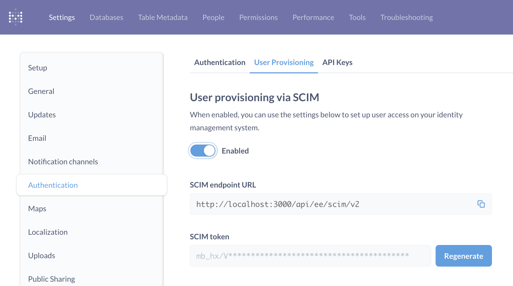

# User provisioning with SCIM



Metabase supports user provisioning via the System for Cross-domain Identity Management (SCIM) protocol. In addition to Single Sign-on (SSO), you can set up user provisioning in Metabase with SCIM to:

- **Decouple authentication from provisioning**. Even though anyone could authenticate with SSO, you may only want some people to be able to create an account in Metabase.
- **Support deprovisioning user accounts**. If you deactivate someone from your SSO, SCIM can let Metabase know to deactivate their Metabase account as well.

> For now, Metabase supports SCIM for [Okta](https://help.okta.com/en-us/content/topics/apps/apps_app_integration_wizard_scim.htm?cshid=ext_Apps_App_Integration_Wizard-scim) and [Microsoft Entra ID](https://learn.microsoft.com/en-us/entra/identity/app-provisioning/configure-automatic-user-provisioning-portal).

## Setting up user provisioning



To set up user provisioning. Click on the settings **Gear** icon in the upper right and navigate to **Admin settings** > **Settings**> **Authentication**.

Click on the **User provisioning** tab.

## User provisioning via SCIM

To set up user provisioning with SCIM, hit the toggle to enable it. Metabase will tell you the SCIM endpoint URL and SCIM token to share with your identity provider.

> If you've previously set up user provisioning with SAML, Metabase will turn that setting off and use the SCIM setup instead.

## SCIM endpoint URL

The SCIM endpoint is `/api/ee/scim/v2`. So your URL will looks something like:

```
https://metabase.example.com/api/ee/scim/v2
```

Replacing the hostname with your Metabase's hostname.

Share this endpoint URL with your identity provider.

## SCIM token

Copy the token and save the token somewhere safe. For security, Metabase can't show you the token again. You can, however, regenerate the token, but you'll need to let your identity provider know about the new token.

## SCIM with Okta

Once you've enabled SCIM in Metabase and gotten your SCIM endpoint URL and SCIM token, follow the docs for [Setting up SCIM in Okta](https://help.okta.com/en-us/content/topics/apps/apps_app_integration_wizard_scim.htm?cshid=ext_Apps_App_Integration_Wizard-scim).

With Okta, Metabase supports user and group provisioning; groups are created and populated in Metabase.

## SCIM with Microsoft Entra ID

Once you've enabled SCIM in Metabase and gotten your SCIM endpoint URL and SCIM token, follow the docs for [Setting up SCIM in Microsoft Entra ID](https://learn.microsoft.com/en-us/entra/identity/app-provisioning/configure-automatic-user-provisioning-portal).

With Microsoft Entra ID, Metabase only supports user provisioning (groups aren't created or populated).

## Notify admins of new users provisioned from SSO

If you're not using SCIM to provision user accounts, you can optionally have Metabase send an email to admins whenever someone signs in to Metabase via SSO for the first time (which creates a Metabase account). This setting doesn't require you to set up SCIM.

## Further reading

- [Authenticating with SAML](./authenticating-with-saml.md)
- [SAML with Okta](./saml-okta.md)
- [SAML with Microsoft Entra ID](./saml-azure.md)
