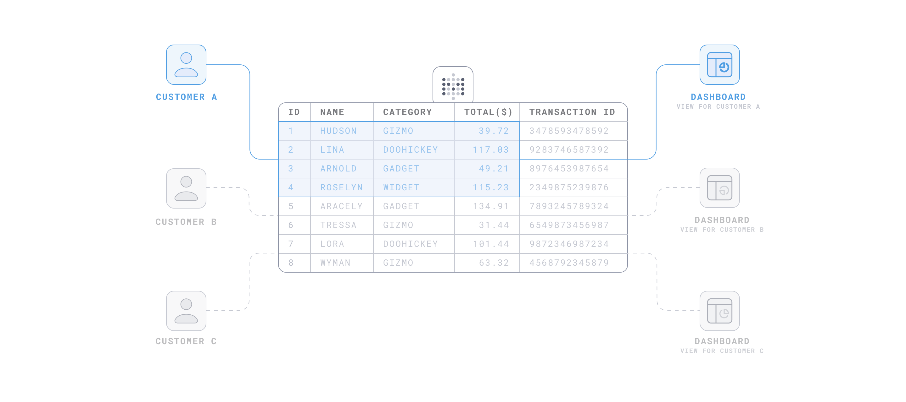
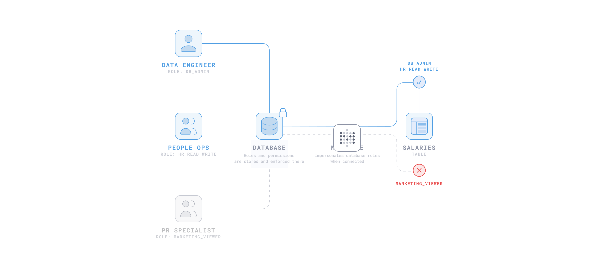
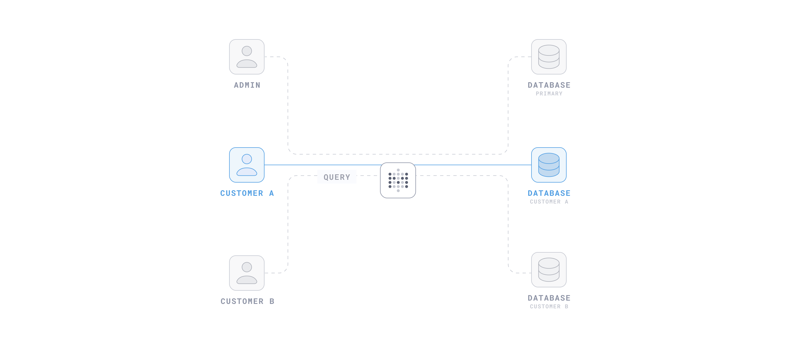
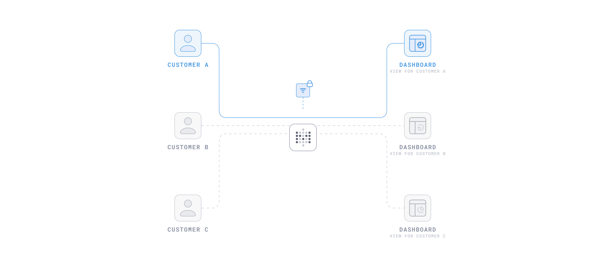

 
# Choosing a data isolation method

> Row and column security, impersonation, and database routing are only available on Metabase [Pro](https://www.metabase.com/product/pro) and [Enterprise](https://www.metabase.com/product/enterprise) plans.

Metabase offers several ways to ensure people only see the data they're supposed to see. The best method depends on how you store your data and where you want to enforce access rules:

- If tenant data lives in the same tables, use [row and column security](#row-and-column-security) to filter data, or [impersonation](#impersonation) to enforce access rules.
- If each tenant has their own database, use [database routing](#database-routing).
- If you're embedding dashboards for people without Metabase accounts, use [locked parameters](#locked-parameters).

You can combine these methods. For example, you can use locked parameters for a guest embed while using row and column security for signed-in users.

## Row and column security

[Row and column security](./row-and-column-security.md) lets you control which rows and columns each group can see. You can define rules that filter data based on [user attributes](../people-and-groups/managing.md#adding-a-user-attribute). Metabase applies your rules to questions you build in the query builder.

Use row and column security when:

- You need granular control over which rows and columns each group, customer, or tenant can see.
- You want to manage access rules in the Metabase UI instead of in your database.

Don't use row and column security when:

- People need to write native SQL queries. Row and column security doesn't apply to the SQL editor.
- You need column-level security on MongoDB or Druid, which only support row-level security.

## Impersonation

[Impersonation](./impersonation.md) lets your database control what each person can see. You define roles and row-level security policies in your database. Metabase connects using the role specified by each person's [user attribute](../people-and-groups/managing.md#adding-a-user-attribute), and your database enforces what that role can see.

Use impersonation when:

- You want to centralize access logic in your database instead of in Metabase.
- People need to write native SQL queries. Since your database enforces the rules, the rules apply in the SQL editor too.

Don't use impersonation when:

- Your database [doesn't support it](./impersonation.md#databases-that-support-impersonation).
- You don't want to set up and maintain roles and policies in your database.
- You rely heavily on caching. You can't share cached results between roles.

## Database routing

[Database routing](./database-routing.md) sends each person's queries to their own database. You build questions and dashboards once against a primary database, and Metabase routes queries to the right destination database based on each person's [user attribute](../people-and-groups/managing.md#adding-a-user-attribute). Database routing requires that each tenant's data lives in a separate database with an identical schema.

Use database routing when:

- You want the strongest isolation. Each tenant's data lives in a separate database.
- You want to avoid one tenant's queries affecting the performance of another tenant's queries.

Don't use database routing when:

- Tenants share tables. Use [row and column security](#row-and-column-security) or [impersonation](#impersonation) instead.
- You want to manage access rules in the Metabase UI instead of maintaining a separate database for each tenant.

## Locked parameters

[Locked parameters](../embedding/guest-embedding.md#locked-parameters) filter an embedded dashboard or question before Metabase displays it. Your app passes the filter value in a signed JWT. The filter is invisible to the person viewing the embed, and they can't change it.

Use locked parameters when:

- You want tenant isolation without setting up Metabase accounts, user attributes, or permissions.
- You want to filter data without exposing the filter or its values to the people viewing the embed.

Don't use locked parameters when:

- You want account-level or role-based access control across your Metabase.
- You're working with sensitive data. Use a method that enforces access at the permissions or database level instead, like [row and column security](#row-and-column-security), [impersonation](#impersonation), or [database routing](#database-routing).

## Further reading

- [Permissions overview](./start.md)
- [Tenants](../embedding/tenants.md)
- [Row and column security](./row-and-column-security.md)
- [Impersonation](./impersonation.md)
- [Database routing](./database-routing.md)
- [Locked parameters for guest embeds](../embedding/guest-embedding.md#locked-parameters)