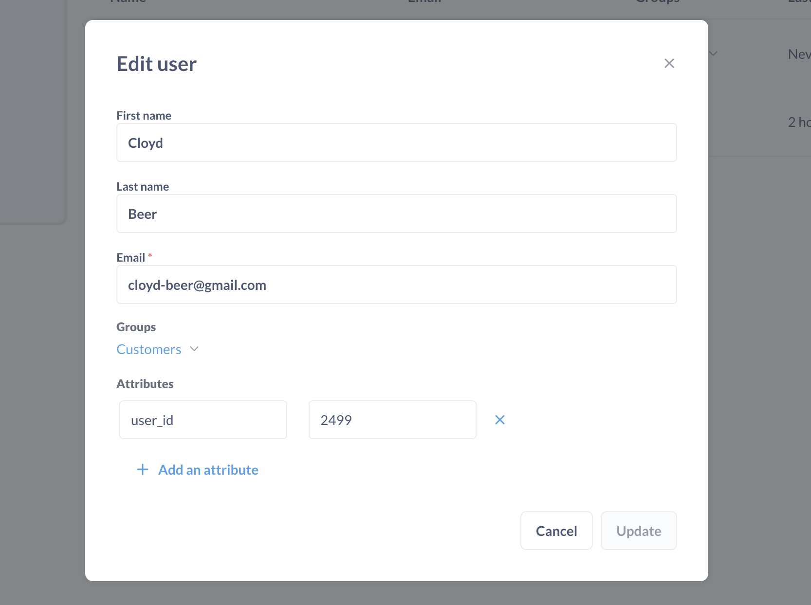
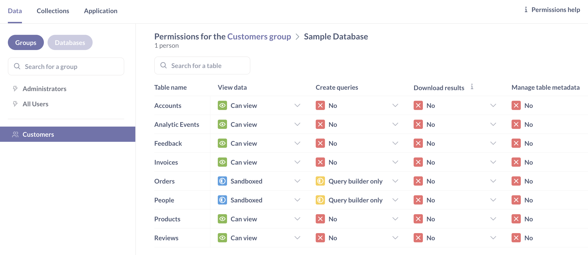
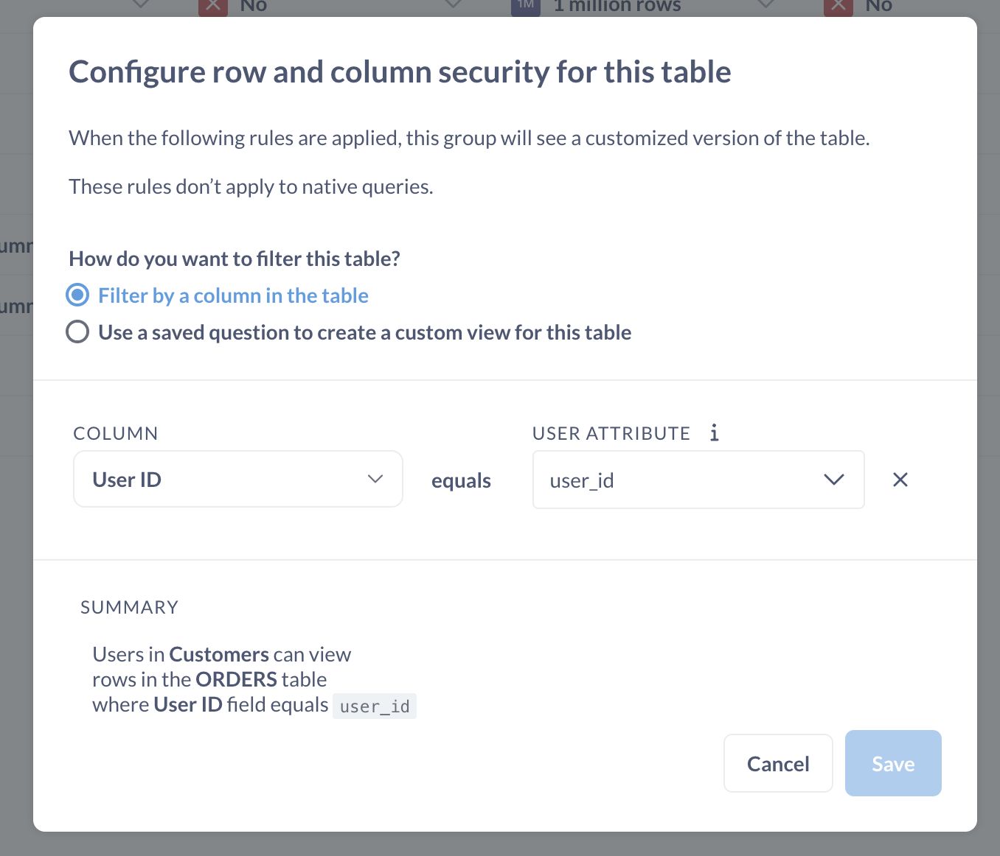
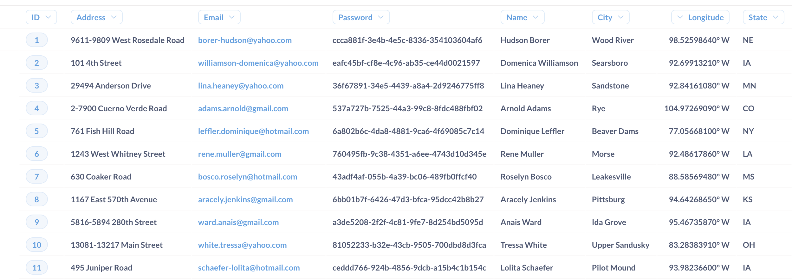
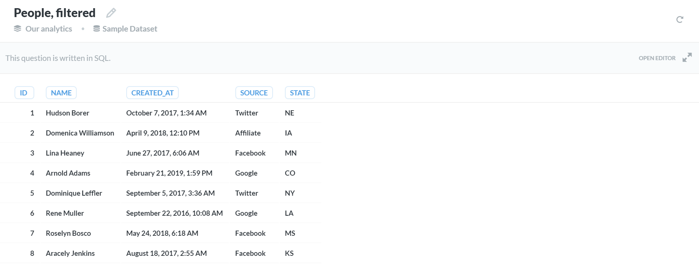
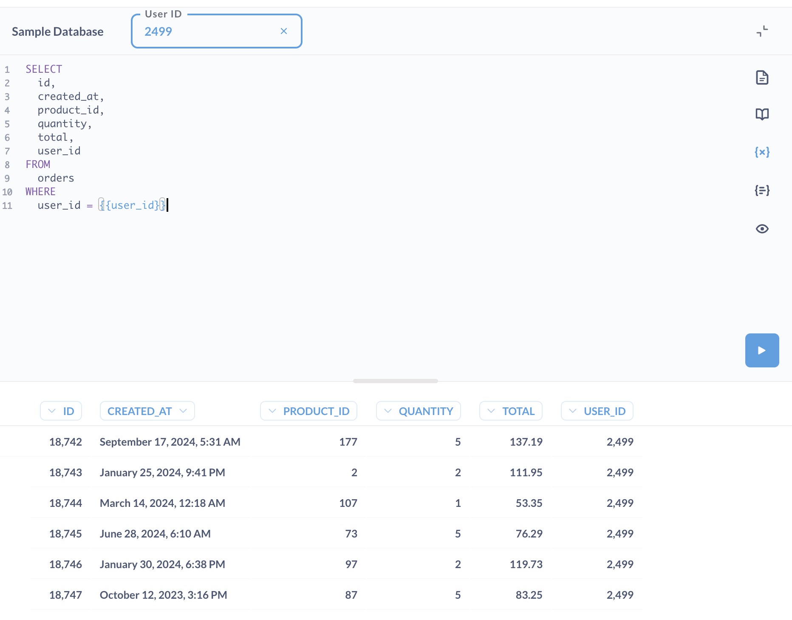
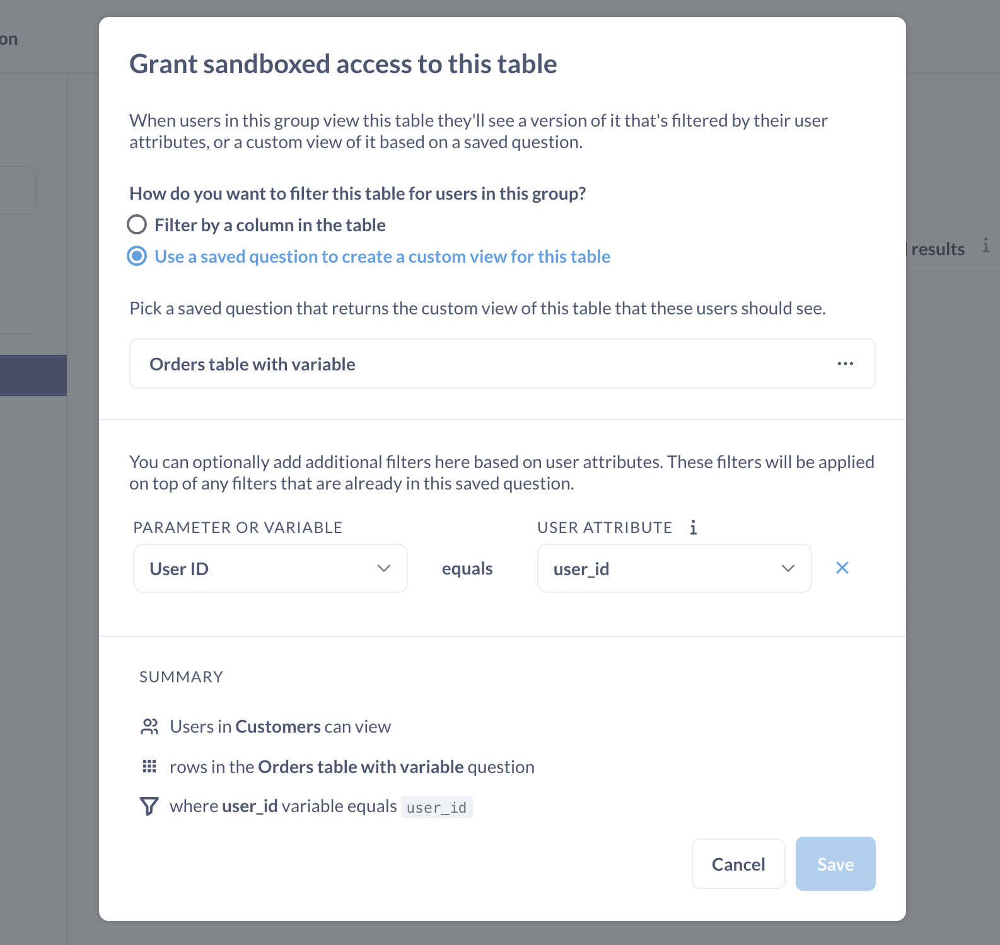
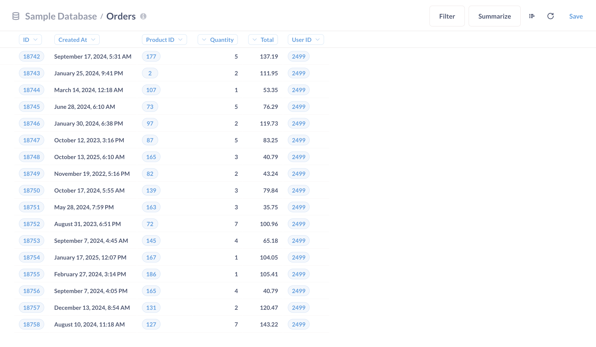

# Data sandbox examples



[Data sandboxes](./data-sandboxes.md) let you:

- Restrict **rows** using a [basic sandbox](./data-sandboxes.md#basic-data-sandboxes-filter-by-a-column-in-the-table).
- Restrict **columns** (and rows) using a [custom sandbox](./data-sandboxes.md#custom-data-sandboxes-use-a-saved-question-to-create-a-custom-view-of-a-table).

## Setup for all examples below

The examples below use the Sample database included with Metabase. Here's the basic setup:

1. **Block permissions for the All users group**: Hit cmd/ctrl + k to bring up the command palette and search for "Permissions". In the **Permissions** > **Data** tab. Click on the **All users** group. For the Sample database, set the All User's [View data](./data.md#view-data-permissions) permission to "Blocked".

2. **Create a group called Customers**. Hit cmd/ctrl + k and search for the People settings. [Create a group called "Customers".

3. **Create a user account for Cloyd Beer**. We'll [create a user account](../people-and-groups/managing.md#creating-an-account) for a random person from the People table in our Sample Database. Let's go with `Cloyd Beer` from the Sample database's `People` table.

4. **Add a user attribute to the account**: We'll add a user attribute to Cloyd's account. Since we want to be able to filter the data by user ID, we'll grab Cloyd's ID from the Sample database's `People` table and add the ID as a [user attribute](../people-and-groups/managing.md#adding-a-user-attribute): `user_id: 2499` (`2499` is Mr. Beer's ID in the Sample database).



5. **Add Mr. Beer to the Customers group**: See [adding people to groups](../people-and-groups/managing.md#adding-people-to-groups).

6. **Create a collection that is only viewable by Admins.**. Call it "Admin collection". We'll use this collection to store SQL questions that we use to sandbox tables in examples 2 and 3. See [Collection permissions](./collections.md).

## Basic sandbox setup - filtering rows based on user attributes

In this example, we’ll sandbox our `Orders` table so that anyone in our Customers group will only be able to see rows in the Orders table where the `User ID` column matches the person's `user_id` attribute.

1. **Go to the Admin settings > Permissions > data**. Click on the "Customers" group.

2. **Set View data to Granular**. For the Sample Database, set the Customer group's [View data](./data.md#view-data-permissions) to "Granular". Setting to "Granular" will allow us to set up permissions on individual tables for the Customer group.

3. **Sandbox the Orders and People tables**. Here, we'll set the View data permissions on the `Orders` and `People` tables to "Sandboxed". And since we want people to self-serve their data (by asking questions, creating dashboards, etc.), we'll also set their [Create queries](../permissions/data.md#create-queries-permissions) permission to "Query builder only."



4. **Filter by a column for each table.** For each table, Metabase will ask us "How do you want to filter this table for users in this group?". In each case, we'll keep the default selection: "Filter by a column on this table." For the `Orders` table, we'll filter by the `User ID` column, which we'll set equal to the `user_id` attribute for people in the Customers group.



For the `People` table, we'll filter by the `ID` column, which we'll set equal to that same `user_id` attribute.

5. **Save your changes**. Otherwise, all is for naught.

### Testing out the basic sandbox

To test out Mr. Beer's sandbox, we’ll open up a new incognito/private browser window and log in using Mr. Beer's account.

1. Log in as Cloyd Beer.
2. Click **Browse** > **Databases**.
3. Click on the **Orders** table.
4. Confirm that Metabase displays only the orders that Mr. Beer placed, that is, orders associated with the User ID of `2499`.

If Mr. Beer views any charts, dashboards, or even automated [X-ray explorations](../exploration-and-organization/x-rays.md) that include the sandboxed `Orders` data, Metabase will also filter those results to show only the data Mr. Beer is permitted to see. When Mr. Beer uses the query builder to ask new questions, his results will be limited to the sandboxed data.

## Custom sandbox setups

The second way you can create a sandbox is by using a saved question to define a customized view of a table to display. When someone with sandboxed access to a table queries that table, behind the scenes Metabase will instead use the saved question you created as the source data for their query.

You can:

- [Filter out columns](#custom-example-1-filtering-columns)
- [Filter out rows and columns](#custom-example-2-filtering-rows-and-columns)

## Custom example 1: filtering columns

In this example, we have a table called `People` that we want to trim down so that Mr. Beer and other Customers can view any row, but only some columns.



1. **Create a query that limits the columns in the People table.** Using the native/SQL editor, we'll write a query that only returns the columns in that table that we _do_ want our Customers group to see, like this:

```sql
  ID,
  Name,
  'Created At',
  State
FROM
  People
```

Here are the results:



We'll call this question "Filtered people table". Save it to the "Admins collection" you created in the setup (or any collection that only Admins have access to).

2. **Use a saved question to create a custom view for this table**: We'll go to the Permissions section and grant this group sandboxed access to this table. This time we'll select the second option, "Use a saved question to create a custom view for this table", and select the saved question we just created ("Filtered people table"), like so:


3. **Save changes**, lest our toil matter not.

4. **Verify things are working correctly**. We can log in as Mr. Beer, and when we go to open up the `People` table, we should see that Mr. Beer can instead see the results of the filtering question.

When Mr. Beer views a chart that uses data from this sandboxed table, Metabase will also apply the filtering. **If the chart uses any columns excluded by the sandboxed table, the chart will NOT load for Mr. Beer.**

## Custom example 2: Filtering rows and columns

If we want to specify which columns _and_ rows people can view, we can sandbox a table based on a SQL question with a variable, and associate that variable with a user attribute. To do that, we'll give our Customers group a custom view of the `Orders` table, but only let each person see rows based on their `user_id` user attribute.

1. **Create a SQL question with a variable**. We'll create a query that selects only some of the columns from the `Orders` table, and then add a `WHERE` clause with a variable that we can associate with Cloyd Beer's `user_id` user attribute.



And here's the code:

```sql

SELECT
  id,
  created_at,
  product_id,
  quantity,
  total,
  user_id
FROM
  orders
WHERE
  user_id = {{user_id}}

```

Save it to the "Admins collection" you created in the setup (or any collection that only Admins have access to).

2. **Set up the sandbox**: Return to the **Permissions** tab. Select Cloyd Beer's Customer group, and set the **View data** access for the `Orders` table to **Sandboxed**. Select **Use a saved question to create a custom view for this table**. Open up the sandboxed access modal and select the second option and select my filtering question, we'll see an additional section which allows me to map the variable we defined in our question with a user attribute:



3. **Save your changes**. Or abandon all hope.

4. **Verify the sandbox**: Now, when we log in as Mr. Beer and look at the `Orders` table, Mr. Beer will only see the columns we included in the filtering question, and the rows are filtered as specified by the variable in the question's `WHERE` clause:



## Further reading

- [Basic sandboxes: setting row-level permissions](https://www.metabase.com/learn/permissions/data-sandboxing-row-permissions)
- [Custom sandboxes: limiting access to columns](https://www.metabase.com/learn/permissions/data-sandboxing-column-permissions)
- [Configuring permissions for different customer schemas](https://www.metabase.com/learn/permissions/multi-tenant-permissions)
