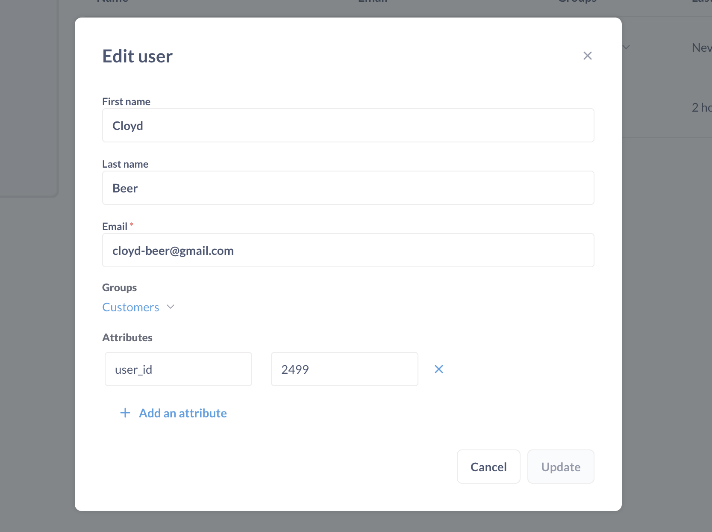

# Data sandbox examples

[Data sandboxes](./data-sandboxes.md) are a set of permissions that show different data to different people based on their user attributes. You can:

- Restrict **rows** using a [basic sandbox](./data-sandboxes.md#basic-data-sandboxes-filter-by-a-column-in-the-table).
- Restrict **columns** using a [custom sandbox](./data-sandboxes.md#custom-data-sandboxes-use-a-saved-question-to-create-a-custom-view-for-this-table). 

Permissions are always a bit pesky to set up, so here are some examples to get you started. (The example happens to use a group called "Customers" but this works the same whether you're doing this for internal or external folks.)

## Basic sandbox setup

In this example, we’ll sandbox our Orders table so that any user in our Customers group will only be able to see rows in the Orders table where the `User ID` column matches the user’s `user_id` attribute.

First we’ve made sure our example user has an attribute that we’ll be able to use in our filter:



Then we’ll head over to the Permissions section of the Admin Panel, and we’ll click on View Tables next to the Sample Database to see the permissions our user groups have for the tables in this database. We want to give the Customers group sandboxed access to the Orders table, so we’ll click on that box in the permissions grid and choose “Grant sandboxed access:”


Metabase will ask us first if we want to restrict this user group to “limited access” to this database. That just means they won’t have full access to all of the tables in this database, which is exactly what we want.


Next we’ll see a worksheet that will ask us how we want to filter this table for these users. We’ll leave it on the default selection. Below that, there’s an area where we get to add our filters. We want to filter using the User ID column in the Orders table where the column equals each user’s user_id attribute. So we’ll select that column and that user attribute from the dropdown menus. At the bottom of the worksheet, there’s a summary of how things will work.


We’ll click Done, then we’ll click Save Changes at the top of the screen to save the changes we’ve made to our permissions. If we ever want to edit how this table should be filtered for users in this group, we can just click on the __Data access__ dropdown for that group and select __Edit sandboxed access__.

To test this out, we’ll open up a new incognito browser window and log in with our test user account. We’ll click on the Sample Database on the home page and then pick the Orders table. As you can see here, this user correctly only sees orders where the User ID column is equal to 1, because that’s what this user’s user_id attribute is.


If this user views any charts, dashboards, or even automated X-ray explorations that include this sandboxed Orders data, those will also be correctly filtered to only show the data they’re allowed to see.

Another great thing about sandboxing is that this user can still use all of the easy and powerful exploration and charting features of Metabase to explore this sandboxed data. For example, they can create a chart like this one to see a breakdown of their orders by product type:


## Custom sandbox setup

As we mentioned above, the second way you can create a sandbox is by using a saved question to define a customized view of a table to display. When a user with sandboxed access to a table queries that table, behind the scenes they'll really be using that saved question as the source data for their query.

### Example 1: hiding specific columns

In this example I have a table called `People` that I want users in my Marketing team to be able to see, but I don't want them to see most of these sensitive columns that have personal information in them:


So what I can do is create a query that only returns the columns in that table that I _do_ want them to see, like this:


Now, when I go to the Permissions section and grant this group sandboxed access to this table, I'll select the second option and select the saved question I just created, like so:


To verify things are working correctly, I'll log in as a test user in the Marketing group, and when I go to open up the `People` table, you'll see that I actually am shown the results of the filtering question instead:


**Note:** this filtering will also happen when a user with sandboxed access goes to look at a chart that uses data from the sandboxed table. If the chart uses any columns that aren't included in the sandboxed version of the table, the chart will not load for that user.

### Example 2: using variables in a saved question

To create even more powerful and nuanced filters, you can use variables in a filtering question in conjunction with user attributes.

In this example, I'm going to give users in a specific group access to my `Orders` table, but I'll filter out which columns they can see, and I'll also make it so that they only see rows where the "Customer ID" column equals the user's `customer_id` attribute.

Here's the table I'm going to filter:


The filtering question that I'll create will exclude columns that I don't want these users to see, and I'll also add in an optional `WHERE` clause which defines a variable, `cid`, that I can then reference in my sandbox. Here's what it looks like:


And here's the code:

```
SELECT
  id,
  created_at,
  product_id,
  quantity,
  total,
  user_id
FROM
  orders
[[WHERE user_id = {{cid}}]]
```

Going back over to the Permissions section, when I open up the sandboxed access modal and select the second option and select my filtering question, I'll see an additional section which allows me to map the variable I defined in my question with a user attribute:


My user's attribute is defined like this, and I got here by clicking on the `…` icon next to this user's name in the People section:


Now, when I log in as this user and look at the `Orders` table, I only see the columns I included in the filtering question, and the rows are filtered as I specified in my `WHERE` clause:


## Further reading

- [Basic sandboxes: setting row-level permissions](https://www.metabase.com/learn/permissions/data-sandboxing-row-permissions)
- [Custom sandboxes: limiting access to columns](https://www.metabase.com/learn/permissions/data-sandboxing-column-permissions)
- [Configuring permissions for different customer schemas](https://www.metabase.com/learn/permissions/multi-tenant-permissions)
