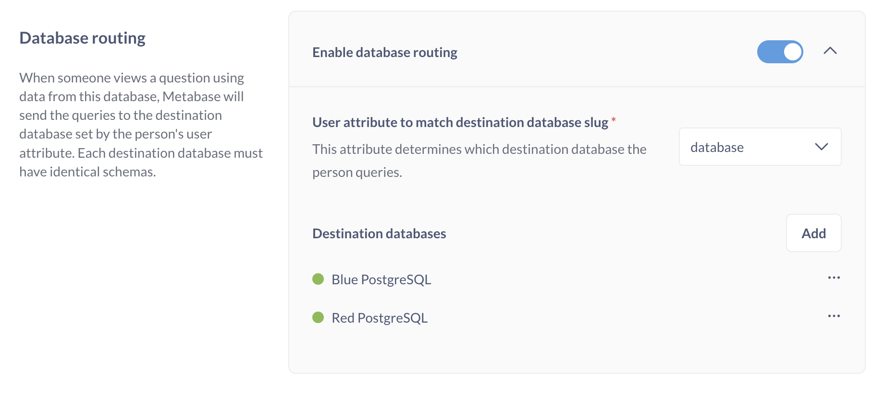

# Database routing



With database routing, an admin can build a question once using one database, and the question will run its query against a different database with the same schema depending on who is viewing the question.

Database routing is useful for:

- Managing modular and full app embedding setups where each customer has their own database with identical schemas.

  Database routing can't be used with guest embedding, because database routing requires people who use the embedded questions and dashboards to have a Metabase account. Without a Metabase account, Metabase can't route the queries because it doesn't know who is viewing the embed.

- Switching between dev and prod data warehouses.
- Changing the target data warehouse for certain teams.
- Managing separate connections to the same data warehouse, with each connection having separate privileges. This connection management is akin to [connection impersonation](./impersonation.md) for databases that prevent the same connection from changing roles.

## Database routing limitations

> Database routing is **not supported** on ClickHouse, Oracle, Spark SQL, and Vertica.

Different database have different setups, so _what_ you can route between (database, schema, data catalog, etc.) will differ slightly depending on which data warehouse you're using.

- [Athena](../databases/connections/athena.md): Only routing between different connections is supported (e.g., different buckets, roles, or catalogs).
- [BigQuery](../databases/connections/bigquery.md): Only routing between databases in different projects is supported.
- [Databricks](../databases/connections/databricks.md): When multi-catalog is not enabled, you can route between catalogs on the same host. If multi-catalog is enabled, then you can only route between databases on separate hosts.

## How database routing works

You connect Metabase to a database as normal. When you turn on database routing for that database, it becomes a **router database** - the main database that will handle routing queries to **destination databases**. You'll add these destination databases to this router database, with each destination database associated with a value for the user attribute you assign to the router database. You don't need to have your customer databases as separate connections.

With the router database set up with its destination databases, an admin can then create questions that query the router database. When other people log in and view these questions, Metabase will route the queries to the destination database specified by the person's user attribute.

## Setting up database routing



1. [Connect to a database](../databases/connecting.md) that has _the same schema as all of your customer's databases_. This database should be a mock/dev database, ideally with some fake data. The name used for this router database will be the name all users will see, regardless of which destination database they're routed to, so make sure the name makes sense for everyone. (You can change the display name at any time).
2. Once connected to this initial database (the "Router database"), go to its Database routing section and toggle on **Enable database routing**.
3. Enter the user attribute you want to use to determine which database a user should be routed to.
4. In the **Destination databases** section, click **Add**, then fill out the connection details. For each destination database, you'll need to specify a **slug** - this slug is the value that Metabase will use to match against the user attribute you assigned to the router database. At run time, when a user views a question built on the router database, Metabase will check the person's user attribute. If the value matches this slug, the question will query this destination database instead.

## User attributes and database routing

For database routing to work, your users must have a user attribute that Metabase can use to route them to the right destination database.

You can add user attributes manually, or via Single Sign-On (SSO) via [JWT](../people-and-groups/authenticating-with-jwt.md) or [SAML](../people-and-groups/authenticating-with-saml.md).

If an admin user lacks a value for the user attribute, they'll see the router database. You can also explicitly set the value for admins (or any user) to `__METABASE_ROUTER__`.

If a non-admin user account lacks a valid value for the user attribute, they won't be able to view the question at all.

See our docs on [user attributes](../people-and-groups/managing.md#adding-a-user-attribute).

## Testing database routing

To see if database routing is working:

1. Log in as an admin.
2. Create a question that queries the router database.
3. Create a user account and add the user attribute you associated with your router database. Set the value as the slug of one of your destination databases.
4. In a private/incognito tab, log in as the user and view the question you created. You should see data from the destination database associated with person's user attribute, not the data in the router database.

## Adding destination databases with the API

To add destination databases programmatically, you'll need an [API key](../people-and-groups/api-keys.md).

Because each database engine has its own settings, we recommend that you use the Network tab in your browser's developer tools while you manually add a destination database in the UI. This way you can see the request Metabase generates.

When you click **Add**, you'll see a `POST` request to `/mirror-database?check_connection_details=true`. Click on that request to get the request's headers and JSON payload.

### Adding a new destination database: example with PostgreSQL via `curl`

Here's a `curl` command to add a PostgreSQL database as a destination database. Here the database's `slug` is defined by `name` (in this case, `Green PostgreSQL`).

```sh
curl 'http://localhost:3000/api/ee/database-routing/mirror-database?check_connection_details=true' \
  --request POST \
  --header 'Content-Type: application/json' \
  --header 'X-Api-Key: mb_CpkoZHvSB5R+P+WsuXWRbdT3WbVphFv/rgMX9UGux/4=' \
  --data '{
  "router_database_id": 2,
  "mirrors": [
    {
     "details": {
        "host": "red-postgres",
        "port": 5432,
        "dbname": "sample",
        "user": "metabase",
        "use-auth-provider": false,
        "password": "metasample123",
        "schema-filters-type": "all",
        "ssl": false,
        "tunnel-enabled": false,
        "destination-database": true
      },
      "name": "Green PostgreSQL",
      "engine": "postgres"
    }
  ]
}'
```

The `details` object will have a different set of keys depending on the database.

If you grab the payload from the browser's Network tab, you may see additional, non-required settings:

```sh
curl 'http://localhost:3000/api/ee/database-routing/mirror-database?check_connection_details=true' \
  --request POST \
  --header 'Content-Type: application/json' \
  --header 'X-Api-Key: mb_CpkoZHvSB5R+P+WsuXWRbdT3WbVphFv/rgMX9UGux/4=' \
  --data '{
  "router_database_id": 2,
  "mirrors": [
    {
      "is_on_demand": false,
      "is_full_sync": true,
      "is_sample": false,
      "cache_ttl": null,
      "refingerprint": null,
      "auto_run_queries": true,
      "schedules": {
        "metadata_sync": {
          "schedule_minute": 14,
          "schedule_day": null,
          "schedule_frame": null,
          "schedule_hour": null,
          "schedule_type": "hourly"
        },
        "cache_field_values": {
          "schedule_minute": 0,
          "schedule_day": null,
          "schedule_frame": null,
          "schedule_hour": 18,
          "schedule_type": "daily"
        }
      },
      "details": {
        "host": "red-postgres",
        "port": 5432,
        "dbname": "sample",
        "user": "metabase",
        "use-auth-provider": false,
        "password": "metasample123",
        "schema-filters-type": "all",
        "ssl": false,
        "tunnel-enabled": false,
        "destination-database": true
      },
      "name": "Red PostgreSQL",
      "engine": "postgres"
    }
  ]
}'
```
