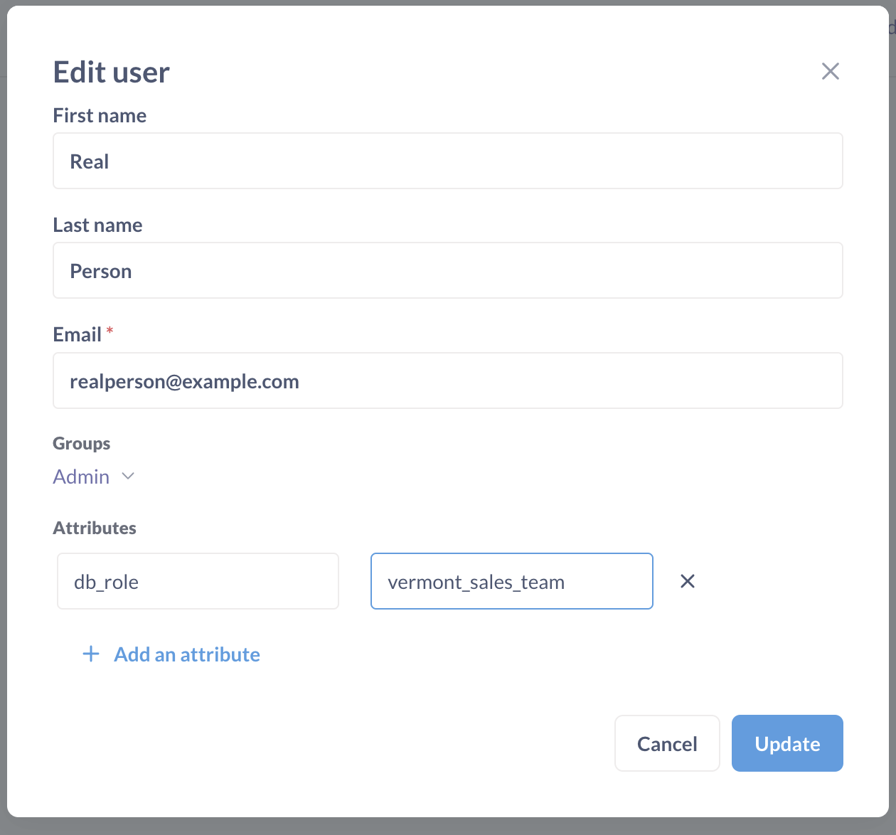
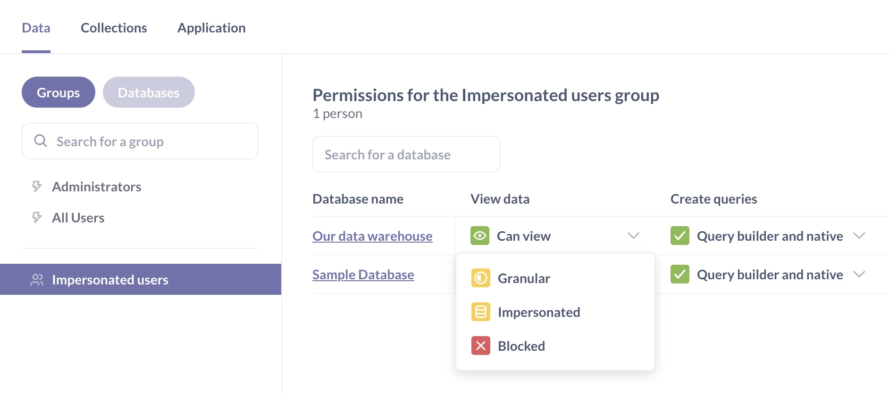

# Impersonation permissions



> For now, impersonation access is only available for ClickHouse, MySQL, PostgreSQL, Redshift, Snowflake, and SQL Server. If you want to switch database _connections_ based on who is logged in, check out [Database routing](./database-routing.md).

> If you're using views in PostgresSQL, the row-level security policies on views will only work on Postgres versions 15 and higher.

This page covers the [View data](./data.md#view-data-permissions) permission level called Impersonation.

**Impersonation access** allows admins to "outsource" View data permissions to roles in your database. Admins can associate user attributes with database-defined roles and their privileges. If someone is in a group with their View data permission set to Impersonation, the person will be able to view and query data based on the privileges granted to the role specified by their user attribute.

## Impersonation vs sandboxing

### Impersonation sets permissions for questions written in both the SQL editor and the query builder

Impersonation operates at the database level. In a database engine, setting the role before the query runs can alter the results of the query, as the role defines the permissions that your database should use when it executes the statements.

### Sandboxing only sets permissions for query builder questions

Sandboxing operates at the Metabase level. Since Metabase can't parse SQL queries to find out what data people are allowed to view, sandboxing only applies to questions composed in the query builder (where Metabase can interpret the queries).

## Example use case for impersonation

Let's say we have a People table that includes rows of accounts from all 50 states of the United States. Let's say you want your Vermont sales team to:

- Be able to ask questions using both the query builder and the native SQL editor.
- Only be able to view customer accounts in the People table who live in Vermont.

First, you'll set up permissions in your database by creating a role with a policy. Then in Metabase, you'll set data access to that database to Impersonation, so when people run queries on that database, Metabase will use that role to limit what data they can see.

## Set up connection impersonation

For impersonation access to work, you'll first need to set up roles in your database for Metabase to impersonate, then configure Metabase to impersonate those roles when people view or query data.

### Set up Metabase database connection for impersonation

Impersonation uses database roles to run queries on your database, but there still needs to be a default role that that will be used to run operations like [sync, scans, and fingerprinting](../databases/sync-scan.md). So the user account that Metabase uses to [connect to your database](../databases/connecting.md) should have access to everything in that database that any Metabase group may need access to, as that database user account is what Metabase uses to sync table information.

You can then create roles in the database that have more restrictive access to the database (like row-level or table-level security). When the role is passed to the database using impersonation, the engine will return a subset of the data, or restrict the query altogether.

> For **Redshift** databases, the user account Metabase uses to [connect to your Redshift database](../databases/connections/redshift.md) must be a superuser, as Metabase will need to be able to run the [SET SESSION AUTHORIZATION](https://docs.aws.amazon.com/redshift/latest/dg/r_SET_SESSION_AUTHORIZATION) command, which can only be run by a database superuser.

### In your database, set up roles

In your database (not in Metabase):

1. Create a new database role (in Redshift, this would be a new user).
2. Grant that role privileges that you'd like impersonated users to have..

For exactly how to create a new role in your database and grant that role privileges, you'll need to consult your database's documentation. We also have some docs on [users, roles, and privileges](../databases/users-roles-privileges.md) that can help you get started.

For example, if you're using PostgreSQL, the SQL below will create a role called `vermont_sales_team` and only allow that role to select rows in the `people` table where the value in the `state` column is `VT` (the abbreviation for Vermont):

```sql
CREATE ROLE vermont_sales_team;

GRANT
SELECT ON ALL TABLES IN SCHEMA PUBLIC TO vermont_sales_team;


CREATE POLICY vermont ON people
FOR
SELECT TO vermont_sales_team USING (state = 'VT');


ALTER TABLE people ENABLE ROW LEVEL SECURITY;
```

### Set up a Metabase group

Permissions in Metabase, including impersonation, are managed by groups, so you'll need to:

1. [Create a new group](../people-and-groups/managing.md#groups) (or select an existing one).
2. [Add people to the group](../people-and-groups/managing.md#adding-people-to-groups).

You might want to create a test user and add them to the group to verify later that impersonation is working correctly.

### Assign a user attribute to people in the group

To associate people in the group with a role that you created in your database, you'll use a user attribute.

Assign a [user attribute](../people-and-groups/managing.md#adding-a-user-attribute) to people in your group:

- The **key** of the attribute can be anything.
- The **value** of the attribute must match the desired database role for every person.



For example, if you created a role named `vermont_sales_team` in your database with access to a subset of data relevant to the Vermont sales team (like [in the example above](#in-your-database-set-up-roles)), you could add a user attribute called `db_role` (or whatever you want to call the attribute) and assign the value `vermont_sales_team` to the person's `db_role` attribute.

Some databases enforce case sensitivity, so you might want to make sure the attribute's value and the database's role match exactly.

People in one group can have different attribute values, but must have the same attribute key. See [People in a group with impersonation access to data do not necessarily share the same privileges](#people-in-a-group-with-impersonation-access-to-data-do-not-necessarily-share-the-same-privileges).

### Set up impersonation

1. In Metabase, hit Cmd/Ctrl + K to bring up the command palette and search for **Permissions**, or go directly to **Admin settings** > **Permissions** > **Data**.

2. Select the group that you want to to associate with the database role you created.

3. Select the database to configure access to.

4. Under **View data** setting for that database, select **Impersonation**. This option will only be visible if you already [created a user attribute](#assign-a-user-attribute-to-people-in-the-group).

   

   If your All Users group has more permissive access to this database (for example, "Can view"), you will see a warning, because [Metabase gives people the most permissive access to data across all of their groups](#metabase-gives-people-the-most-permissive-access-to-data-across-all-of-their-groups). You'll need to [block database access for the All Users group](./data.md#revoke-access-even-though-all-users-has-greater-access) before setting up impersonation.

5. From the user attribute dropdown, select the user attribute that you added that maps to the role you want the group to use when querying the database.

6. Save your changes.

Remember to also set up ["Create queries"](./data.md#create-queries-permissions) permissions for your group and database. For example, if you'd like people to be able to write SQL while using impersonated database roles, you'll need to set "Create queries" permissions to "Query builder and native".

### Verify that impersonated permissions are working

Admins will not be able to verify that impersonation is are working from their own account, so you should create a test user, add them to the group and set up their user attributes.

To verify that the impersonated permissions are working:

- If the test user has "Create queries" permissions set to "Create queries and native", create a SQL question and verify that the test user can only see the right data.

For example, for the `vermont_sales_team` role from the [example above](#in-your-database-set-up-roles), you can run:

```
SELECT * FROM people;
```

to verify that the test user only sees data from Vermont.

- If the test user has "Create queries" permissions set to "Query builder only", go to **Browse data** in the left sidebar and verify that the user can only see the tables they have access to, and only the data in those tables that

## People in a group with impersonation access to data do not necessarily share the same privileges

Metabase will use whatever role you specify in the user attribute for each person. E.g., if you select the `db_role` attribute for impersonation, one person's `db_role` could be `sales`, another person's could be `engineering`, or whatever other value that maps to a valid role in your database.

## Use impersonation to set up row-level SQL access

You can use impersonation to give people access to the SQL editor, while restricting their access to data based on a specific database role. And not just table-level access, but row-level access---or however you define access for that role in your database. Effectively, you can use impersonation to set up data sandbox-like access to your data, while letting people use the SQL editor to query that data. The difference is that, _instead of setting up a data sandbox in Metabase, you need to set up that row-level security via the privileges granted to a role in your database._

If instead you want to give a group SQL access to some, but not all, of the schemas or tables in that database, you can create an additional role in your database that only includes a subset of those tables---or even specific row-level access---and then use Metabase's impersonation feature to associate a user attribute with that role. Essentially what Metabase will do is take the user attribute and pass that attribute as a string into a `SET ROLE` or `USE ROLE` command for the database _before_ Metabase executes the query.

Connection impersonation doesn't apply to people in the Metabase Admins group, as their more permissive privileges take precedence.

## Metabase gives people the most permissive access to data across all of their groups

So if a person is in two groups with different permissions for the same database:

- Red group with impersonated access that limits what they can see.
- Blue group with View data set to "Can view" and Create queries set to "Query builder and native".

Blue group's more permissive access would override the impersonated access.

## Admins won't see the effects of impersonation

Admins won't ever see the effects of impersonation effects, because their privileges will override those of any other group they're a member of.

Metabase's default Administrators group has "Can view" access to all databases, and Metabase uses the most permissive access for any person in multple groups, so any admin will have "Can view" - not "Impersonated" - access to the database.

To test impersonation, create a test user, assign them a user attribute with the database role, and add them to the impersonated group. Then, log in as the test user and verify the data access.
