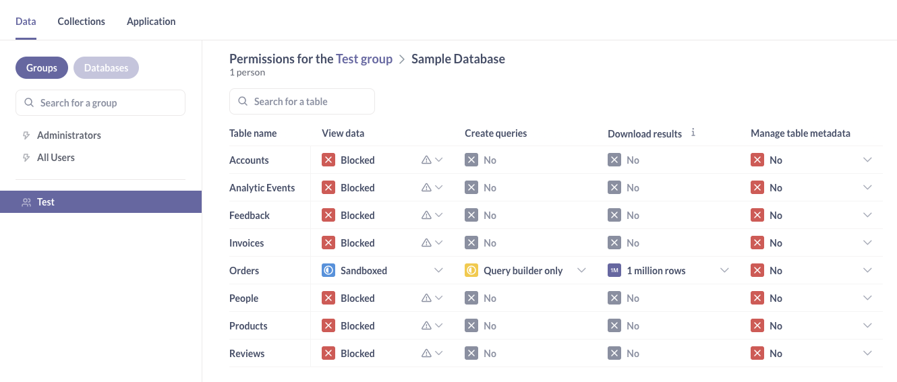
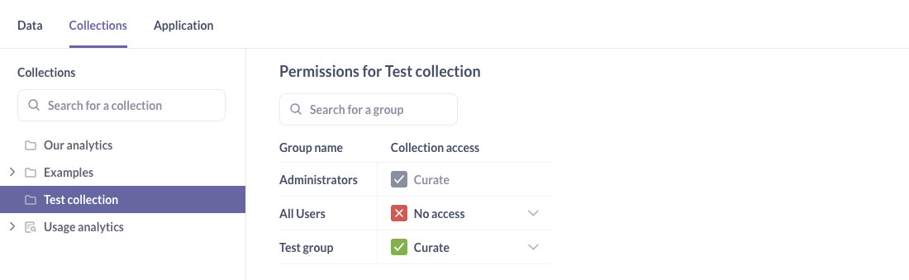

# Verifying permissions

> This guide assumes you're using Metabase on a [Pro or Enterprise](https://www.metabase.com/pricing/) plan, which gives you access to the full suite of access control tools.

It's good practice to check that you've set up your permissions the way you intended. This page assumes you have a basic understanding of how [data](./data.md) and [collection](./collections.md) permissions work in Metabase.

## Create a test user to verify a group's permissions

Let's say we set permissions up on the Sample Database that ships with Metabase. To verify those permissions, you'll want to:

1. Create a [test user account](../people-and-groups/managing.md#creating-an-account).
2. If you're using [user attributes](../people-and-groups/managing.md#adding-a-user-attribute), manually add the user attribute to the test user (e.g., `user_id=3`).
3. Add the test user to the group you want to test.
4. In another private/incognito tab, log in as the test user and check the various permissions you've set up for that group.

## Checking data permissions

- **View data**: visit a question that queries the data you set permissions on. Can they view the question? Unless you've also given the group "Create queries" permissions, the question should be marked "View only", and they shouldn't be able to drill-through charts or edit questions.
- **Create queries**: in the left sidebar, navigate to the database you've set permissions on. Can the test user see the tables they're supposed to see? They should only be able to view tables they have Create queries permission to view. If they only have View data permissions, the user should only be able to see data from that table when viewing a question or dashboard in a collection.
- **Download results**: visit a question that queries the data you set permissions on. Can they download the results?
- **Manage table metadata**: click on the gear icon in the upper right and select Admin settings. Can the person view the Table metadata tab? Does the list of tables they can edit match your expectations?

## Checking collection permissions

- **No access**: they should _not_ be able to see the collection at all.
- **View**: they _should_ be able to view the items in the collection, but _not_ edit the items, nor add items to that collection. Whether they can view the results of questions in that collection depends on their data permissions for the relevant data source.
- **Curate**: they should be able to view and edit questions in the collection, as well as add items to the collection.

## Example permissions setup

Let's walk through an example where we create a group that can:

- View only their own orders
- Create new questions based on those orders
- Download rows
- Save new questions to a specific collection

Here's the setup:

1. First, make sure the All Users group has View data access of "Blocked" for the Sample Database.
2. [Create a test user account](../people-and-groups/managing.md#creating-an-account).
3. Add a [user attribute](../people-and-groups/managing.md#adding-a-user-attribute) to that account: key `user_id`, value `3`.
4. [Create a test group](../people-and-groups/managing.md#creating-a-group).
5. Set the group's View data access for the [Sample Database to "Blocked"](../permissions/data.md#blocked-view-data-permission).
6. Set the test group's "Orders" table's [View data to "Sandboxed"](../permissions/data-sandboxes.md).
7. Configure the sandbox to associate the `user_id` attribute with the "Orders" table's `User_ID` field.
8. Set Download results to 1 million rows.
9. Set Manage table metadata to "No."

Now set up collection access.

1. [Create a new collection](../exploration-and-organization/collections.md).
2. Give the test group ["Curate access" to the collection](./collections.md#curate-access).

Now that the group's permissions are set up, you can add the test user to the group.

### Testing the example permissions setup

Log in as the test user in a private/incognito window, and test the following:

1. Try to access the Sample Database directly from Browse Data.

- Expected: They should only be able to see the Orders table.
- Expected: They should only see orders where `USER_ID` is `3`.

2. Navigate to the test collection.

- Expected: They should see the collection and any questions inside it. They should be able to create a new question and save it to that collection.
- Expected: They should be able to edit questions in the collection.

3. Use your admin account to add a question that queries a different table, like the Reviews table. Save that question to the test collection. Log in as the test user and view the collection.

- Expected: They should be able to see the question (because they have Curate access to the collection), but not view the question's _results_ (because their View data permissions are "Blocked" for the Reviews table).

### Troubleshooting

If the test user is still seeing data they shouldn't:

- Verify permission changes were saved.
- Check group membership. Are they in another group that has more access?
- Verify that the "All Users" group has "Blocked" View data permissions.
- Check for permissions on nested collections. Do sub-collections have the intended permissions? 
- Verify data sandboxing rules. Is the user attribute associated with the correct table column?
