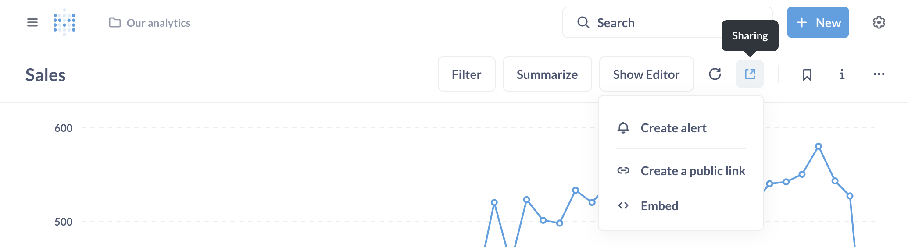

# Alerts

Set up an alert to send the results of questions to people via email or Slack, or to a webhook.

Alerts are for questions only. If you instead want to get the results of a dashboard sent to you, check out [dashboard subscriptions](../dashboards/subscriptions.md).

## Prerequisite for alerts

To start using alerts, an administrator will need to have set up at least one of the following notification channels.

- [Email](../configuring-metabase/email.md)
- [Slack](../configuring-metabase/slack.md)
- [Webhooks](../configuring-metabase/webhooks.md)

## Creating an alert

To create an alert:

1. Save your question.
2. Click on the sharing icon in the top-right of the screen.
3. Select **Create an alert**.
4. Select what you want to be alerted about. The alert options will depend on the question's visualization. See [types of alerts](#types-of-alerts).
5. Select when you want Metabase to check the results. Metabase can check for results by the minute, hourly, daily, weekly, monthly, or on a custom schedule that you set using the Quartz [cron syntax](https://www.quartz-scheduler.org/documentation/quartz-2.3.0/tutorials/crontrigger.html).
6. Select the alert's destination: [email](../configuring-metabase/email.md), [Slack](../configuring-metabase/slack.md), or to a [webhook](../configuring-metabase/webhooks.md).

You'll also have the option to only send the alert once. To test the alert, you can hit the **Send now** button. But just make sure that the question returns results. If the question doesn't return any results, Metabase won't send the alert.

## Types of alerts

- [Results alerts](#results-alerts): when a question returns any result.
- [Goal line alerts](#goal-line-alerts) when a time series crosses a goal line.
- [Progress bar alerts](#progress-bar-alerts): when a progress bar reaches or goes below its goal.

## Results alerts

Metabase can send you an alert on a schedule when one of your questions returns _any_ result. This kind of alert is also particularly useful if you have a question that doesn't _usually_ return any results, but you want to know when the question _does_ return results.

For example, you might have a table called `Reviews`, and you want to know any time a customer leaves a bad review, which you consider to be anything below three stars. To set up an alert for this situation, you'd go and create a raw data question (i.e., a question that returns a list of reviews), and add a filter to only include results with fewer than three stars.

You probably don't want to be alerted about all the bad reviews you've _ever_ gotten, but just recent ones. So you can add a filter to only include results from yesterday or today, depending on how often you want to check for these bad reviews. At this point, when you check the results of this question, it probably won't return any results, which is a good thing.

Save the question, create an alert, and select how often you want Metabase to check this question for results. That's it!

## Goal line alerts

_Requires a [bar, line, or area chart](./visualizations/line-bar-and-area-charts.md) with a goal line._

Goal line alerts are useful when you're doing things like tracking daily active users (DAU) and you want to know when you reach a certain number of DAU, or when you're tracking orders per week and you want to know whenever the number of orders ever goes below a certain threshold.

To start, you'll need a line, area, or bar chart displaying a number over time.

Next, you need to set up a goal line on your chart. Open up the visualization settings by clicking the **gear** icon in the bottom-left. Then click on the **Display** tab, and turn on the **Show goal** setting. Choose a value for your goal (and optionally a label) and click Done.

You can choose:

- Whether you want Metabase to alert you when the time series goes above the goal line or when it goes below the goal line.
- Whether you want Metabase to alert you every time the time series crosses a goal line, or only the first time it crosses the goal line.
- How often you want Metabase to check to see if the goal line has been crossed.

Click Done, and your alert will be all set up!

If you need to edit or unsubscribe from the alert you set up, just click that same icon. You'll see the Edit and Unsubscribe buttons. This is also where you'll see alerts about this question that admins might have added you to.

Metabase will email you when:

- You set up an alert
- You've been unsubscribed from an alert
- One of your alerts has stopped working
- You unsubscribed from an alert
- An admin added you to an alert

## Progress bar alerts

_Requires the [progress bar visualization](./visualizations/progress-bar.md)._

If you want to set up an alert when a single number reaches a goal, you can use a progress bar visualization.

1. Create a question that returns a single number as its result,
2. Choose the Progress Bar chart type,
3. In Visualization settings, select a goal value
4. Save your question,
5. Create an alert by clicking on the Sharing icon in top right

You'll see the options for when you want to get alerts about this progress bar:

- Whether to alert when the progress bar reaches the goal line or below the goal,
- Whether to alert only the first time the progress bar reaches the goal line, or every time
- How often you want Metabase to check to see if the goal has been reached.

## Editing and deleting alerts

To edit or delete alerts on a question, click on the Sharing icon in the top right corner. What you can edit depends on whether you're an admin.

Everyone:

- Everyone can edit alerts that they've personally set up (but not alerts set up by other people).
- Everyone can view and unsubscribe from all alerts they receive by clicking on the **gear** icon in the upper right and navigating to **Account settings** > **Notifications**.

Admins:

- Admins can edit and delete any alert. This can't be undone, so be careful!
- Admins can add or remove recipients on any alert, even ones that they didn't create themselves.
- Admins can bulk manage alerts per person from the [People menu in Admin settings](../people-and-groups/managing.md#unsubscribe-from-all-subscriptions-and-alerts).

## Avoid changing the name of the alerted channel in Slack

Once you set up an alert to a Slack channel, avoid changing the name of that channel in Slack. If you rename the channel in Slack, but you want Metabase to continue to send alerts to that renamed channel, you'll need to update the alert in Metabase to point to the new channel name.

## Alert expiration and special cases

Some circumstances will automatically change or delete alerts:

- **You rename the target Slack channel**. Well, technically the alert won't get deleted, but Metabase will no longer have anywhere to send the alerts to. You'll need to update the alert's target channel in Metabase to the new channel's name.
- **If a goal line is removed from the question powering a "Goal line" alert**, the alert will change to a "Results" type alert.
- **If the question is deleted**, Metabase will delete any alerts set up for that question.

Alerts will continue to work _even if the person who set up the alert no longer has an active account_. For example, if an alert with multiple recipients (or to a Slack channel) was set up by someone whose account has since been deactivated, that alert will continue to work (though Metabase will stop sending the alerts to the deactivated account).

## Admins can see all alerts



Admins can view a list of all alerts and dashboard subscriptions that people have set up in your Metabase in the **Usage analytics** collection. See [Usage analytics](../usage-and-performance-tools/usage-analytics.md#alerts-model).

## How permissions work with alerts

See [Notification permissions](../permissions/notifications.md).

### Sending alerts to private Slack channels

See [Sending alerts and subscriptions to private Slack channels](../configuring-metabase/slack.md#sending-alerts-and-subscriptions-to-private-slack-channels).

## Further reading

- [Dashboard subscriptions](../dashboards/subscriptions.md)
- [Setting up email](../configuring-metabase/email.md)
- [Setting up Slack](../configuring-metabase/slack.md)
- [Usage analytics](../usage-and-performance-tools/usage-analytics.md)
