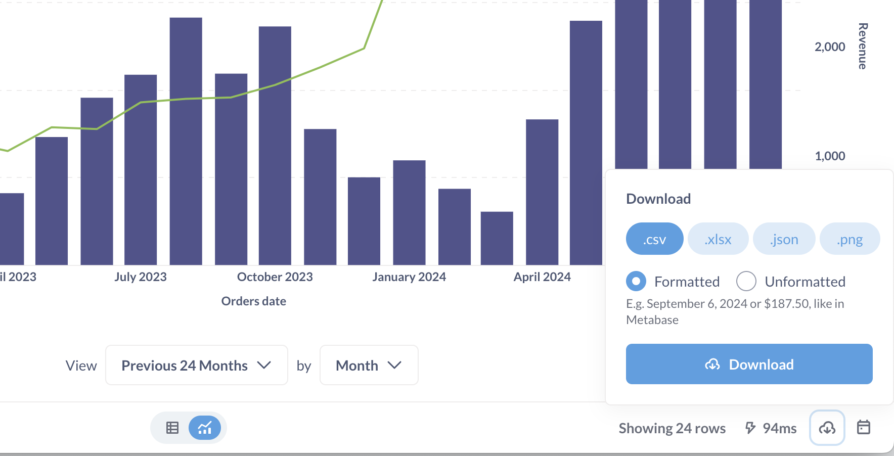
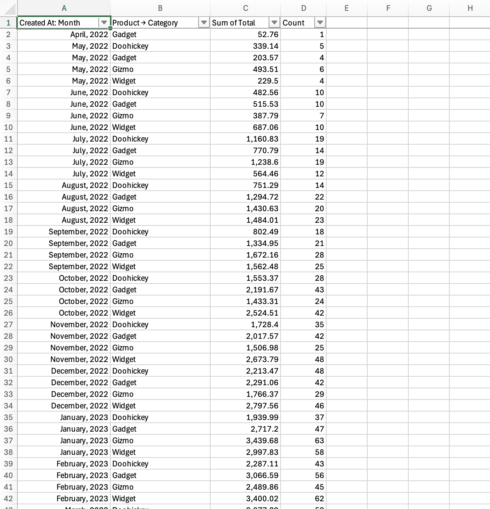
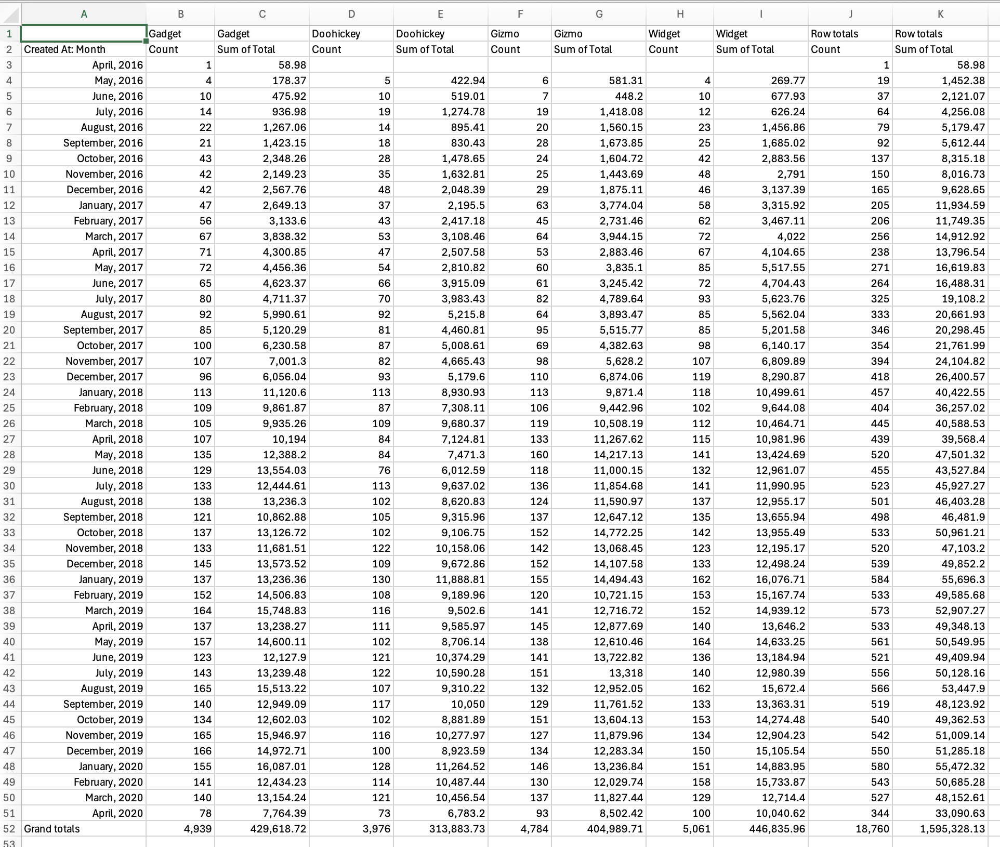

# Exporting results

You can export the results of a question or dashboard.

## Exporting results of a question

To export the results of a question, click on the **Download** button in the lower right of a question.

You can export the results of a question as:

- .csv
- .xlsx
- .json
- .png (if a chart)

You can choose between downloading the results as:

- **Formatted**: With any [formatting changes](../data-modeling/formatting.md) you've applied in Metabase.
- **Unformatted**: Metabase will export the raw results of the question without applying any of the [formatting you applied](../data-modeling/formatting.md) to the columns in the question. For example, if you formatted a floating point number to display only the first two decimal digits in the table results, exporting the unformatted results would include additional decimal digits (if any) found in the raw results.

If you don't see the option to export results, you may not have [permissions to download results](../permissions/data.md#download-results-permissions).

## Exporting pivot tables

By default, Metabase will export the pivoted results, but you'll have the option to export the unpivoted results.

**Pivot table in Metabase**

**Exported unpivoted results**

**Exported pivoted results**

The pivoted results will display as a flat table in Excel, not a native [Excel PivotTable](https://support.microsoft.com/en-us/office/overview-of-pivottables-and-pivotcharts-527c8fa3-02c0-445a-a2db-7794676bce96).

If you want to use a native Excel PivotTable, you'll instead want to export the raw, unaggregated rows of data that you'll need. That is, you'll want to undo any of the summarizations and groupings in your question, _then_ export the results.

One thing to watch out for: some summarizations in Metabase include implicit joins, so when you drop the summarizations, you may need to join tables to include all of the columns you'll need.

**Raw table** (Orders table including joined Products table):

The reason Metabase doesn't try to export results as a native Excel PivotTable is that Excel doesn't support all of Metabase's aggregation functions. Trying to reconstruct Metabase pivot tables as Excel PivotTables without these functions can lead to correctness issues, which defeats the purpose of looking at the data in the first place.

## Export limits

### Row limit

By default, Metabase will export first 1048575 rows of results.

- For CSV exports, you can increase this limit with an environment variable: [`MB_DOWNLOAD_ROW_LIMIT`](../configuring-metabase/environment-variables.md). Increasing this limit, however, may impact your Metabase's performance.
- XLSX exports will always be limited to Excel's maximum of 1048575 rows (plus the header row).

### Cell character limit in Excel exports

When exporting results to an Excel document (.xlsx), Metabase will limit the number of characters per cell to 32,767, which is the [character limit enforced by Excel](https://support.microsoft.com/en-us/office/excel-specifications-and-limit-1672b34d-7043-467e-8e27-269d656771c3). If you have a bonkers number of characters in a single cell, Metabase will truncate the content to fit within that limit.

## Exporting results from document cards

You can download results from charts embedded in [documents](../documents/introduction.md).

To export results from a chart in a document:

1. Hover over the chart in the document.
2. Click on the three dot menu (**...**).
3. Select **Download results**.
4. Choose your format: .csv, .xlsx, or .json.

You can export results as formatted or unformatted (hold `Option` on Mac or `Alt` on Windows when clicking the format).

If you don't see the **Download results** option, you may not have [permissions to download results](../permissions/data.md#download-results-permissions).

## Exporting data via a public link

You can create a [public link](../embedding/public-links.md#public-link-to-export-question-results-in-csv-xlsx-json) that people can use to download data in a specific format, as well as [raw, unformatted question results](../embedding/public-links.md#exporting-raw-unformatted-question-results).

## Exporting question data via alerts

You can also export data by setting up an [alert](./alerts.md).

## Exporting results of a dashboard

You can export the results of a dashboard and its cards in different ways:

- [Export dashboard as PDF](#export-dashboard-as-pdf)
- [Exporting dashboard card](#exporting-results-of-a-dashboard-card)
- [Exporting via dashboard subscriptions](#exporting-results-of-a-dashboard-via-dashboard-subscriptions)

### Export dashboard as PDF

You can export a dashboard as a PDF. Click on the **Sharing** button, then select **Export as PDF**.

The PDF will only include screenshots of the charts as they are visible on the dashboard.

### Exporting results of a dashboard card

To export the results of a particular card, hover over the dashboard card, click on the three dot menu (**...**), and select **Download results**.

From here you can select:

- .csv
- .xlsx
- .json
- .png (if a chart)

To export the raw, unformatted results, hold down the `Option` key for Macs, or `Alt` key for Windows, then click on the download file format.

If you don't see this option, you may not have [permissions to download results](../permissions/data.md#download-results-permissions).

### Exporting results of a dashboard via dashboard subscriptions

You can use [dashboard subscriptions](../dashboards/subscriptions.md) to regularly export data from all questions on a dashboard, and include those results as an attachment.

## Remove Metabase branding from exports

By default, data exports (PDFs, PNGs, alert and subscription emails, etc.) feature Metabase branding, like this "Made with Metabase" logo:

To remove the Metabase logo and branding on exports, you'll need to subscribe to a [Pro or Enterprise plan](https://www.metabase.com/pricing/).

## Further reading

- [Alerts](./alerts.md)
- [Dashboard subscriptions](../dashboards/subscriptions.md)
- [Tables](./visualizations/table.md)
