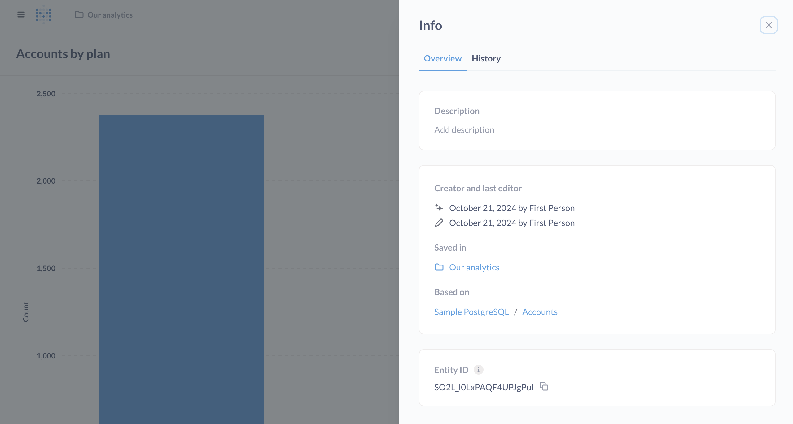

# Questions

Questions in Metabase are queries, their results, and their visualization. Questions are the basic analytical unit in Metabase. You can think about questions as saved queries that you can display as tables or charts. You can organize questions into collections and dashboards. You can [embed questions](../embedding/start.md), share links to them, export their results, and have them alert you when results are interesting.

## Creating a new question

You can create a new question from scratch, or build off of an existing question. To create a question from scratch, you can click on **+ New** and select how you want to query your data: either with the graphical query builder, or the SQL/native editor:

You can also use [Metabot](../ai/metabot.md) to create questions using natural language. Just ask Metabot what you want to know about your data, and it can generate charts and queries for you.

### Query builder

Selecting **Question** will take you to the [editor in the graphical query builder](./query-builder/editor.md).

### Native editor

Selecting **SQL/native code** will open the [native code editor](./native-editor/writing-sql.md).

Even if you know SQL, you should still check out the [graphical query builder](./query-builder/editor.md), as you can use it to build [interactive charts](https://www.metabase.com/learn/metabase-basics/querying-and-dashboards/questions/drill-through).

### From an existing question

You can also build a new question from an existing question. You won't overwrite the existing question, so feel free to play around. You can use either the [query builder](./query-builder/editor.md) or the [native code editor](./native-editor/referencing-saved-questions-in-queries.md).

Some kinds of saved questions, however, can't be used as source data:

- Druid questions
- Mongo questions
- Questions that use `Cumulative Sum` or `Cumulative Count` aggregations
- Questions that have columns that are named the same or similar thing, like `Count` and `Count 2`

## Saving questions

Once you've built your query and [visualized its results](./visualizations/visualizing-results.md), you can save a question to a [dashboard](../dashboards/introduction.md) (the default), or to a [collection](../exploration-and-organization/collections.md). You'll need to name the question, include an optional description, and save it to a dashboard or a collection.

### Saving questions to dashboards

Questions that live in a dashboard are only visible in that dashboard. These questions can't be used in other dashboards. When you save a question to a dashboard, you'll need to arrange the card on one of the dashboard's tab, then save the dashboard.

### Saving questions to collections

Questions saved to a collection can be added to multiple dashboards. Moving a question from one collection to another collection won't have any effect on the dashboards the question has been added to. To save a question to a collection, you'll need to be in a group with [curate access](../permissions/collections.md#curate-access) to that collection.

### Checking for breaking changes



When a question, model, or metric is saved, Metabase will try to detect whether the changes you made would break any dependent entities. For example, if you removed a column from a question that other questions rely on, Metabase will warn you that those downstream questions will break.

Currently, Metabase will look for broken column references. If you rename or remove a column, Metabase will likely flag the change as breaking downstream entities. But Metabase can't detect other types of changes like changing the column type or computation logic as breaking changes.

## Moving questions from collections to dashboards (and vice versa)

Whether you can move a question in a collection into a dashboard depends on how many other dashboards use that question.

You can move the question from a collection into a dashboard if either:

- No other dashboards use that question.
- The other dashboards that use that question live in collections you have [curate access](../permissions/collections.md#curate-access) to. In this case, Metabase will tell you which other dashboards use that question, and you'll have to decide whether you're okay with removing the question from those dashboards.

## Info about your question

Once you save a question, you can click on the **info** icon in the upper right to see some metadata about your question:

### Overview tab

- Description, which you can add–descriptions even support Markdown!
- Who created the question, and who edited it last
- The collection or dashboard the question is saved in
- The data the question is based on.
- The question's Entity ID (which you can use with [Serialization](../installation-and-operation/serialization.md) to keep IDs consistent across multiple Metabases).

### History tab

See [history](../exploration-and-organization/history.md).

## Downloading your question's results

See [exporting results](./exporting-results.md).

## Verifying a question

See [content verification](../exploration-and-organization/content-verification.md).

## Bookmark a question

Click the **bookmark** icon to pin a question to your Metabase sidebar. See [Bookmarks](../exploration-and-organization/exploration.md#bookmarks).

## Turning a question into a model

You can turn a question saved to a collection into a model to let others know that the results make a good starting point for new questions. (You can't turn a question saved to a _dashboard_ into a model; you'll first need to move the question to a collection). See [models](../data-modeling/models.md).

## Caching question results



See [caching per question](../configuring-metabase/caching.md#question-caching-policy).

## Setting up alerts

You can set up questions to run periodically and notify you if the results are interesting. Check out [alerts](./alerts.md).

## Viewing events on your chart

If your results are a time series, you can display events on along the x-axis. See [events and timelines](../exploration-and-organization/events-and-timelines.md).

## Deleting a question

See [delete and restore](../exploration-and-organization/delete-and-restore.md).
