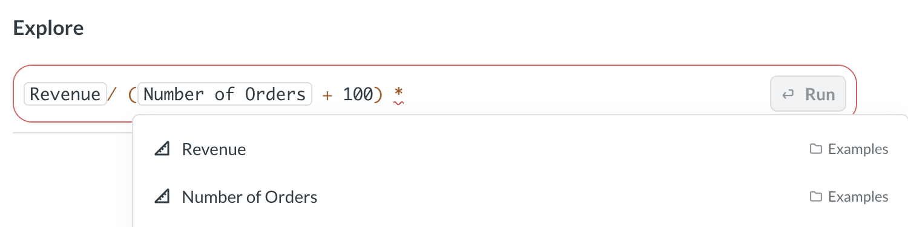

# Metrics explorer

The metrics explorer is a space for ad-hoc analysis of [metrics](../data-modeling/metrics.md) and [measures](../data-studio/measures.md)

The metrics explorer can help you visualize trends and breakdowns of different metrics and measures from one or more data sources. For example, you might want to see how the revenue trend compares to changes in customer sentiment for different products.

You can:

- [Explore metrics and measures along their dimensions](#explore-a-metric-or-a-measure)
- [Compare multiple metrics and measures](#compare-metrics-and-measures)
- [Do math with metrics](#calculations-with-metrics-and-measures)
- [Break out by additional dimensions](#break-out-by-dimensions)
- [Filter each metric or measure](#filter-metrics-and-measures)
- Zoom into time periods

The metric explorer is intended for ad hoc exploration and analysis. Currently, you can't save the results of your explorations. You can use the [query builder](../questions/query-builder/editor.md) to create saved explorations.

To share your metric explorations with people in your organization, you can copy the link (which will look like `[your-metabase-URL]/explore#abunchofcharacters`). The link encodes your explorations, so other people will be able to see what you see.

## Explore a metric or a measure

In the metrics explorer, you can explore how a measure or metric varies across dimensions.

To open a **metric** in the Metrics Explorer:

1. Navigate to the metric's home page.

   To get to the metric's home page, you can click on a metric from its collection, from the [metrics browser](../data-modeling/metrics.md#see-all-metrics), or from search.

2. To view the metric in the explorer, click **Explore** in the top right corner.

To return to the metric's home page, click the metric card in the search bar and select **Go to metric home page**.

To open a **measure** in the metrics explorer:

1. Navigate to the measure in **Data studio > Tables > [Your table] > Measures**.
2. Select your measure.
3. On the measure's page, click **three dots** next to the measure's name and select **Explore**.

Once you open a measure or metric in the metrics explorer, Metabase will create tabs plotting the metric/measure along the most appropriate dimensions, as well as the **Totals** tab with the total result of the metric, without any dimensions applied.

You can also [break out](#break-out-by-dimensions) a metric/measure by additional dimensions or [filter the metric/measure](#filter-metrics-and-measures).

## Compare metrics and measures

To compare multiple metrics or measures:

1. [Open one of the metrics/measures in the metrics explorer](#explore-a-metric-or-a-measure).
2. Click the top search bar and search for another measure or metric you want to add.

3. Press **Enter** or click **Run** in the search bar.

   

You can add the same metric/measure multiple times. This is useful if you want to [break out](#break-out-by-dimensions) or [filter](#filter-metrics-and-measures) the metric, while keeping the total trend visibile. For example, you might want to compare the trend of total revenue to the revenue of a single product category.

Once you pick the metrics, you'll see the dimensions of the first metric/measure below the search bar. You can pick a dimension to compare metrics/measures (for example, if you want to see how both Number of Orders and Revenue change by date, state, or product category).

Metabase will automatically detect shared dimensions and offer them for comparison, like when the metrics/measures are associated with the same data source, or the underlying data sources have foreign key relationships to another shared data source.

If your metrics/measures don't have shared dimensions, you'll need to select a dimension for comparison:

1. Click on the **+** under the search bar to select a dimension for the first metric/measure.

   

2. At the bottom of the screen, select compatible dimensions for other metrics/measures.

   

When your metrics/measures don't have shared dimensions, Metabase has no way of knowing how the dimensions relate to each other, so it's on you to make sure the dimensions you pick make sense to compare!

You can [filter](#filter-metrics-and-measures) or [break out](#break-out-by-dimensions) each metric/measure separately, or [do simple calculations with metrics/measures](#calculations-with-metrics-and-measures).

## Break out by dimensions

You can also break out each metric by additional dimensions. For example, you might want to compare overall revenue to the number of orders for each product category.

To break out a metric or measure by additional dimensions:

1. Click on the metric's card in the search bar.
2. Select **Break out**
   
3. Choose the breakout dimension.

To remove the breakout, click on the measure/metric card in the search bar again and select **Remove breakout**.

## Filter metrics and measures

You can add filters to each metric/measure in the metrics explorer. For example, you might want to compare overall revenue trend to number of orders for one specific product category.

To add a filter to a metric or measure:

1. Click the **filter** icon in the top right corner of the metrics explorer.
2. Select the metric/measure you want to filter.
3. Select the field to filter and define the filter.

You'll see the filter added below the metric or measure's card in the search bar. To remove the filter, click the **X** on the filter's card.

## Calculations with metrics and measures

You can use the four basic math operations (`+`,`-`,`*`,`/`) on metrics/measures in the metrics explorer. For example, you can explore how revenue per user, `Revenue / Active users`, changes with time.

The metrics explorer is especially useful when metrics and measures are associated with different data sources, likeif you have a  "Revenue" metric on the `Subscriptions` table and an "Active users" metric on the `Events` table. If you were to compare these metrics in the query builder, you'd have to wrangle their tables with joins, but the metrics explorer lets you compare these metrics by just typing out a formula.

To write an expression with metrics/measures, just start entering the formula into the search bar. You can use `+`,`-`,`*`,`/`, parentheses, numbers, or other metrics (including using the same metric multiple times). To visualize the results, just press Enter.

To edit the expression, click on the expression's card in the search bar and click **Edit**.

You can also rename your expressions. For example, you might want to rename your formula `Revenue / Active users` as `Per user revenue`. To rename the expression, click the expression's card in the search bar, click **Rename**, and type the new name.
