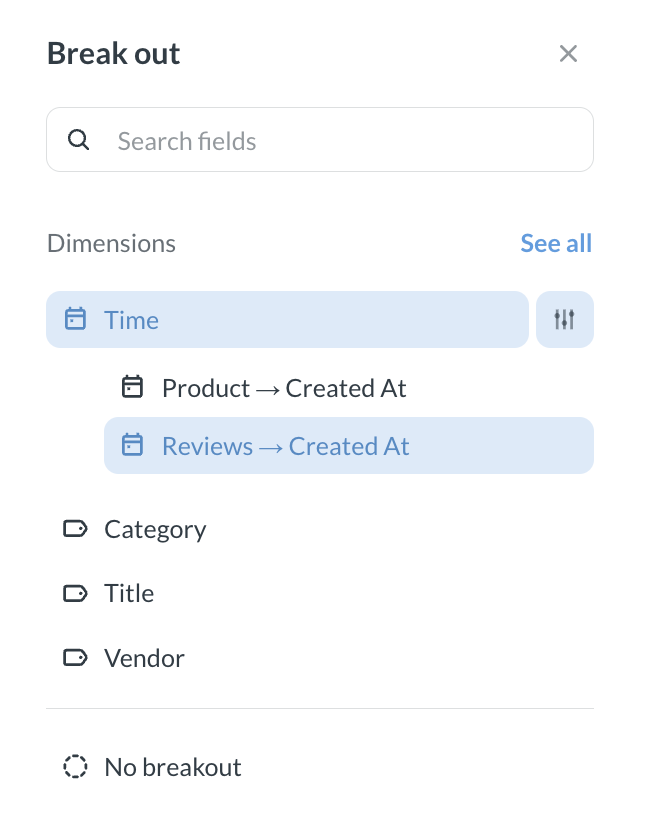
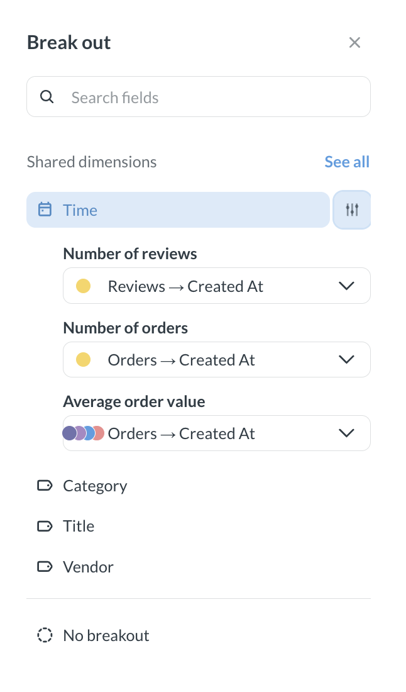

# Metrics explorer

The metrics explorer is a space for ad-hoc analysis of [metrics](../data-modeling/metrics.md) and [measures](../data-studio/measures.md)

The metrics explorer can help you visualize trends and breakdowns of different metrics and measures from one or more data sources. For example, you might want to see how the revenue trend compares to changes in customer sentiment for different products.

You can:

- [Explore metrics and measures along their dimensions](#explore-a-metric-or-a-measure)
- [Compare multiple metrics and measures](#compare-metrics-and-measures)
- [Do math with metrics](#calculations-with-metrics-and-measures)
- [Break out by additional dimensions](#break-out-by-dimensions)
- [Filter each metric or measure](#filter-metrics-and-measures)
- Zoom into time periods

The metric explorer is intended for ad hoc exploration and analysis. Currently, you can't save the results of your explorations. You can use the [query builder](../questions/query-builder/editor.md) to create saved explorations.

To share your metric explorations with people in your organization, you can copy the link (which will look like `[your-metabase-URL]/explore#abunchofcharacters`). The link encodes your explorations, so other people will be able to see what you see.

## Explore a metric or a measure

In the metrics explorer, you can explore how a measure or metric varies across dimensions.

To open a **metric** in the Metrics Explorer:

1. Navigate to the metric's home page.

   To get to the metric's home page, you can click on a metric from its collection, from the [metrics browser](../data-modeling/metrics.md#see-all-metrics), or from search.

2. To view the metric in the explorer, click **Explore** in the top right corner.

To return to the metric's home page, click the metric card in the search bar and select **Go to metric home page**.

To open a **measure** in the metrics explorer:

1. Navigate to the measure in **Data studio > Tables > [Your table] > Measures**.
2. Select your measure.
3. On the measure's page, click **three dots** next to the measure's name and select **Explore**.

When you open a measure or metric in the Metrics explorer, Metabase plots it along the most appropriate dimension. To change how the metric is broken out, click the current breakout dimension in the bottom controls to open the **Break out** sidebar. 

By default, the sidebar lists all available dimensions. The heading reads **Dimensions** when you select a single metric or measure, or **Shared dimensions** when you compare multiple metrics or measures. 

To break out by a column that isn't listed, click **See all**. This shows every column from the table the metric or measure is built on, and any related tables. To see the total result without any dimensions, select **No breakout**.

You can also [break out](#break-out-by-dimensions) a metric/measure by additional dimensions or [filter the metric/measure](#filter-metrics-and-measures).

Column labels are hidden from the visualization by default. To show them, open the **...** menu in the bottom controls and enable the **Show column labels** toggle.

### Time and country dimensions

Metabase collapses all time columns into a single **Time** bucket and all country columns into a single **Country** bucket. 

- A column appears in the **Time** bucket based on its data type, so any date or datetime column is included. 
- A column appears in the **Country** bucket based on its semantic type, so the **Country** bucket only appears when a column has the **Country** semantic type. 

To break out by a specific time or country column, click the slider button next to **Time** or **Country** and choose one.

## Compare metrics and measures

To compare multiple metrics or measures:

1. [Open one of the metrics/measures in the metrics explorer](#explore-a-metric-or-a-measure).
2. Click the top search bar and search for another measure or metric you want to add.

3. Press **Enter** or click **Run** in the search bar.

   

You can add the same metric/measure multiple times. This is useful if you want to [break out](#break-out-by-dimensions) or [filter](#filter-metrics-and-measures) the metric, while keeping the total trend visible. For example, you might want to compare the trend of total revenue to the revenue of a single product category.

Once you pick the metrics or measures, open the **Break out** sidebar to choose a dimension to compare them by. Metabase matches dimensions across metrics/measures differently depending on the column type:

- **Compare across different time or country columns.** If your metrics/measures have time or country dimensions, you can choose which column each metric/measure uses for the comparison, even if they're different columns. For example, you can compare Orders by their order date with Reviews by their review date. Click the slider icon next to **Time** or **Country** to choose a dimension for each metric/measure.
  
- **Other columns require an exact match.** The column appears as a comparison option under **Shared dimensions** only if both metrics/measures have it. To break out by a column that only one metric/measure has, click **See all** and select that column. Metabase applies the breakout to that metric/measure and disables the other.

Metabase treats dimensions as shared when the metrics or measures come from the same data source, or when their data sources have foreign key relationships to a common data source.

You can [filter](#filter-metrics-and-measures) or [break out](#break-out-by-dimensions) each metric/measure separately, or [do simple calculations with metrics/measures](#calculations-with-metrics-and-measures).

## Break out by dimensions

You can also break out each metric by additional dimensions. For example, you might want to compare overall revenue to the number of orders for each product category.

To break out a metric or measure by additional dimensions:

1. Click the metric's card in the search bar.
2. Select **Add a series breakout**
   
3. Choose the breakout dimension.

To remove the breakout, click on the measure/metric card in the search bar again and select **Remove series breakout**.

## Filter metrics and measures

You can add filters to each metric/measure in the metrics explorer. For example, you might want to compare overall revenue trend to number of orders for one specific product category.

To add a filter to a metric or measure:

1. Click the **filter** icon in the top right corner of the metrics explorer.
2. Select the metric/measure you want to filter.
3. Select the field to filter and define the filter.

You'll see the filter added below the metric or measure's card in the search bar. To remove the filter, click the **X** on the filter's card.

## Calculations with metrics and measures

You can use the four basic math operations (`+`,`-`,`*`,`/`) on metrics/measures in the metrics explorer. For example, you can explore how revenue per user, `Revenue / Active users`, changes with time.

The metrics explorer is especially useful when metrics and measures are associated with different data sources, likeif you have a  "Revenue" metric on the `Subscriptions` table and an "Active users" metric on the `Events` table. If you were to compare these metrics in the query builder, you'd have to wrangle their tables with joins, but the metrics explorer lets you compare these metrics by just typing out a formula.

To write an expression with metrics/measures, just start entering the formula into the search bar. You can use `+`,`-`,`*`,`/`, parentheses, numbers, or other metrics (including using the same metric multiple times). To visualize the results, just press Enter.

To edit the expression, click on the expression's card in the search bar and click **Edit**.

You can also rename your expressions. For example, you might want to rename your formula `Revenue / Active users` as `Per user revenue`. To rename the expression, click the expression's card in the search bar, click **Rename**, and type the new name.
