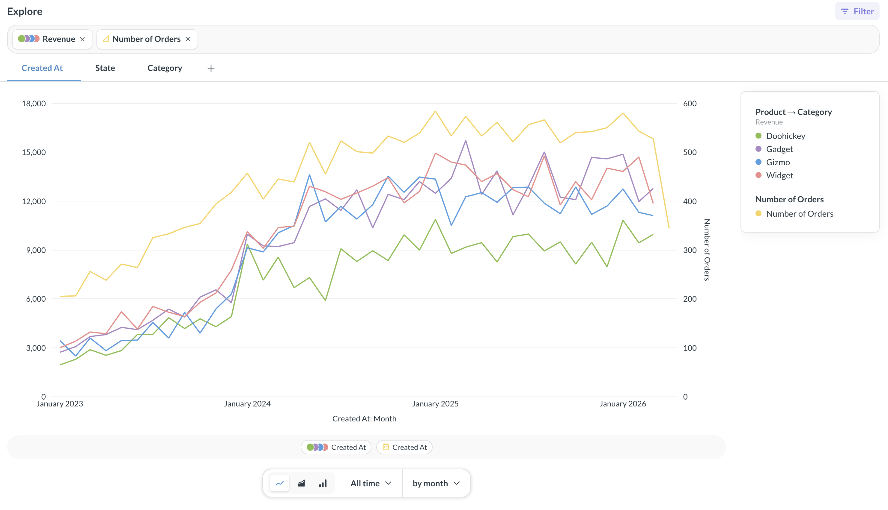
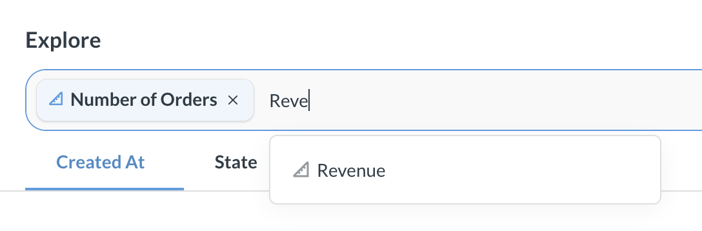
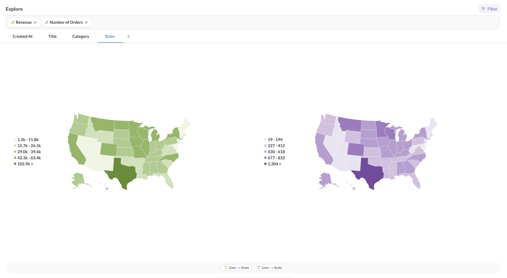
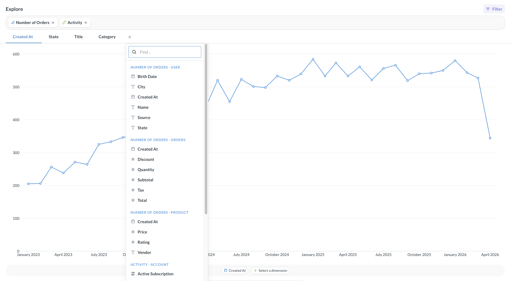
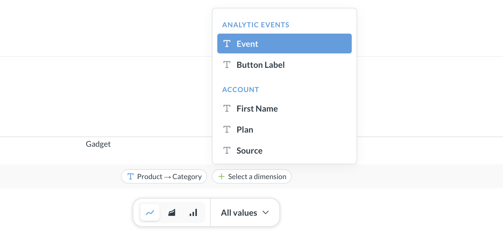
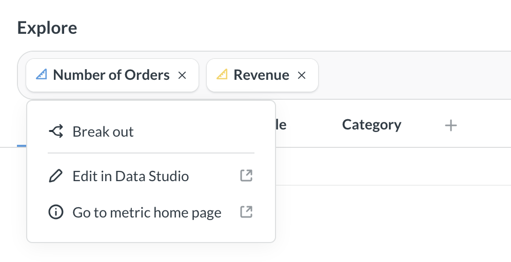
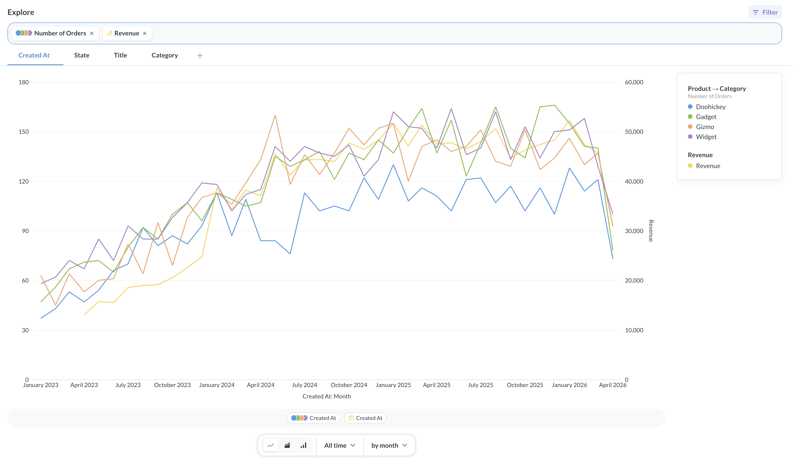
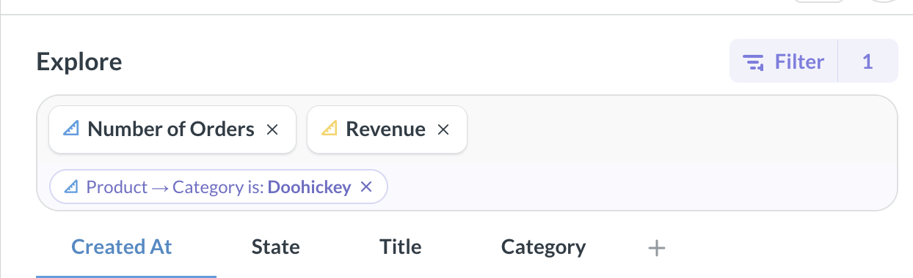

# Metrics explorer

The metrics Explorer is a space for ad-hoc analysis of [metrics](../data-modeling/metrics.md) and [measures](../data-studio/measures.md)

The metrics explorer can help you visualize trends and breakdowns of different metrics and measures from one or more data sources. For example, you might want to see how the revenue trend compares to changes in customer sentiment for different products.

You can:

- [Explore metrics and measures along their dimensions](#explore-a-metric-or-a-measure)
- [Compare multiple metrics and measures](#compare-metrics-and-measures)
- [Break out by additional dimensions](#break-out-by-dimensions)
- [Filter each metric or measure](#filter-metrics-and-measures)
- Zoom into time periods

The metric explorer is intended for ad hoc exploration and analysis. Currently, you can't save the results of your explorations. You can use the [query builder](../questions/query-builder/editor.md) to create saved explorations.

To share your metric explorations with people in your organization, you can copy the link (which will look like `[your-metabase-URL]/explore#abunchofcharacters`). The link encodes your explorations, so other people will be able to see what you see.

## Explore a metric or a measure

To open a **metric** in the Metrics Explorer:

1. Navigate to the metric's home page.

   To get to the metric's home page, you can click on a metric from its collection, from the [metrics browser](../data-modeling/metrics.md#see-all-metrics), or from search.

2. Click **Explore** in the top right corner to open the metrics explorer

To get back to the metric's page from metrics explorer, right-click the metric card in the search bar and select **Go to metric home page**.

To open a **measure** in the metrics explorer, go directly to `[your metabase URL]/explore` and type the measure's name in the search bar. To get back to the measure definition from metrics explorer, right-click the measure card in the search bar and select **Edit in Data Studio**.

## Compare metrics and measures

To compare multiple metrics or measures, search for measure or metric you want to add in the search bar.

You'll see the dimensions of the first metric/measure below the search bar. You can pick a dimension to break out the metrics/measures (for example, if you want to see how both Number of Orders and Revenue change by date, state, or product category).

Metabase will automatically detect shared dimensions and offer them for comparison, like when the metrics/measures are associated with the same data source, or the underlying data sources have foreign key relationships to another shared data source.

If your metrics/measures don't have shared dimensions, you'll need to select a dimension for comparison:

1. Click on the **+** under the search bar to select a dimension for the first metric/measure.

   

2. At the bottom of the screen, select compatible dimensions for other metrics/measures.

   

When your metrics/measures don't have shared dimensions, Metabase has no way of knowing how the dimensions relate to each other, so it's on you to make sure the dimensions you pick make sense to compare!

## Break out by dimensions

You can also break out each metric by additional dimensions. For example, you might want to compare overall revenue to the number of orders for each product category.

To break out a metric or measure by additional dimensions:

1. Right-click on the metric's card in the search bar.
2. Select **Break out**
   
3. Choose the breakout dimension.

To remove the breakout, right-click on the measure/metric card again and select **Remove breakout**

## Filter metrics and measures

You can add filters to each metric/measure in the metrics explorer. For example, you might want to compare overall revenue trend to number of orders for one specific product category.

To add a filter to a metric or measure:

1. Click the **filter** icon in the top right corner of the metrics explorer.
2. Select the metric/measure you want to filter.
3. Select the field to filter and define the filter.

You'll see the filter added below the metric or measure's card in the search bar. To remove the filter, click the **X** on the filter's card.

