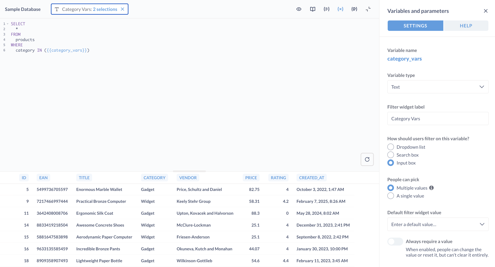

# Basic SQL parameters

> If you want to filter on a database field in your query, you should prefer using [field filter variables](./sql-parameters.md), which require a different syntax.

Text, number, and date variables let you plug basic values into your SQL code.

To add a basic variable to a SQL query, enclose the variable in double braces: `{{variable_name}}`.

This example defines a **Text** variable called `category_filter` (but you can call the variable whatever you want):

```sql

SELECT
  count(*)
FROM
  products
WHERE
  category = {{category_filter}};

```

These basic variabless simply plug in the values set by the widget into the placeholder in the code. Basic variables have a different syntax than [field filters](./sql-parameters.md).

Here's the [field filter](./field-filters.md) syntax:

```sql

WHERE
  {{category}}

```

Whereas the basic variable syntax includes an `=` operator:

```sql

WHERE
  category = {{category}};

```

Here, we don't connect the variable to a database field; we merely insert the value into the variable.

Metabase will read the variable and attach a filter widget to the query, which people can use to change the value inserted into the `category` variable. So if someone enters "Gizmo" into the filter widget, the query Metabase would run would be:

```sql
SELECT
  count(*)
FROM
  products
WHERE
  category = 'Gizmo';
```

If you're writing a native MongoDB query, your query would look more like this, with the `category` variable being defined inside the `match` clause:

```
[{ $match: { category: {{category}} } }]
```

## Basic variable that allows people to select multiple values



To let people plug multiple values into your variable, you'll need to write the code in such a way that multiple values will make sense when interpolated into your code. The most common way to do this would be to use an `WHERE` clause with `IN`:

```sql

SELECT
  *
FROM
  products
WHERE
  category IN ({{category_vars}});

```

With your code in place, you'll need to set the **People can pick** setting to multiple values. In this case, however, you're probably better off using a [field filter](./field-filters.md).

## Basic SQL variables offer limited options for filter types

- **Text**: a plain input box
- **Number**: a plain input box
- **Date**: a simple date picker
- **Boolean**: a this or that picker.

If you want a more expressive filter widget, like a dynamic date picker, you should use a [field filter variable](./field-filters.md).

## Making a variable optional

See [optional variables](./optional-variables.md).
