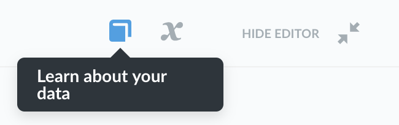
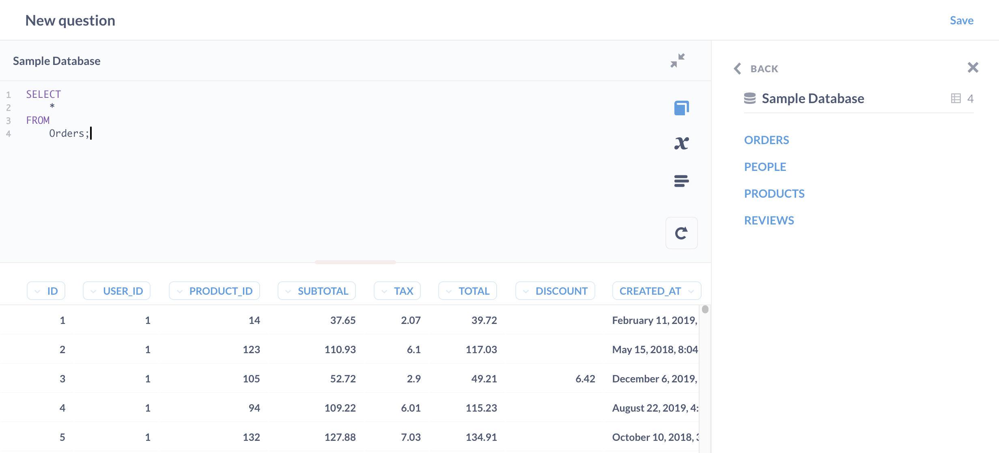
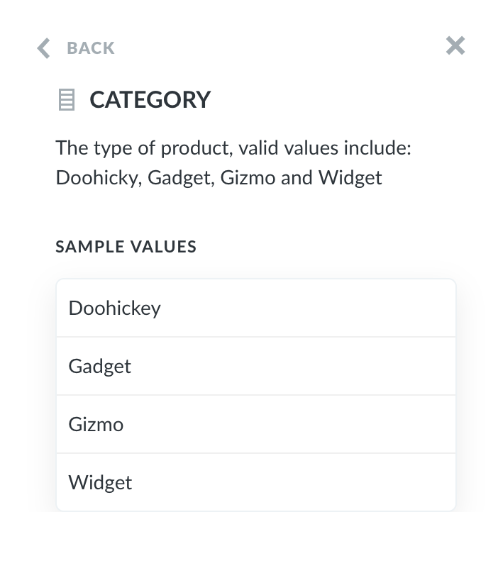

## Data reference

Sometimes when you're writing a SQL query, you might forget the exact names of different tables or columns, or which table contains what. That’s where the _data reference_ comes in handy. You can open the data reference panel from the SQL editor by clicking on the book icon in the top right corner of the editor when it's open.

This panel lists all the databases you have access to and the tables and columns inside of them.

Click on the table you would like to explore further to see a description of it and a list of all the columns it has. Each table or column will only contain a description if your admin wrote something in the Data Model section of the Admin Panel.

If you click on a column you’re interested in, you’ll see a description of its contents, as well as a list of sample values for columns that don't have a huge number of distinct values.

### Foreign keys

You can find a list of connections to other tables (i.e., [foreign key](/glossary/foreign_key) relationships) under **Connected to these tables**. If there’s a column in the table you’re looking at that’s included in another table, Metabase will display this section in the sidebar. Note that connections are managed by your Metabase admin. If a foreign key relationship exists in your database, but not in your Metabase, your Metabase admin will need to update your [Metabase data model](../../data-modeling/metadata-editing.md).
