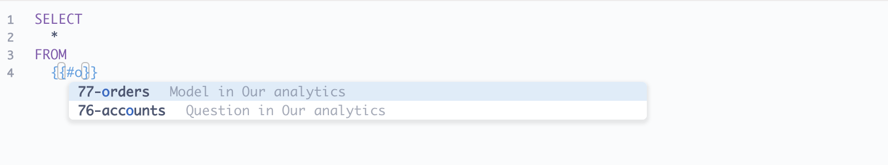

## Referencing models and saved questions

With SQL databases, we can use a [model][model] or an existing question as the basis for a new query, or as a common table expression [CTE][CTE].

For example, let's say we have a lot of data spread across a number of tables, but people are most interested in a subset of that data. We can perform a complicated query once to return those results, and save that question as a model, which people can refer to in their queries just like they would with any other table.

## Search for models and questions as you type

First, create and save a question or model that returns the result set you'd like to make available for people to query.

To reference that question or model in a SQL query, use typeahead search in a variable prefixed with `#`.

Type `{{#your search term }} ` and Metabase will display a list of models and questions relevant to your search term.



You can also find the question or model ID by navigating in Metabase to the model or question you'd like to reference in your query. The ID is in the URL in your browser's address bar. The ID will be the number after `/model/` or `/question/`. E.g., for `https://metabase.example.com/model/12345-example-name`, the model's ID would be `12345`.

Only the `#` and `ID` is required. Metabase just displays the model or question name to make the query more readable.

## Model, table, or saved question as a Common Table Expression (CTE)

The same syntax can be used in [Common Table Expressions (CTEs)](https://www.metabase.com/learn/sql-questions/sql-cte) (with SQL databases that support CTEs):

```
WITH gizmo_orders AS {{#5-gizmo-orders-in-2019}}
SELECT count(*)
FROM gizmo_orders
```

When this query is run, the `{{#5-gizmo-orders-in-2019}}` tag will be substituted with the SQL query of the referenced question, surrounded by parentheses. So it'll look like this under the hood:

```
WITH gizmo_orders AS (SELECT *
FROM   orders AS o
       INNER JOIN products AS p
               ON o.product_id = p.id
WHERE  p.category = 'Gizmo'
       AND o.created_at BETWEEN '2019-01-01' AND '2019-12-31')
SELECT count(*)
FROM gizmo_orders
```

## Limitations and tradeoffs

- You can only reference a model or saved question in a query when working with a SQL database like PostgreSQL, MySQL, Snowflake or SQL Server.
- The model or saved question you select has to be one that's based on the same database as the one you've currently selected in the native query editor.
- You cannot refer to variables in sub-queries. You only have access to the _results_ of the model or saved question, not the model or saved question's query. For example, if you have a saved question that uses a [field filter](https://www.metabase.com/learn/building-analytics/sql-templates/field-filters), you won't be able to reference that variable. If you need to change how the saved question has filtered the results, you'll need to update (or duplicate) that question and apply the filter.

## Further reading

- [Models](../../data-modeling/models.md)
- [SQL Snippets](https://www.metabase.com/learn/building-analytics/sql-templates/sql-snippets.html)
- [SQL Snippets vs Saved Questions vs. Views](https://www.metabase.com/learn/building-analytics/sql-templates/organizing-sql.html)
- [SQL troubleshooting guide](../../troubleshooting-guide/sql.md).
- [Segments and Metrics](../../data-modeling/segments-and-metrics.md)


[cte]: https://www.metabase.com/learn/sql-questions/sql-cte
[model]: ../../data-modeling/models.md
