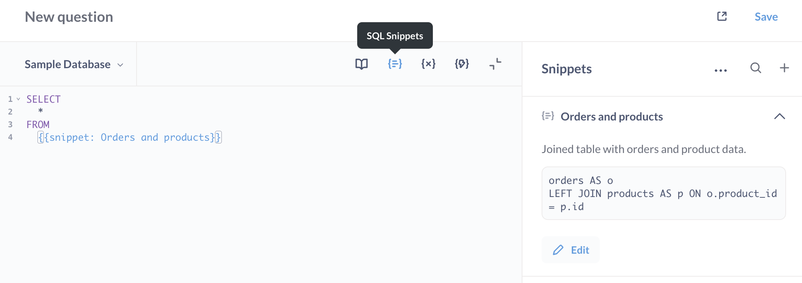
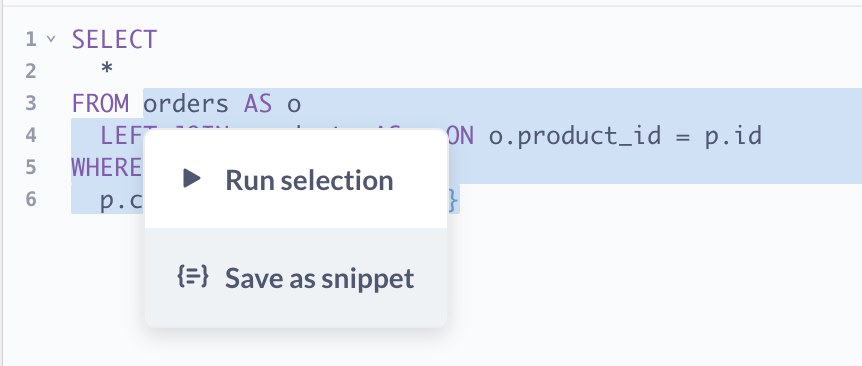
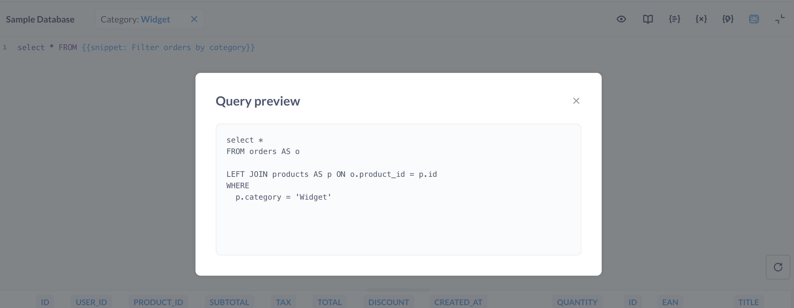
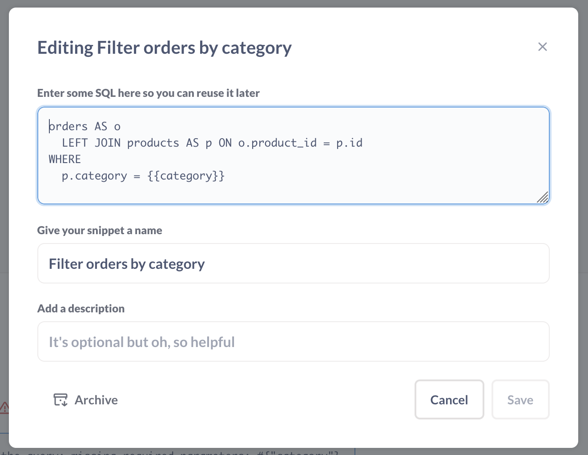
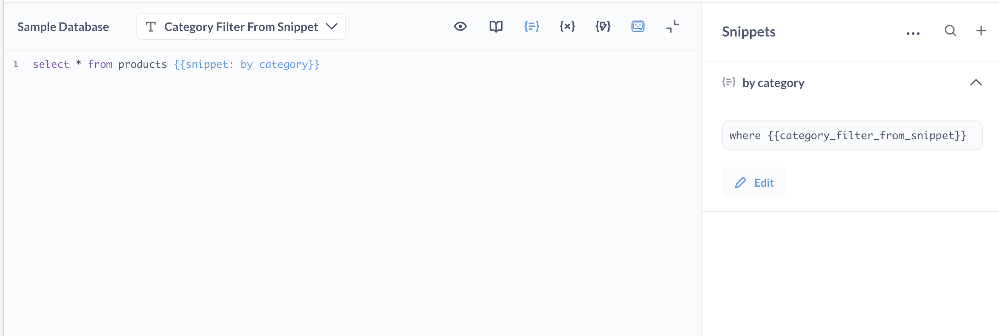

# Snippets



**Snippets** are reusable bits of SQL or native queries. Anyone with permissions to the [native editor](./writing-sql.md) can create and edit snippets, which are then available for all native query authors.

For example, if you frequently write queries that involve multiple tables, you can save the SQL code that joins those tables as a snippet so that you (and others in your organization) can reuse that code in multiple questions.

You can use snippets to define standardized KPIs and filters using SQL, just like you do with [metrics](../../data-modeling/metrics.md) and [segments](../../data-modeling/segments.md) in the query builder. For example, you may want to store exactly how you calculate revenue, or what constitutes an active user.

You can also use snippets to define a set of reusable filters for SQL questions.

## Create a snippet

In the [**native editor**](./writing-sql.md):

1. Open the native editor by clicking **+ New > SQL query** or **+ New > Native query** in the top right corner.
2. Write some SQL or native code and highlight a section of code that you want to save to reuse later. The section doesn't have to be a whole query. For example, you can highlight:

   ```sql
   orders AS o
   LEFT JOIN products AS p ON o.product_id = p.id
   WHERE p.category = {{category}}
   ```

   Within a snippet, you can use:

   - [SQL parameters](#sql-parameters-in-snippets), like `{{param}}`,
   - references to other snippets, like `{{snippet: orders}}` (Metabase will detect and disallow circular references),
   - [references to saved questions or models](./referencing-saved-questions-in-queries.md), like `{{#123-orders-model}}`.

3. Right-click on the highlighted section and select **Save as snippet** to create a snippet.

   

4. Name and describe your snippet. Snippet names must be unique (even names of archived snippets).
5. Save.

You can also create a new snippet from the Snippet sidebar:

1. Open the native editor by clicking **+ New > SQL query** or **+ New > Native query**in the top right corner.
2. Open the Snippet sidebar by clicking the **Snippets** button above the editor window
3. Enter the code that you want to save as a reusable snippet.
4. Save.

## Use a snippet

You can insert a saved snippet into your query, which will add a `{{snippet: }}` reference:

```sql
SELECT
  *
FROM
 {{snippet: orders and products}}
```

To add a snippet to your native code, start typing `{{snippet: }}` and Metabase will present autocomplete options for available snippets.

Metabase is sensitive to whitespace in snippet references, so you should type `{{snippet: Products}}`, with no space between `{{` and `snippet`, and with a space between `:` and snippet's name.

When you execute the query, behind the scenes Metabase replace the snippet reference with the snippet's SQL.

You can also just pick a snippet to insert from the snippet sidebar:

1. Open the snippet sidebar by clicking on the **Snippets** button above the editor window.
   
2. Search for the snippet. Note that search results only include snippets that you have permissions to see.
3. Hover over a snippet and click on the arrow to the left of snippet's name to insert it into your query.

If you use aliases in a snippet, you'll need to refer to those aliases in the larger query. For example, if a snippet aliases `products AS p`, code outside of the snippet will need to use the alias `p` to refer to columns in that table (as in `p.column_name`).

## Preview a query with snippets

Metabase will keep the snippet as a reference and will not show you the full query - with snippet's code substituted - in the SQL editor itself. You can see the full query that Metabase will send to the database by clicking on the **Eye** icon above the editor.



## Edit snippets

Editing snippets is a great way to make changes to many questions at once. If, for example, you've saved the SQL code to pull user data from tables X, Y, and Z as the snippet `User Data`, but you need to change how that data is pulled (such as by adding data from another column or table), you can update the SQL code in the snippet, and all questions that use the snippet `User Data` will have the updated code.



To edit a snippet:

1. Open the snippet sidebar by clicking on the **Snippet** icon above the editor window.

2. Search for the snippet. Search results only include snippets you have permission to edit.

3. Click the **down arrow** to the right of the snippet name, then click **Edit**.

   You can change the code, snippet name, and snippet description.

- **Editing a snippet's name**. Changing a snippet's name will update the snippet's name in every question that uses that snippet. Renaming a snippet won't break any existing _questions_ that reference this snippet, but it will **break other snippets** that reference this snippet.

- **Editing a snippet's code.** Here's where we have to remind you that with great power comes great responsibility. There is one major caveat when editing snippets, worthy of a callout: if you edit a snippet and include broken code, you will break every question that uses that snippet. Make sure to test your code before saving it to an existing snippet.

## Archive snippets

Archiving snippets can help keep dated or less relevant snippets out of the way.

When you archive a snippet, the snippet no longer populates in the snippet autocomplete dropdown, and the snippet will no longer show up in the list of snippets in the sidebar. Archiving a snippet does **not** affect any existing queries that use the snippet, so you can safely archive a snippet without impacting any questions.

To archive a snippet:

1. Open the snippet sidebar by clicking on the **Snippet** icon above the editor window.
2. Search for the snippet.
3. Click the **down arrow** to the right of the snippet name, then click **Edit**.
4. Click **Archive**

You can access an archived snippet from the snippet sidebar menu by clicking on the archived button in the bottom left of the sidebar.

Although there is no way to delete a snippet, you can archive and unarchive a snippet at any time.

Two snippets cannot share the same name, as even if a snippet is archived, that snippet might still be active in questions.

## SQL parameters in snippets

You can reference [SQL parameters](sql-parameters.md) in snippets. For example, you can save a snippet with SQL code like

```sql
 
WHERE
  {{created_at}}
AND category = {{category}}
GROUP BY {{time_grouping}}

```

When a snippet with parameters is added to a SQL query, Metabase will show a widget for the snippet's parameter.



You'll be able to specify the type, connected columns, and default values for the parameters coming from snippets in the query's Variables sidebar.

Settings for snippet parameters are defined by the query, not the snippet, so settings aren't shared between queries that use the same snippet. For example, if you have a snippet like:

```sql
WHERE {{created_at}}
```

you could put the snippet in one query and have the snippet parameter map to a `CREATED_AT` column, and put the snippet in another query and have that same snippet parameter map to a different column, like `CANCELED_AT`.

If you have multiple snippets containing parameters with the same name, the question using those snippets will only use one instance of the parameter. For example, if `{{snippet: 1}}` contains parameter `{{var}}` and `{{snippet: 2}}` also contains parameter `{{var}}`, the question will display only one `{{var}}` parameter and use its value in both snippets.

### Sharing parameters across questions

You can also use snippets to share parameters across multiple SQL questions, including questions that build on one another (nested questions). For example, you have a question “Orders by date” that filters orders using `{{start_date}}`. You then create another question, say “Revenue by product,” that uses the results from “Orders by date.” To keep using the same `{{start_date}}` parameter in both questions, move the SQL that contains the parameter from “Orders by date” into a snippet and update both questions to reference that snippet. Now, both questions surface the same parameter, and a single dashboard date filter can control both cards that use the snippet.

## Snippet permissions

Any user who has native editor permissions to at least one of your connected databases will be able to view the snippets sidebar, and will be able to create, edit, and archive or unarchive any and all snippets — even snippets intended to be used with databases the user lacks SQL editing access to.

Some plans contain additional functionality for organizing snippets into folders and setting permissions on those folders. See our [docs on Snippet folders and permissions](../../permissions/snippets.md).

## Why use Snippets?

Snippets are good for:

- **Standardization**

  How does your organization define a popular product? Is it by number of units sold? Or by reviews with an average rating greater than 4? You can define those qualifications for a popular product and codify them in a Snippet, `{{snippet: popular products}}`, and have that code populate in every question that uses that snippet. If down the line this definition needs to change, simply update the snippet’s SQL, and the change will propagate to all questions that use that snippet.

  Similar to how [segments](../../data-modeling/segments.md) (a named filter or set of filters) and [metrics](../../data-modeling/models.md) (a named computation) can standardize analytics in your organization, snippets offer a way to ensure correctness and consistency of SQL across teams.

- **Efficiency**

  Do you find yourself copying and pasting SQL code often? Don’t want to bother remembering which foreign keys map to which tables? Write that complicated join once, save it as a snippet, and summon the snippet as needed.

- **Education**

  Snippets can level up folks who are new to SQL (or even experienced analysts) by exposing them to your organization’s “canonical SQL,” or to more efficient or more complex queries. Reading, copying, and building upon quality code is one of the best ways to develop skills. It can also save your organization time: people can copy a snippet’s code, modify it to obtain different results, and save that code as a new snippet for others to use.

## Learn more

- [Snippets vs Saved Questions vs Views](https://www.metabase.com/learn/metabase-basics/querying-and-dashboards/sql-in-metabase/organizing-sql).
- If you're having trouble with your SQL query, go to the [SQL troubleshooting guide](../../troubleshooting-guide/sql.md).
