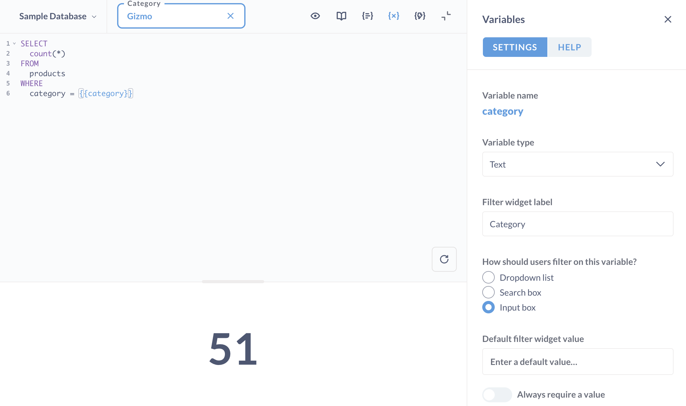
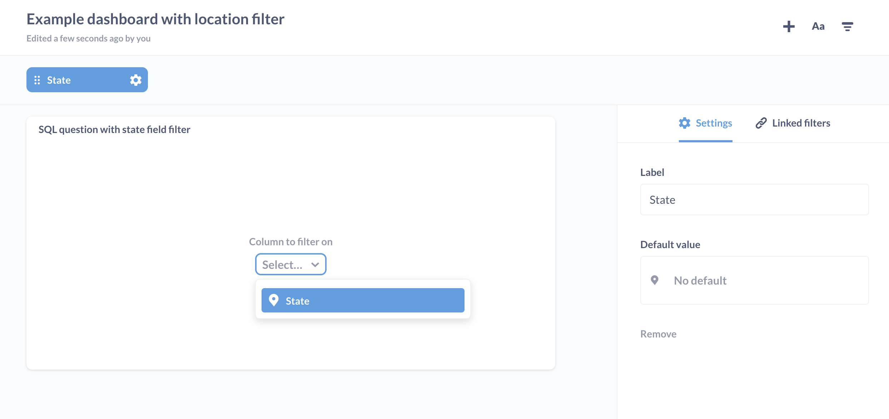

# SQL parameters

You can create SQL templates by adding variables to your SQL queries in the [Native/SQL editor][sql-editor]. These variables will create filter widgets that you can use to change the variable's value in the query. You can also add parameters to your question's URL to set the filters' values, so that when the question loads, those values are inserted into the variables.



## Defining variables

Typing `{{variable_name}}` in your native query creates a variable called `variable_name`.

Field Filter, a special type of filter, have a [slightly different syntax](#field-filter-syntax).

This example defines a **Text** variable called `cat`:

```
SELECT count(*)
FROM products
WHERE category = {{cat}}
```

Metabase will read the variable and attach a filter widget to the query, which people can use to change the value inserted into the `cat` variable with quotes. So if someone entered "Gizmo" into the filter widget, the query Metabase would run would be:

```
SELECT count(*)
FROM products
WHERE category = 'Gizmo'
```

If you're writing a native MongoDB query, your query would look more like this, with the `cat` variable being defined inside of the `match` clause.

```
[{ $match: { category: {{cat}} } }]
```

## Setting SQL variables

To set a SQL variable to a value, you can either:

- Enter a value into the filter widget, and re-run the question, or
- Add a parameter to the URL and load the page.

To add a value to the URL, follow this syntax:

```
?variable_name=value
```

For example, to set the `{{cat}}` variable on a question to the value "Gizmo", your URL would look something like:

```
https://metabase.example.com/question/42-eg-question?cat=Gizmo
```

To set multiple variables, separate parameters with an ampersand (`&`):

```
https://metabase.example.com/question/42-eg-question?cat=Gizmo&maxprice=50
```

## SQL variable types

When you define a variable, the **Variables** side panel will appear. You can set a type for a variable, which changes the kind of filter widget that Metabase presents.

There are four types of variables:

- **Text**: a plain input box.
- **Number**: a plain input box.
- **Date**: a simple date picker. If you want a more expressive date picker, like specifying a range, you'll want to use a Field Filter.
- **[Field Filter](#the-field-filter-variable-type)**: different filter widgets, depending on the mapped field.

That last variable type, [Field Filter](#the-field-filter-variable-type), is special; it lets you create "smart" filter widgets, like a search box, or a dropdown menu of values, or a dynamic date picker that allows you to specify a date range.

You can include multiple variables in the query, and Metabase will add multiple filter widgets to the question. When you have multiple filter widgets, you can click on a filter widget and drag it around to rearrange the order.

### Optional clauses

You can make a clause optional in a query. For example, you can create an optional `WHERE` clause that contains a SQL variable, so that if no value is supplied to the variable (either in the filter or via the URL), the query will still run as if there were no `WHERE` clause.

To make a clause optional in your native query, type `[[brackets around a {{variable}}]]`. If you input a value in the filter widget for the `variable`, then the entire clause is placed into the template; otherwise Metabase will ignore the clause.

In this example, if no value is given to `cat`, then the query will just select all the rows from the `products` table. But if `cat` does have a value, like "Widget", then the query will only grab the products with a category type of Widget:

```
SELECT count(*)
FROM products
[[WHERE category = {{cat}}]]
```

To use multiple optional clauses, you must include at least one regular `WHERE` clause followed by optional clauses, each starting with `AND`:

```
SELECT count(*)
FROM products
WHERE true
  [[AND id = {{id}}]]
  [[AND {{category}}]]
```

That last clause uses a Field filter (note the lack of a column in the `AND` clause). When using a field filter, you must exclude the column in the query; you need to map the variable in the side panel.

If you're using MongoDB, you can make an clause optional like so:

```

[
    [[{
        $match: {category: {{cat}}}
    },]]
    {
        $count: "Total"
    }
]

```

Or with multiple optional filters:

```

[
    [[{ $match: {{cat}} },]]
    [[{ $match: { price: { "$gt": {{minprice}} } } },]]
    {
        $count: "Total"
    }
]

```

## Setting a default value in the filter widget

In the variables sidebar, you can set a default value for your variable. This value will be inserted into the corresponding filter widget by default (even if the filter widget is empty). You'll need to insert a new value into the filter widget to override the default.

## Setting complex default values in the query

You can also define default values directly in your query by enclosing a comment inside the end brackets of an optional parameter:

```
WHERE column = [[ {{ your_parameter }} #]]your_default_value
```

This is useful when defining complex default values (for example, if your default value is a function like `CURRENT_DATE`).

Here's a PostgreSQL example that sets the default value of a Date filter to the current date using `CURRENT_DATE()`:

```
SELECT *
FROM accounts
WHERE DATE(created_at) = [[ {{dateOfCreation}} #]]CURRENT_DATE
```

Note that the hash (`#`) used to comment the text might need to be replaced by the comment syntax specific to the database you're using. Some databases use double-dashes (`--`) as comment syntax.

## The Field Filter variable type

Setting a variable to the "Field Filter" type allows you to map the variable to a field in any table in the current database, and lets you create a "smart" filter widget that makes sense for that field.

Field Filter variables should be used inside of a `WHERE` clause in SQL, or a `$match` clause in MongoDB.

### Field Filter compatible types

Field Filters ONLY work with the following field types:

- Category
- Entity Name
- Entity Key
- Foreign Key
- City
- State
- ZIP or Postal Code

The field can also be a date or timestamp, which can be left as "No semantic type" in the Table Metadata.

When you set the **Variable type** to "Field Filter", Metabase will present an option to set the **Field to map to**, as well as the **Filter widget type**. The options available for the Filter widget type depend on the field's type. For example, if you map to a field of type Category, you'll see options for either "Category" or None. If you map to a Date Field, you'll see options for None, Month and year, Quarter and year, Single date, Date range, or Date filter.

If you're not seeing the option to display a filter widget, make sure the mapped field is set to one of the above types, and then try manually syncing your database from the "Databases" section of the Admin Panel to force Metabase to scan and cache the field's values.

If you want to map a Field Filter to a field that isn't one of the compatible types listed above, you'll need an Admin to change the field type for that column. See [metadata editing](../../data-modeling/metadata-editing.md).

## Field Filter syntax

Let's say you want to create a Field Filter that filters the `People` table by state, and you want people to be able to select multiple states at a time. Here's the query:

The syntax for Field Filters differs from a Text, Number, or Date variable.

```
SELECT *
FROM PEOPLE
WHERE {{state}}
```

Then, in the side panel, select the "Field Filter" variable type, and choose which field to map your variable to (in this case, `State`).

Note the lack of the column and operator (like `=`). The reason you need to structure Field Filters this way is to handle cases where Metabase generates the code for you. For example, for handling cases where someone selects multiple values in the filter widget, or a range of dates. With Field Filters, you can't control the generated SQL, so if you need greater control, you should use one (or more) Text, Number, or Date variables.

A MongoDB native query example might look like this:

```
[ {$match: {{date_var}} } ]
```

For a more in-depth guide, check out [Field Filters: create smart filter widgets for SQL questions][field-filter].

## How to create different types of filter widgets

The kind of filter widget that Metabase displays when you create a Field Filter widget depends on a setting for that field in Metabase called **Filtering on this field**. Admins can set this field option to:

- Plain input box
- Search box
- A list of all values (also known as a dropdown menu)

Date fields will either have a simple date filter (for Date variables) or a dynamic date picker (for Field Filters mapped to a date field).

If you want to change the filter widget for a particular field, you'll need to ask an Admin to update that field in [the Table Metadata](../../data-modeling/metadata-editing.md) and set the desired "Filtering on this field" option.

### Filter widget with plain input box

Create a simple **Text** or **Number** variable. Additionally, you can use a Field Filter with a field that has its **Filtering on this field** value set to "Plain input box".

Note: to guard against SQL injection attacks, Metabase converts whatever is in the Search box to a string. If you want to use wildcards, check out [our Learn article][basic-input].

### Filter widget with search box

- Include a SQL variable in your query.
- Set the **Variable type** to **Field Filter**.
- Set the **Field to map to** to a field of type "Category" that has its **Filtering on this field** option set to "Search box"

### Filter widget with dropdown menu and search

To create a dropdown menu with search and a list of all values, you need to:

- Include a SQL variable in your query.
- Set the **Variable type** to **Field Filter**.
- Set the **Field to map to** to a field of type "Category" that has its **Filtering on this field** option set to "A list of all values".
- Set the **Filter widget type** to "Category".

If the field you want to create a dropdown for is not set to the type "Category" with **Filtering on this field** set to "A list of all values", an Admin will need to update the settings for that field. For example, if you want to create a dropdown menu for an incompatible field type like an Email field, an admin will need to change that field type to "Category", set the **Filtering on this field** option to **A list of all values**, then re-scan the values for that field.

If however, there are too many different values in that column to display in a dropdown menu, Metabase will simply display a search box instead. So if you have a lot of email addresses, you may just get a search box anyway. The dropdown menu widgets work better when there's a small set of values to choose from (like the fifty U.S. states).

## Field filter limitations

Some things that could trip you up when trying to set up a Field Filter variable.

### Table aliases

You won't be able to select values from field filters in queries that use table aliases for joins or CTEs.

The reason is that field filters generate SQL based on the mapped field; Metabase doesn't parse the SQL, so it can't tell what an alias refers to. You have three options for workarounds, depending on the complexity of your query.

1. Use full table names.
2. Replace CTEs with subqueries.
3. Create a view in your database, and use the view as the basis of your query.

### Include dependencies in your query

Your main query should be aware of all the tables that your Field Filter variable is pointing to, otherwise you'll get a SQL syntax error. For example, let's say that your main query includes a field filter like this:

```
SELECT *
FROM ORDERS
WHERE {{ product_category }}
```

Let's say the `{{ product_category }}` variable refers to another question that uses the `Products` table. For the field filter to work, you'll need to include a join to `Products` in your main query.

```
SELECT *
FROM ORDERS
JOIN PRODUCTS
ON ORDERS.product_id = PRODUCTS.id
WHERE {{ product_category }}
```

### SQL syntax

Make sure your SQL dialect matches the database you've selected. Common errors:

| Database | Do this                    | Avoid                |
| -------- | -------------------------- | -------------------- |
| BigQuery | `` FROM `dataset.table` `` | `FROM dataset.table` |
| Oracle   | `FROM "schema"."table"`    | `FROM schema.table`  |

For more help, see [Troubleshooting SQL error messages](../../troubleshooting-guide/error-message.md#sql-editor).

## Connecting a SQL question to a dashboard filter

In order for a saved SQL/native question to be usable with a dashboard filter, the question must contain at least one variable.

The kind of dashboard filter that can be used with the SQL question depends on the field. For example, if you have a field filter called `{{var}}` and you map it to a State field, you can map a Location dashboard filter to your SQL question. In this example, you'd create a new dashboard (or go to an existing dashboard), click the **Pencil icon** to enter **Dashboard edit mode**, add the SQL question that contains your State Field Filter variable, add a new dashboard filter (or edit an existing Location filter), then click the dropdown on the SQL question card to see the State Field Filter.

If you add a **Date** variable to the question, then it's only possible to use the dashboard filter option **Single Date**. So if you are trying to use one of the other Time options on the dashboard, you'll need to change the variable to a [Field Filter](#the-field-filter-variable-type) variable and map it to a date column.



More on [Dashboard filters][dashboard-filters].

## Further reading

- [Create filter widgets for charts using SQL variables][sql-variables].
- [Field Filters: create smart filter widgets for SQL questions][field-filter].
- [Troubleshooting SQL][troubleshooting-sql].
- [Troubleshooting filters][troubleshooting-filters].
- [Dashboard filters][dashboard-filters].

---

## Next: Referencing saved questions in queries

Learn how to [refer to a saved question in a SQL query](referencing-saved-questions-in-queries.md).

[sql-editor]: ./writing-sql.md
[dashboard-filters]: ../../dashboards/filters.md
[field-filter]: https://www.metabase.com/learn/sql-questions/field-filters.html
[sql-variables]: https://www.metabase.com/learn/sql-questions/sql-variables.html
[troubleshooting-filters]: ../../troubleshooting-guide/filters.md
[troubleshooting-sql]: ../../troubleshooting-guide/sql.md
[basic-input]: https://www.metabase.com/learn/sql-questions/sql-variables.html#basic-input-variable-text
