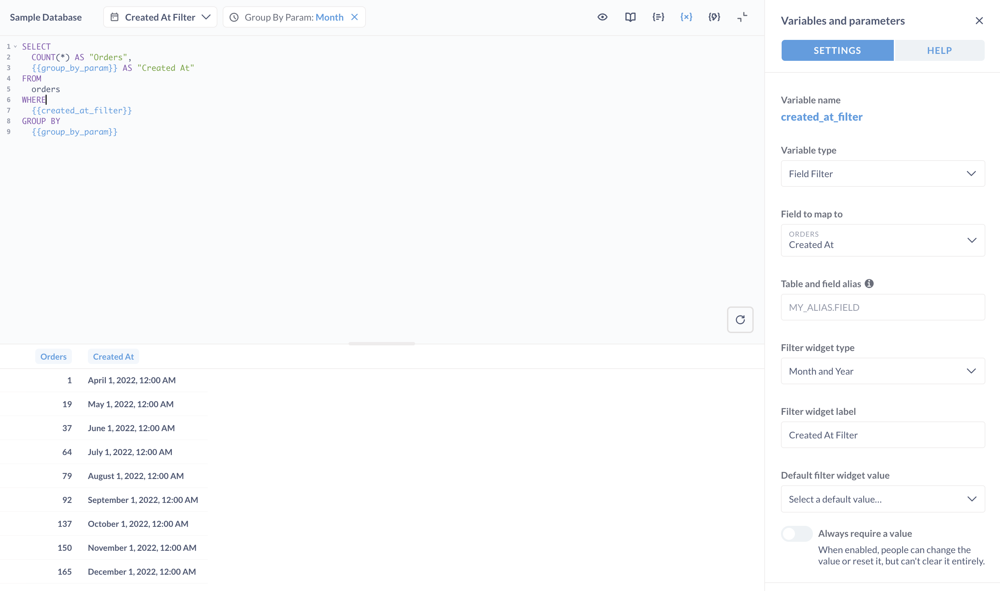

# SQL parameters



You can create SQL templates by adding parameters (a.k.a. variables) to your SQL queries in the [Native/SQL editor](./writing-sql.md).

These variables create widgets that people can use to plug in values for those variables. You can also connect [dashboard widgets to these parameters](../../dashboards/filters.md).

## SQL variable types

When you define a variable, the **variables and parameters** side panel will appear. You can set a type for a variable, which changes the kind of filter widget that Metabase presents.

Variable types include:

- **[Field filter variables](./field-filters.md)**: create "smart" filter widgets with date pickers or dropdown menus. To use a field filter, you'll need to connect to a database field included in your query.
- **[Basic variables](./basic-sql-parameters.md)**: text, number, and date variables. You'll almost always want to use field filters instead of these basic variables, as field filters create "smart" filter widgets, but Metabase provides these basic variables for situations where you can't use field filters.
- **[Time grouping parameters](./time-grouping-parameters.md)**: allows people to change how the results are grouped by a date column: by month, week, day, etc.

You can include multiple variables in a single query, and Metabase will add multiple widgets to the question. To rearrange the order of the widgets, enter edit mode and click on any widget and drag it around.

### Configure your filter widget

When you add a field filter variable or basic variable to your SQL code, you'll need to configure it in the sidebar.

1. Set the **Filter widget type**. Options will differ depending on whether you used a [field filter](./field-filters.md) (preferred) or a [basic variable](./basic-sql-parameters.md) (if you can't use a field filter).
2. Set the **Filter widget** label.
3. Set **How should users filter on this variable?**:
   - [Dropdown list](../../dashboards/filters.md#dropdown-list). A dropdown list shows all available values for the field in a selectable list.
   - [Search box](../../dashboards/filters.md#search-box). A search box allows people to type to search for specific values.
   - [Input box](../../dashboards/filters.md#plain-input-box). An input box provides a simple text field for entering values.
4. If the filter is mapped to a field in an aliased table, you'll need to [specify the table and field alias](./field-filters.md#specifying-the-table-and-field-alias).
5. Optionally, set a **Default filter widget value**.

Check out [filter widgets](./filter-widgets.md).

## Setting values for SQL variables

To set a SQL variable to a value, you can either:

- Enter a value into the [filter widget](./filter-widgets.md), and re-run the question.
- Add a parameter to the URL and load the page.

### Setting a parameter via URL

To add a value to the URL, follow this syntax:

```
?variable_name=value
```

For example, to set the `{{category}}` variable on a question to the value "Gizmo", your URL would look something like:

```
https://metabase.example.com/question/42-eg-question?category=Gizmo
```

To set multiple variables, separate parameters with an ampersand (`&`):

```
https://metabase.example.com/question/42-eg-question?category=Gizmo&maxprice=50
```

## Connecting a SQL question to a dashboard filter

In order for a SQL/native question to be usable with a [dashboard filter](../../dashboards/filters.md), the question must contain at least one variable or parameter.

The kind of dashboard filter that can be used with the SQL question depends on the field. For example, if you have a field filter called `{{var}}` and you map it to a field with State semantic type, you can map a location dashboard filter to your SQL question. In this example, you'd:

1. Create a new dashboard (or go to an existing dashboard).
2. Click the **Pencil icon** to enter **Dashboard edit mode**.
3. Add the SQL question that contains your `State` field filter.
4. Add a new dashboard filter (or edit an existing Location filter).
5. Click the dropdown on the SQL question card to connect the widget to the `State` field filter.

If you add a basic **Date** variable to the question (i.e., not a field filter), then it's only possible to use the dashboard filter option **Single Date**. So if you're trying to use one of the other Time options on the dashboard, you'll need to change the variable to a [field filter](./field-filters.md) and map it to a date field.


## Further reading

- [Create filter widgets for charts using SQL variables](https://www.metabase.com/learn/metabase-basics/querying-and-dashboards/sql-in-metabase/sql-variables).
- [Field Filters: create smart filter widgets for SQL questions](https://www.metabase.com/learn/metabase-basics/querying-and-dashboards/sql-in-metabase/field-filters).
- [Troubleshooting SQL](../../troubleshooting-guide/sql.md).
- [Troubleshooting filters](../../troubleshooting-guide/filters.md).
- [Dashboard filters](../../dashboards/filters.md).
