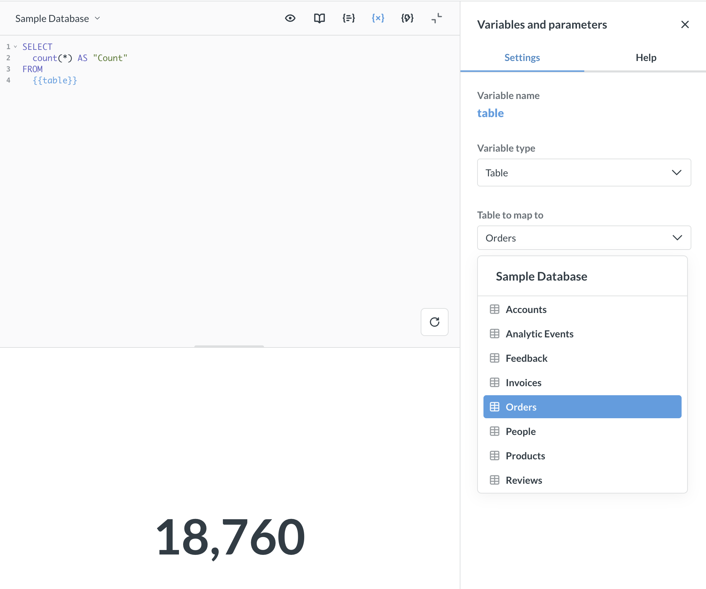

# Table variables



Table variables let you write a SQL query with a placeholder for the table name. When you run the query, Metabase substitutes the variable with the schema and table name.

Table variables are especially useful when combined with [snippets](./snippets.md), so you can write a generic query once and reuse it across different tables.

## Adding a table variable to a query

Use double braces where you'd normally write a table name:

```sql

SELECT
  COUNT(*)
FROM
  {{table}}

```

You can use table variables anywhere a table name would go, including `FROM` and `JOIN` clauses:

```sql

SELECT
  t.*,
  p.title
FROM
  {{table}} AS t
  JOIN {{products_table}} AS p ON t.product_id = p.id

```

Metabase inserts the table reference using the schema-qualified name (e.g., `public.orders`), so some databases like PostgreSQL will require you to use an alias. For example: `SELECT t.id FROM {{table}} t`.

### Setting the variable type to Table

After adding a `{{variable}}` to your query:

1. Open the **Variables** sidebar (it should appear automatically).
2. Change the variable type to **Table**.
3. Under **Table to map to**, select a table from the picker (Required).

When you run the query, Metabase replaces the variable with the selected table's schema and table name. To preview the code Metabase will run, click the **eye** icon.

## Using table variables with snippets

One neat thing you can do is combine table variables with [snippets](./snippets.md). You can write a generic query as a snippet and reuse the snippet in multiple questions, each mapped to a different table.

For example, create a snippet called "row count" with:

```sql

SELECT
  COUNT(*)
FROM
  {{table}}

```

Then insert the snippet into different questions:

```sql

{{snippet: row count}}

```

In each question, open the Variables sidebar and map `{{table}}` to a different database table. This way, the same snippet can count rows in `Products`, `Orders`, or any other table.

## Limitations

- **Not available as dashboard filter parameters.** You can't connect a table variable to a dashboard filter widget. Table variables must be set directly on each question.
- **SQL queries only.** Table variables are available in native SQL queries, not in the query builder.
- **No input widget.** There's no input widget for people to plug in a table. You must select the table to insert into the variable from the variables sidebar.
- **Not supported in transforms.** Table variables aren't available in [transforms](../../data-studio/transforms/transforms-overview.md) yet.

## Further reading

- [SQL parameters](./sql-parameters.md)
- [Snippets](./snippets.md)
- [SQL troubleshooting guide](../../troubleshooting-guide/sql.md)
