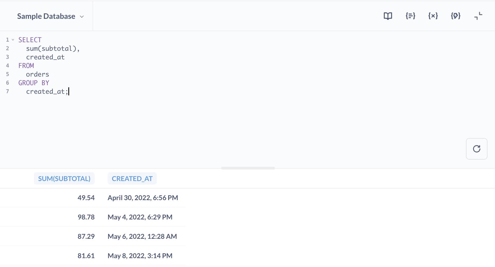
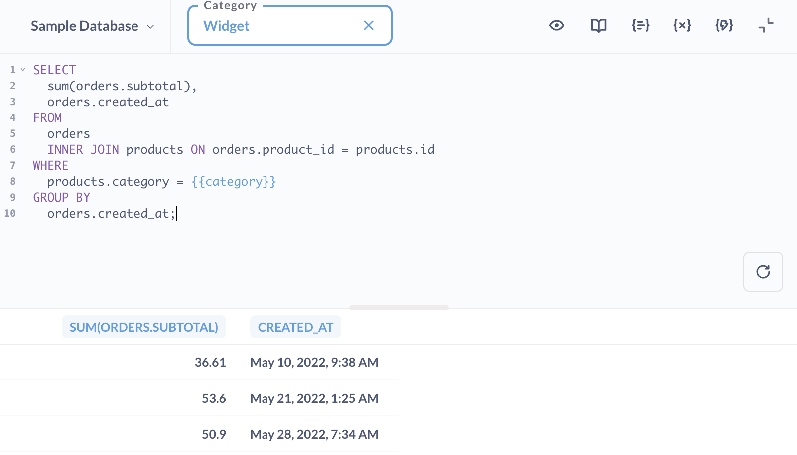

# SQL editor

If you ever need to ask questions that can't be expressed using the query builder, you can use [SQL][sql-gloss] instead.

## What's SQL?

SQL (pronounced "sequel", or sometimes as S.Q.L. — people argue about this) stands for Structured Query Language, and is a widely used standard for getting data from databases. We won't try to teach you all about SQL right now, but to learn more about it, check out [Working with SQL][learn-sql].

Even if you don't understand SQL or how to use it, it's worthwhile to get an idea of how it works inside Metabase, because sometimes other people will share SQL-based questions that might be useful to you.

## Starting a new SQL query

Select **+ New** in the main nav bar. If you have the [permissions](../../permissions/data.md) to use the SQL editor, you'll see an option to start a new **SQL query** next to a little console icon.

After clicking **SQL query**, you'll see an editor where you can write and run queries in SQL (or your database's native querying language).



To try it out, make sure you've selected the [Sample Database][sample-database-gloss], then paste in this short SQL query:

```sql
SELECT
    sum(subtotal),
    created_at
FROM orders
GROUP BY created_at;
```

Don't worry if you don't understand this just yet. Click the blue **Run query** button to execute your query.

You'll notice that the table that comes back is the same as if you had used the [query builder](../query-builder/editor.md) to ask for the sum of `Subtotal` in the `Orders` table, grouped by the `Created At` date.

### Running query selections

You can run your SQL query by pressing **ctrl + enter** on Windows and Linux, or **⌘ + return** on a Mac. You can also run only part of a query by highlighting the part you'd like to run before clicking the run button or using the run shortcut key.

Questions asked using SQL can be saved, downloaded, converted to models, and added to dashboards just like questions asked using the query builder.

You can also [refer to models and saved questions][ref-models] in your SQL queries.

## Use `??` instead of `?` operator

If you're using the `?` JSON operator in PostgreSQL, use the equivalent `??` operator instead.

This is due to limitations of JDBC that interprets a single question mark `?` as a parameter placeholder.

## Format SQL queries

You can format your SQL queries by clicking on the "document" icon in the editor sidebar.

**Before format**:

```sql
select sum(subtotal),
  created_at from orders group by created_at;
```

**After format**:

```sql
SELECT
  sum(subtotal),
  created_at
FROM
  orders
GROUP BY
  created_at;
```

The formatter works only for SQL queries, and isn’t available for SQLite and SQL Server.

## Using SQL filters

If you or someone else wrote a SQL query that includes [variables][variable-gloss], that question might have filter widgets at the top of the screen above the editor. Filter widgets let you modify the SQL query before it's run, changing the results you might get.



Writing SQL queries that use variables or parameters can be very powerful, but it's also a bit more advanced, so that topic has its own page if you'd like to [learn more](./sql-parameters.md).

## Snippets

You can use [Snippets](snippets.md) to save, reuse, and share SQL code across multiple questions that are composed using the SQL editor.

## How Metabase executes SQL queries

When you run a query from the SQL editor, Metabase sends the query to your database exactly as it is written. Any results or errors displayed in Metabase are the same as the results or errors that you would get if you ran the query directly against your database. If the SQL syntax of your query doesn’t match the SQL dialect used by your database, your database won’t be able to run the query.

## Question version history

For questions, [dashboards](../../dashboards/start.md), and [models](../../data-modeling/models.md), Metabase keeps a version history for the previous fifteen versions of that item.

See [History](../../exploration-and-organization/history.md).

## Explore SQL question results using the Query Builder

On saved SQL questions without [parameters](./sql-parameters.md), you'll get the **Explore results** button. It will create a new Query Builder question that uses the SQL question results as a data source.


## Drill-though in SQL questions

Visualizations created with SQL have limited [drill-through][drill-through] capabilities:

- You can filter results of SQL queries by clicking on data points, zoom in on time series or maps, and use some [column header actions](../visualizations/table.md#column-heading-options-for-filtering-and-summarizing).
- You won't be able to drill down to unaggregated records, change time granularity, or break out by categories or locations.

## Caching results

See [Caching question policies](../../configuring-metabase/caching.md#question-caching-policy).

## Learn more

- [Best practices for writing SQL queries](https://www.metabase.com/learn/sql/working-with-sql/sql-best-practices)
- [SQL troubleshooting guide][troubleshooting-sql].

[learn-sql]: https://www.metabase.com/learn/sql/working-with-sql
[ref-models]: ./referencing-saved-questions-in-queries.md
[sample-database-gloss]: https://www.metabase.com/glossary/sample-database
[sql-gloss]: https://www.metabase.com/glossary/sql
[troubleshooting-sql]: ../../troubleshooting-guide/sql.md
[variable-gloss]: https://www.metabase.com/glossary/variable
[drill-through]: https://www.metabase.com/learn/metabase-basics/querying-and-dashboards/questions/drill-through
