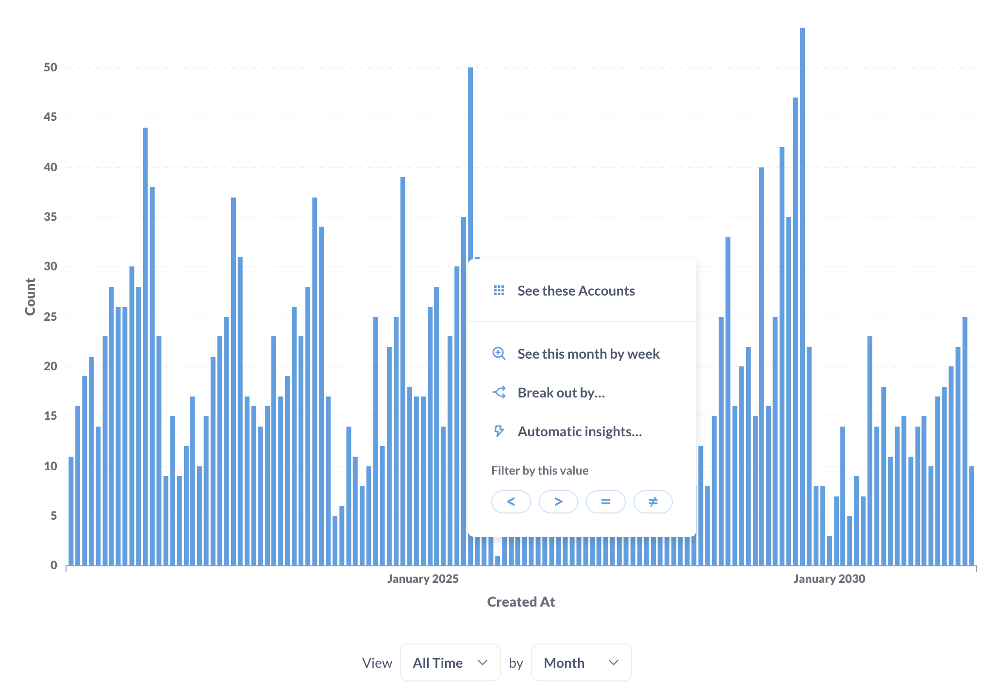

# Query builder

Metabase includes a graphical query builder that lets you build interactive charts by building a query step by step from building blocks like filters and summaries.

## Create a new question with the query builder

From the **+ New** dropdown, select **Question**. Metabase will give you a graphical interface to build your query step-by-step:

- [Pick data](#pick-data)
- [Join tables](#join-data)
- [Create custom columns](#custom-columns)
- [Filter data](./filters.md)
- [Summarize and group data](./summarizing-and-grouping.md)
- [Limit results](#setting-a-row-limit)
- [Visualize results as a chart](#visualizing-your-data)

## Preview results

To the right of each step in the query builder is a **Preview** button (looks like a Play button - a triangle pointing to the right) that shows you the first 10 rows of the results of your question up to that step.

## Pick data

To start building a question with the query builder, you need to The data select the data you want to work with. You can pick pick a a table from a database, a[model](../../data-modeling/models.md), a [metric](../../data-modeling/metrics.md), or another saved question. You can search by typing, or browse your databases and collections.

If your Metabase has the [Library collection](../../data-studio/library.md), then by default you'll only see the Data (tables) and Metrics from the library, but you can click on "Browse all" to find other sources.

Once you select the data source, you can see it in a new browser tab by Cmd/Ctrl+Clicking on the data source's name in the query builder.

To choose which columns to include in your query, click on the arrow next to the data source. If you uncheck a column, you'll still be able to use the column while building a query (for example, in filters) but Metabase won't display the column in results.

You can [hide columns](../visualizations/table.md#rearranging-adding-and-hiding-columns) from the table views.

> **Hiding columns should _not_ be used to secure sensitive information**. Hiding columns in table visualization settings only affects the visibility of the columns _in the visualization_, not in the query results. Even people with only "view data" permissions to the question will be able to change the visualization settings and unhide columns. To exclude a column from the results of a specific query, uncheck the column in the "Data" block of the query builder.

## Join data

You can also select data from multiple tables from the same database by joining the tables, see [Joins](./join.md).

## Custom columns

Custom columns are helpful when you need to create a new column based on a calculation, such as subtracting the value of one column from another, or extracting a portion of an existing text column. Custom columns that you add aren't permanently added to the underlying database table; the columns will only be present in the given question.

You can use the following math operators in your formulas: `+`, `–`, `*` (multiplication), and `/` (division), along with a whole host of spreadsheet-like functions. You can also use parentheses to clarify the order of operations.

You can add custom columns after [Pick data](#pick-data-to-start-with) step or after [Summarize](#summarize-and-group-data) step.

See [Custom expressions](../query-builder/expressions.md).

## Filter data

You can add filters to restrict the data you retrieve. For example, you can tell Metabase to only retrieve data for `Widgets` over `Last 3 weeks`. See [filtering data](./filters.md).

## Summarize and group data

Once you pick the data to query and hhe filters to apply, you can choose to summarize your data - for example, compute the count of rows or average of a column. You can also break out and group summaries by dimensions.

See [Summarizing and grouping](./summarizing-and-grouping.md).

Metabase comes with several built-inn summaries but you can also use custom expressions to write spreadsheet-like functions and simple arithmetic within or between aggregation functions.

For example, you could do `Average(sqrt[FieldX]) + Sum([FieldY])` or `Max(floor([FieldX] - [FieldY]))`, where `FieldX` and `FieldY` are fields in the currently selected table. [Learn more about writing expressions](./expressions.md).

## Sort results

The sorting step lets you pick one or more columns to sort your results by. For each column you pick, you can also choose whether to sort ascending or descending; just click the arrow to change from ascending (up arrow) to descending (down arrow).

If you're using cumulative aggregation functions in you **Summarize** block, the sort order might affect how the aggregation is computed (as opposed to just how the results are displayed ). See [Cumulative functions](../query-builder/expressions/cumulative.md).

## Setting a row limit

The row limit step lets you cap how many rows you want from the previous results. When used in conjunction with sorting, limits can let you do things like create a top-10 list, by first sorting by one of the columns in your result, then adding a row limit of 10.

Unlike other steps, the row limit step can only be added at the end of your question, so if you limit your results to 10 rows, Metabase will _first_ do all the actions in previous steps (filters, summaries, etc), and only _then_ limit the display (as opposed to just starting with 10 rows to begin with)

If you do want to add more steps to limited results, you can always save the limited results as a question, then start a _new_ question based on those results.

Note that if you pick row limit over 2,000 for unaggregated queries or 10,000 for aggregated queries, Metabase will still only display 2,000 or 10,000 rows in the table visualization. This is to avoid overloading your browser. See [Table visualization](../visualizations/table.md).

## Viewing the native query that powers your question

Under the hood, all Metabase questions are converted to SQL or another language native to your query engine. To view the native query that Metabase will run when you click **Visualize**, click the **View SQL** or **View query** button in the top right of the query builder. Metabase will preview the native query in a sidebar:

To view the native query, you must have [query builder and native permissions](../../permissions/data.md).

### Convert a query-builder question to SQL

You can also convert the question to a [native editor question](../native-editor/writing-sql.md). From the query builder screen:

1. Click the **Console** icon in the upper right of the query builder.
2. Click **Convert the question to SQL** option in the bottom right below the SQL code.

Conversion is a one-way street: you can't convert a SQL question back into a query builder question.

## Visualizing your data

Once you finish assembling your query from blocks, you can click **Visualize** to create a chart. Metabase will automatically pick the best visualization for your data, but you can change and customize it.

Check out [visualizing results](../visualizations/visualizing-results.md).

### Drill-through

When viewing a chart, you can also click through questions to explore the data in greater detail.

The drill-through menu will present different options depending on what you click on. You can then optionally save any exploration as a new question. Full drill-through menu is only available for questions built using the query builder. Questions built with the SQL/native editor will have only have [limited drill-through actions](../native-editor/writing-sql.md#drill-though-in-sql-questions). For more on how drill-through works, check out [Creating interactive charts](https://www.metabase.com/learn/metabase-basics/querying-and-dashboards/questions/drill-through).

### Column heading drill-through

When viewing a [table](../visualizations/table.md), clicking on the heading of a column gives you different options, depending on the columns data type. See [table](../visualizations/table.md#column-heading-options-for-filtering-and-summarizing).
