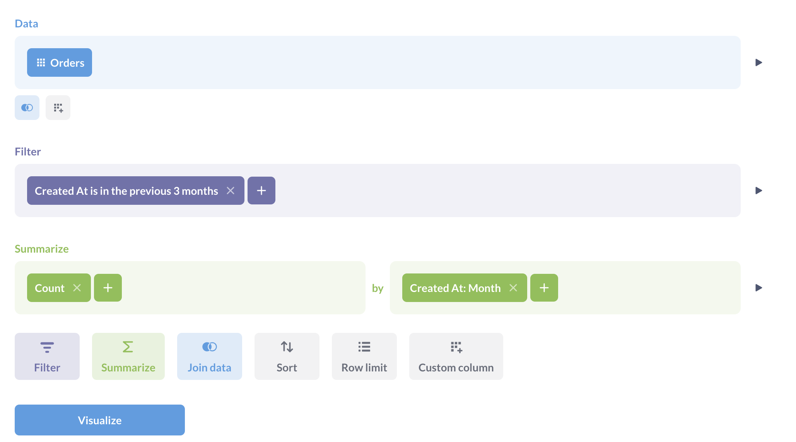
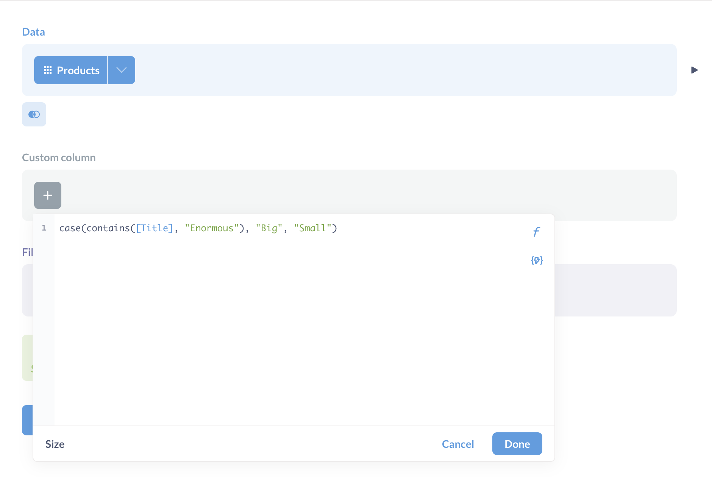
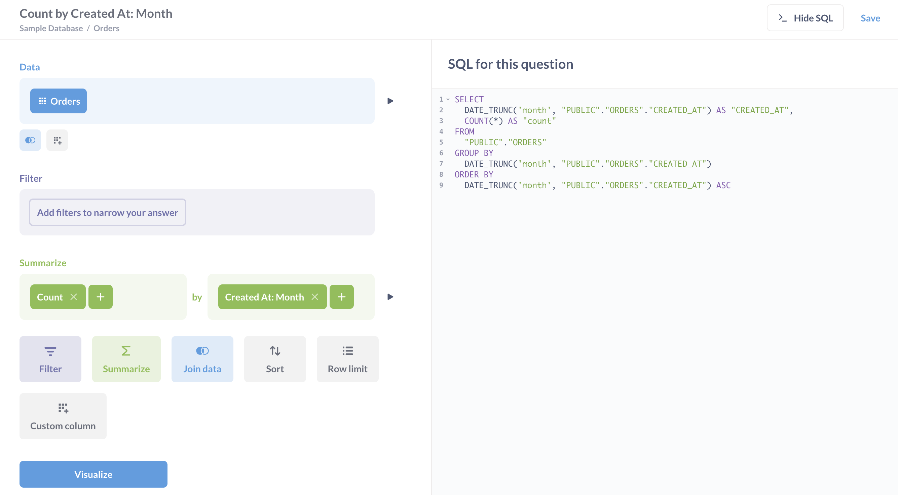

# The query builder

Metabase includes a graphical query builder that lets you build interactive charts.

With the query builder you can:

- [Pick data](#picking-data)
- [Join tables](#joining-data)
- [Create custom columns](#custom-columns)
- [Filter data](./filters.md)
- [Summarize and group data](./summarizing-and-grouping.md)
- [Limit results](#setting-a-row-limit)

When viewing a chart, you can also click through questions to explore the data in greater detail.

The drill-through menu will present different options depending on what you click on. You can then optionally save any exploration as a new question. Full drill-through menu is only available for questions built using the query builder. Questions built with the SQL/native editor will have only have [limited drill-through actions](../native-editor/writing-sql.md#drill-though-in-sql-questions). For more on how drill-through works, check out [Creating interactive charts](https://www.metabase.com/learn/metabase-basics/querying-and-dashboards/questions/drill-through).

## Creating a new question with the query builder

From the **+ New** dropdown, select **Question**, then pick your starting data:

You can start a question from:

- **A model**. A [model](../../data-modeling/models.md) is a special kind of saved question meant to be used as a good starting point for questions. Sometimes these are called derived tables, as they usually pull together data from multiple raw tables.
- **A metric**. [Metrics](../../data-modeling/metrics.md) are pre-defined calculations. If you pick a metric as a starting point for a question, Metabase will create a question with the same data source as the selected metric, and apply the metric. You'll be able to add more joins, filter, and summaries.
- **Tables**. You'll need to specify the database and the table in that database as the starting point for your question.
- A **saved question**. You can use the results of any question as the starting point for a new question.

Note that there are some kinds of saved questions that can't be used as source data:

- Druid questions
- Mongo questions
- Questions that use `Cumulative Sum` or `Cumulative Count` aggregations
- Questions that have columns that are named the same or similar thing, like `Count` and `Count 2`

## The editor

Once you select your data, Metabase will take you to the query builder's editor. Say you selected **Tables** > **Sample database** > **Orders**, then you'll see something like this:

This is the query builder's editor. It has three default steps.

- [Picking data](#picking-data)
- [Filtering](./filters.md)
- [Summarizing and grouping by](./summarizing-and-grouping.md)

You can also add steps for [joining data](./join.md), [custom columns](#custom-columns), and [sorting results](#sorting-results), and [limiting results](#setting-a-row-limit).

To the right of each completed step is a **Preview** button (looks like a Play button - a triangle pointing to the right) that shows you the first 10 rows of the results of your question up to that step.

## Picking data

The data section is where you select the data you want to work with. Here you'll pick a [model](../../data-modeling/models.md), a [metric](../../data-modeling/metrics.md), a table from a database, or a saved question. You can search by typing, or browse your databases and collections.

You can see the data source in a new browser tab by Cmd/Ctrl+Clicking on the data source's name in the query builder.

To choose which columns to include in your query, click on the arrow next to the data source. If you uncheck a column, you'll still be able to use the column while building a query (for example, in filters) but Metabase won't display the column in results.

You can [hide columns](../visualizations/table.md#rearranging-adding-and-hiding-columns) from the table views.

> **Hiding columns should _not_ be used to secure sensitive information**. Hiding columns in table visualization settings only affects the visibility of the columns _in the visualization_, not in the query results. Even people with only "view data" permissions to the question will be able to change the visualization settings and unhide columns. To exclude a column from the results of a specific query, uncheck the column in the "Data" block of the query builder.

## Joining data

You can also select multiple tables from the same database by [joining them](./join.md).

## Filtering data

See [filters](./filters.md).

## Visualizing your data

Check out [visualizing results](../visualizations/visualizing-results.md).

## Column heading drill-through

When viewing a [table](../visualizations/table.md), clicking on the heading of a column gives you different options, depending on the columns data type. See [table](../visualizations/table.md#column-heading-options-for-filtering-and-summarizing).

## Custom expressions

Custom expressions allow you to use spreadsheet-like functions and simple arithmetic within or between aggregation functions.

For example, you could do `Average(sqrt[FieldX]) + Sum([FieldY])` or `Max(floor([FieldX] - [FieldY]))`, where `FieldX` and `FieldY` are fields in the currently selected table. [Learn more about writing expressions](./expressions.md).

## Custom columns

Custom columns are helpful when you need to create a new column based on a calculation, such as subtracting the value of one column from another, or extracting a portion of an existing text column. Custom columns that you add aren't permanently added to the underlying database table; the columns will only be present in the given question.

You can use the following math operators in your formulas: `+`, `–`, `*` (multiplication), and `/` (division), along with a whole host of spreadsheet-like functions. You can also use parentheses to clarify the order of operations. See [list of expressions](../query-builder/expressions-list.md).

## Sorting results

The sorting step lets you pick one or more columns to sort your results by. For each column you pick, you can also choose whether to sort ascending or descending; just click the arrow to change from ascending (up arrow) to descending (down arrow).

## Setting a row limit

The row limit step lets you cap how many rows you want from the previous results. When used in conjunction with sorting, limits can let you do things like create a top-10 list, by first sorting by one of the columns in your result, then adding a row limit of 10. Unlike other steps, the row limit step can only be added at the end of your question. If you do want to add more steps to limited results, you can always save the limited results as a question, then start a _new_ question based on those results.

## Viewing the native query that powers your question

Under the hood, all Metabase questions are converted to SQL or another language native to your query engine. To view the native query that Metabase will run when you click **Visualize**, click the **View SQL** or **View query** button in the top right of the query builder. Metabase will preview the native query in a sidebar:

To view the native query, you must have [query builder and native permissions](../../permissions/data.md).

### Convert a query-builder question to SQL

You can also convert the question to a [native editor question](../native-editor/writing-sql.md). From the query builder screen:

1. Click the **Console** icon in the upper right of the query builder.
2. Click **Convert the question to SQL** option in the bottom right below the SQL code.

Conversion is a one-way street: you can't convert a SQL question back into a query builder question.
