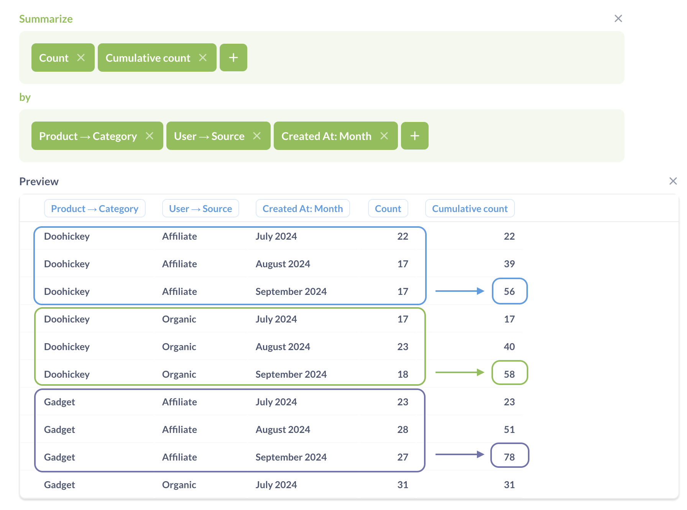
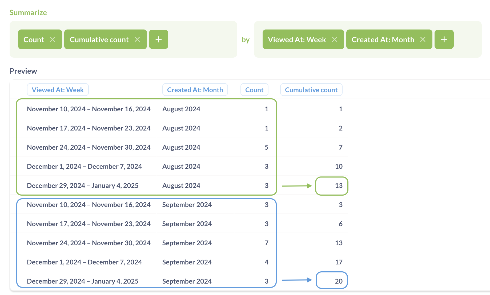
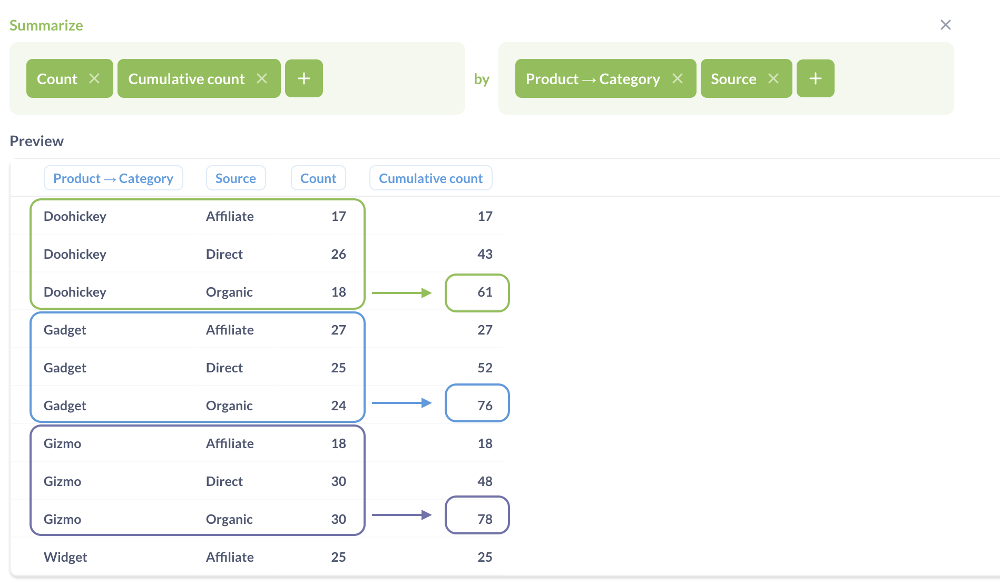
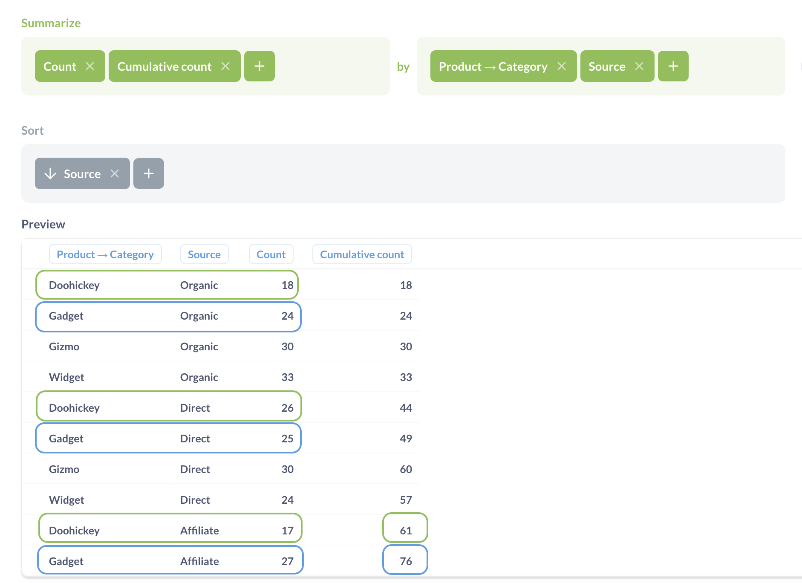

# Cumulative count and sum

Cumulative count computes the additive total count of rows across a breakout. Cumulative sum computes the rolling sum (also known as running total) of a column across a breakout.

## Syntax

You can use the predefined "Cumulative count" and "Cumulative sum" metrics, or a custom expression:

```
CumulativeCount
```

```
CumulativeSum(column)
```

Cumulative metrics can only be used in the query builder's **Summarize** step — you can't use cumulative metrics to create a custom column or filter.

## How cumulative metrics are computed

Under the hood, cumulative metrics is computed in three steps:

1. Group records using the breakout from the **Group by** block.
2. Count the rows in each group.
3. For each group, compute the cumulative total of the counts in all previous groups, including the current group.

Because cumulative metrics use values from previous rows, the sort order in the breakout column matters.

For example, if you have a table with data grouped by month, Metabase will compute the cumulative count like this:

| Month    | `Count()` | `CumulativeCount()` |
| -------- | --------- | ------------------- |
| July     | 5         | 5                   |
| November | 4         | 5+4 = 9             |
| March    | 2         | 5 + 4 + 2 = 11      |

If the sort is changed (while values remain the same), then the cumulative count changes as well:

| Month    | `Count()` | `CumulativeCount()` |
| -------- | --------- | ------------------- |
| March    | 2         | 2                   |
| July     | 5         | 2 + 5 = 7           |
| November | 4         | 2 + 5 + 4 = 11      |

When you have only one breakout in the query, Metabase will sort the data by the breakout column in ascending order (using the logic that your database uses for the column's data type). To change how Metabase accumulates the metric, you can add a **Sort** block by the breakout column.

## Cumulative metrics with multiple breakouts

Because cumulative metrics calculate their summaries based on previous rows, Metabase needs to determine what those previous rows are. Metabase will decide how to compute and display the cumulative metric first based on whether you're grouping by a datetime column, then by the order of other breakouts:

### Queries with a datetime dimension

If you use a datetime dimension in the **Group by** block, Metabase will accumulate along the datetime dimension, then break out by any other fields in the **Group by** block (in order):



If there are multiple datetime dimensions (including multiple groupings by the same datetime column), Metabase will accumulate along the the more granular dimension, regardless of their order. For example, if you're grouping by "Created At: Month" and "Viewed At: Week", Metabase will accumulate along "Viewed At: Week".



In queries with a datetime dimension, **Sort** blocks for non-datetime fields won't affect how Metabase computes the results. Sort blocks will only affect the order of breakouts in the results.

### Queries without datetime dimension

If there is no datetime field in the **Group by** block, Metabase will accumulate along the _last_ dimension specified in the **Group By** block, and break out by the other fields in their order, from left to right.



By default, Metabase will use ascending sort for the dimension used for accumulation. You can add a **Sort** block for the accumulation dimension to change the order, which will change both how Metabase computes the cumulative metric and, how it presents the results.



Sorting by any field _other than_ the last (accumulation) field only affects the order of breakouts in the results. It won't change how Metabase computes the results.

## Related functions

### Cumulative count in SQL

In SQL, you can use window functions to compute cumulative metrics. For example, to compute cumulative count of orders over months, you can use the following query:

```sql
SELECT
  created_month,
  SUM(count(*)) OVER (
    ORDER BY
      created_month ASC ROWS UNBOUNDED PRECEDING
  ) AS "sum"
FROM
  (
    SELECT
      quantity,
      DATE_TRUNC ('month', created_at) AS created_month
    FROM
      orders
  )
GROUP BY
  created_month
ORDER BY
  created_month ASC
```

### Cumulative sums in SQL

For cumulative sums, you can use:

```sql
SELECT
  created_month,
  SUM(SUM(quantity)) OVER (
    ORDER BY
      created_month ASC ROWS UNBOUNDED PRECEDING
  ) AS "sum"
FROM
  (
    SELECT
      quantity,
      DATE_TRUNC ('month', created_at) AS created_month
    FROM
      orders
  )
GROUP BY
  created_month
ORDER BY
  created_month ASC
```

You can view the SQL generated by a query in the query builder by clicking on the **View the SQL** (**>\_**) button in the top right corner.
