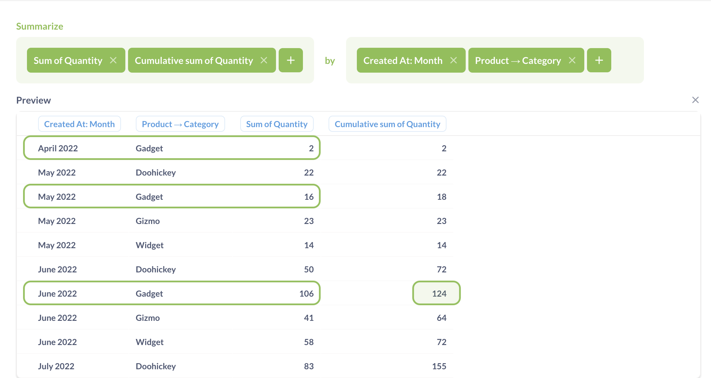
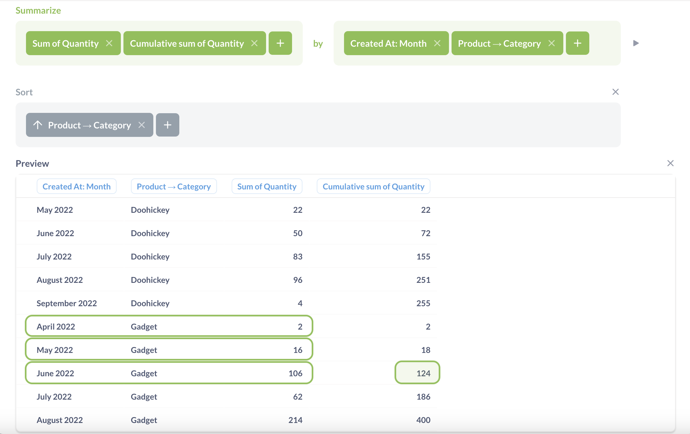
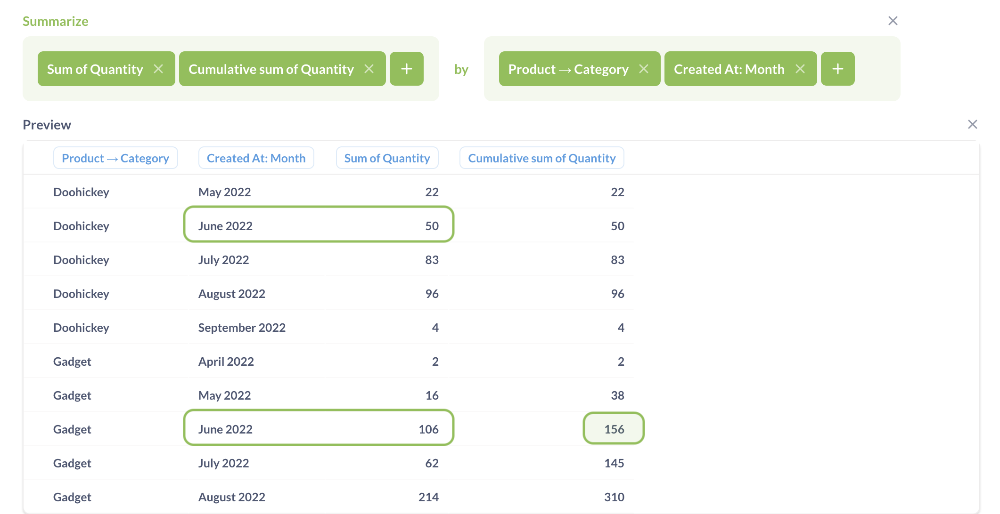

# Cumulative count and sum

Cumulative count computes the additive total count of rows across a breakout. Cumulative sum computes the rolling sum (also known as running total) of a column across a breakout.

## Syntax

You can use the predefined "Cumulative count" and "Cumulative sum" metrics, or a custom expression:

```
CumulativeCount
```

```
CumulativeSum(column)
```

Cumulative metrics can only be used in the query builder's **Summarize** step — you can't use cumulative metrics to create a custom column or filter.

## How cumulative metrics are computed

Under the hood, cumulative metrics is computed in three steps:

1. Group records using the breakout from the **Group by** block.
2. Count the rows in each group.
3. For each group, compute the cumulative total of the counts in all previous groups, including the current group.

Because cumulative metrics use values from previous rows, the sort order in the breakout column matters.

For example, if you have a table with data grouped by month, Metabase will compute the cumulative count like this:

| Month    | `Count` | `CumulativeCount` |
| -------- | ------- | ----------------- |
| July     | 5       | 5                 |
| November | 4       | 5+4 = 9           |
| March    | 2       | 5 + 4 + 2 = 11    |

If the sort is changed (while values remain the same), then the cumulative count changes as well:

| Month    | `Count` | `CumulativeCount` |
| -------- | ------- | ----------------- |
| March    | 2       | 2                 |
| July     | 5       | 2 + 5 = 7         |
| November | 4       | 2 + 5 + 4 = 11    |

Metabase will automatically sort the data by the breakout column in ascending order (using the logic that your database uses for the column's data type). If you add a manual sort, it will only apply _after_ cumulative count or sum computes its results. Sorting here has no effect on how Metabase computes the cumulative metric.

If you want to use a different order (for example, sort by the breakout column but in descending order), you can [use SQL](#related-functions).

## Cumulative metrics with multiple breakouts

Because cumulative metrics calculate its summaries based on previous rows, Metabase needs to determine what those previous rows are. Cumulative metrics will always order the rows based on the _first_ breakout. So if there are multiple breakout columns specified in **Group by**, Metabase will:

1. Sort by the first breakout column to determine what the previous rows are.
2. Break out by the first column and any additional columns.
3. Compute cumulative sums or counts for the additional breakouts over the first column.

This sorting in step 1 only happens in the context of calculating the Cumulative metric.

If you then want to manually sort the results, this sorting only applies _after_ cumulative count or sum computes its results. Sorting here has no effect on how Metabase computes the cumulative metric.

For example, if you want to see the cumulative sum of order quantity over time by product category, you should first group by `Created At`, _then_ group by product category.

In the example below, the cumulative sum uses `Created At` date for sort, and `Category` for breakout, so cumulative sum will:

1. Sort by `Created At`.
2. Break out by `Created At` and `Category`, and compute total sum of sums for each group.
3. For each `Created At` and `Category`, compute the cumulative total sum of sums in the same `Category` using previous `Created At` dates.



For example, the cumulative sums for Gadgets in June 2022 will be determined by the total sums for Gadgets over this month and previous months.

To make these results easier to digest, you can add sort by `Category` to see the results for the same category together next to each other:



Adding a **Sort** block only changes how data is displayed, but it will not change how the cumulative metric is computed.

If instead you group first by category, then by date: Metabase will compute the cumulative sum for the same month, but _over_ categories.



Here, Metabase determines the cumulative cum for Gadgets in July 2022 by taking the total sums for July 2022 over Gadgets and previous categories (in alphabetical order).

This result looks similar to the previous cumulative count result (grouped by `Created At` and `Category`, sorted by `Category`), but the actual values are different. That's probably not what you want. In this case, you probably want cumulative count by `Created At` and `Category` (in that order). Then you can sort by `Category` (for readability).

## Related functions

### Cumulative count in SQL

In SQL, you can use window functions to compute cumulative metrics. For example, to compute cumulative count of orders over months, you can use the following query:

```sql
SELECT
  created_month,
  SUM(count(*)) OVER (
    ORDER BY
      created_month ASC ROWS UNBOUNDED PRECEDING
  ) AS "sum"
FROM
  (
    SELECT
      quantity,
      DATE_TRUNC ('month', created_at) AS created_month
    FROM
      orders
  )
GROUP BY
  created_month
ORDER BY
  created_month ASC
```

### Cumulative sums in SQL

For cumulative sums, you can use:

```sql
SELECT
  created_month,
  SUM(SUM(quantity)) OVER (
    ORDER BY
      created_month ASC ROWS UNBOUNDED PRECEDING
  ) AS "sum"
FROM
  (
    SELECT
      quantity,
      DATE_TRUNC ('month', created_at) AS created_month
    FROM
      orders
  )
GROUP BY
  created_month
ORDER BY
  created_month ASC
```

You can view the SQL generated by a query in the query builder by clicking on the **View the SQL** (**>\_**) button in the top right corner.
