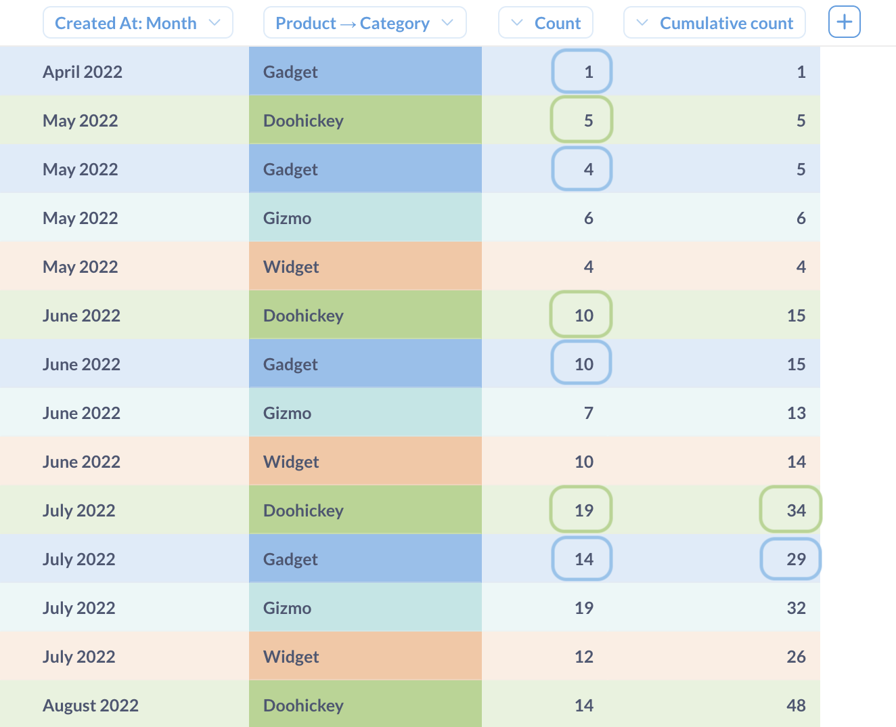
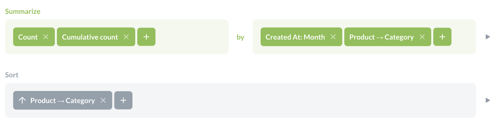
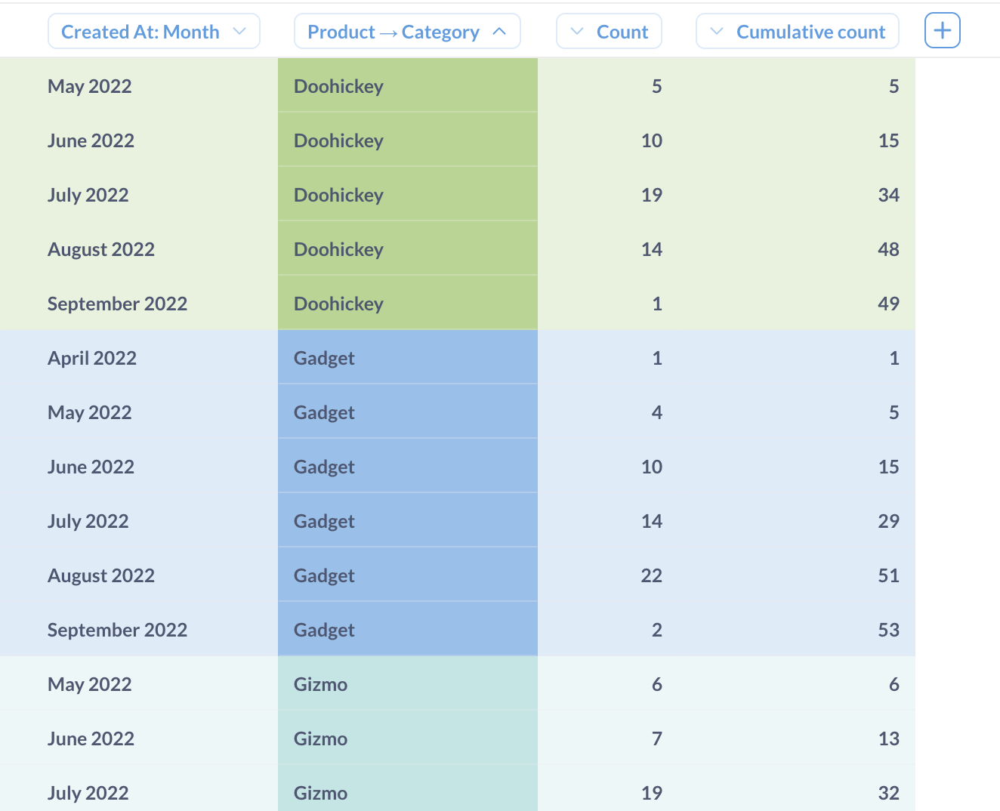
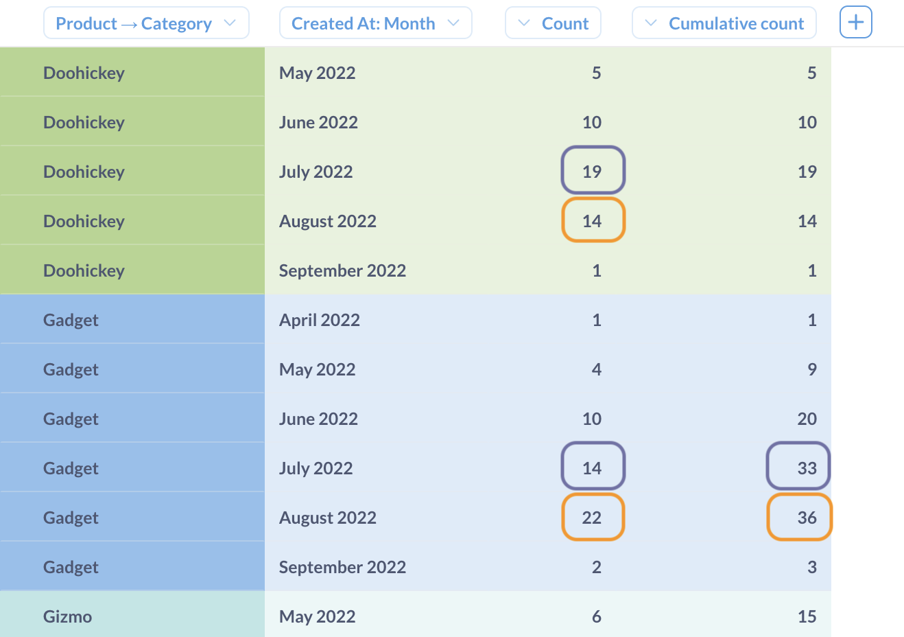

# Cumulative count

Cumulative count computes the additive total count of rows across a breakout.

## Syntax

You can use the pre-defined "Cumulative count" metric, or a custom expression:

```
CumulativeCount
```

Cumulative count can only be used in the query builder's **Summarize** step — you cannot use cumulative count to create a custom column or in a custom filter.

## How cumulative count is computed

Under the hood, cumulative count is computed in three steps:

1. Group records using the breakout from the **Group by** block,
2. Count the rows in each group,
3. For each group, compute the cumulative total of the counts in all previous groups up to the current group.

Because cumulative count uses values from previous rows, the sort order in the breakout column matters.

For example, if you have a table with data grouped by month, cumulative count will be computed like this:

| Month    | `Count` | `CumulativeCount` |
| -------- | ------- | ----------------- |
| July     | 5       | 5                 |
| November | 4       | 5+4 = 9           |
| March    | 2       | 5 + 4 + 2 = 11    |

If the sort is changed (while values remain the same), then the cumulative count changes as well:

| Month    | `Count` | `CumulativeCount` |
| -------- | ------- | ----------------- |
| March    | 2       | 2                 |
| July     | 5       | 2 + 5 = 7         |
| November | 4       | 2 + 5 + 4 = 11    |

You can preview and check the results of your summary by clicking on the ▶ button to the right of the **Summarize** block.

## Cumulative count with multiple breakouts

Because `CumulativeCount` uses other rows, the order of data is important. When there are multiple breakout columns specified in **Group by**, there are multiple potential sort orders, so in Metabase, cumulative count will handle it as follows:

1. Sort by the first breakout column,
2. Break out by the first column and any additional columns.
3. Compute cumulative counts for the additional breakouts over the first column.

So what "previous rows" means is determined by the first column in the breakout. Keep in mind that cumulative count will use the first breakout column for sort _regardless of any additional sort specified in the **Sort** block_. **Sort** block applies only to the _results_ of the **Summarize** block, rather than the logic within **Summarize** block.

For example, if you want to see the cumulative count of orders over time by product category, you should first group by `Created At`, _then_ group by product category.

You can preview and check the results of your summary or sort by clicking on the ▶ button to the right of the block.

In the example below, the cumulative count uses `Created At` date for sort, and `Category` for breakout, so cumulative sum will:

1. Sort by `Created At`,
2. Break out by `Created At` and `Category`, and compute count of rows for each group,
3. For each `Created At` and `Category`, compute the cumulative total of counts in the same `Category` using previous `Created At` dates.




For example, the cumulative count for Gadgets in July 2022 will be determined by the total counts for Gadgets over this month and previous months.

To make these results easier to digest, you can add sort by `Category` to see the results for the same category together next to each other:




Adding a **Sort** block only changes how data is displayed, but it will not change how the cumulative count is computed.

If the order of breakouts is switched, and the data is grouped first by category, then by date, then the cumulative count will be computed for the same month, but over categories.




For example, cumulative count for Gadgets in July 2022 will be determined by total counts for July 2022 over this category and previous categories (determined by alphabetical order).

Even though this result looks similar to the previous cumulative count result (grouped by `Created At` and `Category`, sorted by `Category`), the actual values are different. In most cases, you probably want cumulative count by `Created At` and `Category` (in that order) , sorted by `Category` (for readabilility), instead of cumulative count by `Category` and then `Created At`.

## Related functions

### SQL

In SQL, you can use window functions to compute cumulative counts. For example, to compute cumulative count of orders over months, you can use the following query:

```sql
SELECT
  created_month,
  SUM(count(*)) OVER (
    ORDER BY
      created_month ASC ROWS UNBOUNDED PRECEDING
  ) AS "sum"
FROM
  (
    SELECT
      quantity,
      DATE_TRUNC ('month', created_at) AS created_month
    FROM
      orders
  )
GROUP BY
  created_month
ORDER BY
  created_month ASC
```

You can view the SQL generated by a query in the query builder by clicking on the **View the SQL** (**>\_**) button in the top right corner.
