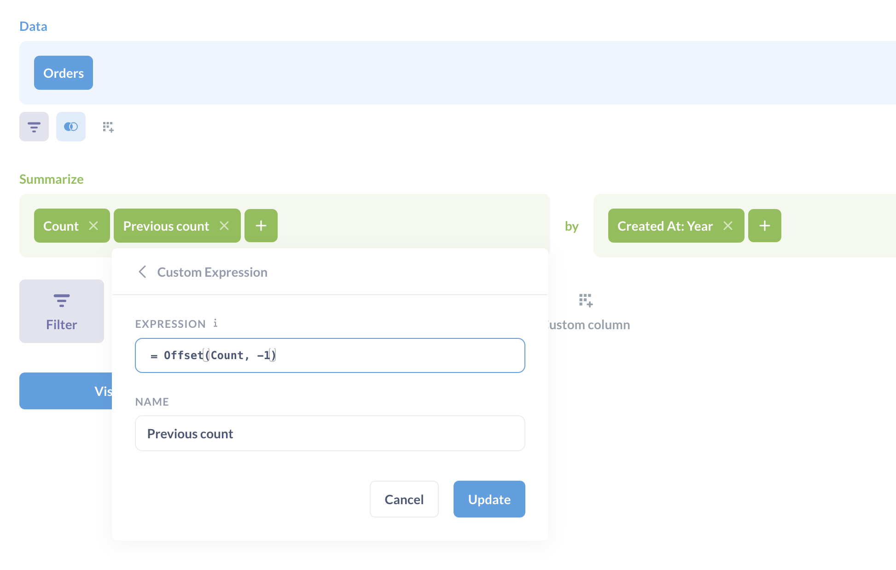
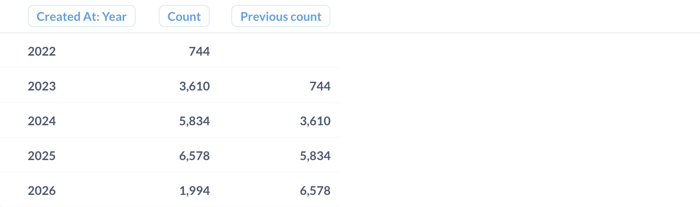

# Offset

The `Offset` function returns the value of an expression in a different row.

Syntax: `Offset(expression, rowOffset)`

The `expression` is the value to get from a different row.

The `rowOffset` is the number relative to the current row. For example, `-1` for the previous row, or `1` for the next row.

Example: `Offset([Total], -1)` would get the `Total` value from the previous row.

## Data types

The `Offset` function returns whatever value is in the offset row.

| [Data type](https://www.metabase.com/learn/databases/data-types-overview#examples-of-data-types) | Returned by `Offset` |
| ------------------------------------------------------------------------------------------------ | -------------------- |
| String                                                                                           | ✅                   |
| Number                                                                                           | ✅                   |
| Timestamp                                                                                        | ✅                   |
| Boolean                                                                                          | ✅                   |
| JSON                                                                                             | ✅                   |

## Example year-over-year (YoY) time series comparison using `Offset`

In the Sample database, you can use `Offset` to compare the count of orders year over year (YoY).

First, summarize by Sum of Total. Then summarize that summation again, this time using `Offset` to offset the Sum of Total by one. Then group the results by `Created At` by year:



Which yields:



With these offsets (the Sums in the "Previous Sum" column), we can then create [custom columns](../introduction.md#creating-custom-columns) to calculate things like the difference between yearly Sums, and the percentage change year to year:


## Example rolling average

You can use `Offset` to calculate rolling averages.

For example, let's say you want to calculate the rolling average sum of order totals over the past three months. You'd use an expression like:

```
(Sum([Total]) + Offset(Sum([Total]), -1) + Offset(Sum([Total]), -2)) / 3
```

Which takes this period's total, plus the previous two periods: offset by `-1` and `-2`, and divides by three to get the average across those periods.

## Related functions

### SQL

The `Offset` function compares with SQL's `LAG` and `LEAD` window functions.

For example, if you're trying to create a line chart with two series to compare a) this month's order counts with b) the previous month's order counts, you'd `count` the orders for this month, then use an `offset` expression to count the previous month's orders, like so:


```
Offset(count, -1)
```

Under the hood, Metabase will translate that `Offset` expression into a `LAG` window function, like in this query:

```sql
SELECT
  "source"."CREATED_AT" AS "CREATED_AT",
  COUNT(*) AS "count",
  LAG(COUNT(*), 1) OVER (

ORDER BY
      "source"."CREATED_AT" ASC
  ) AS "Order count previous period"
FROM
  (
    SELECT
      DATE_TRUNC('month', "PUBLIC"."ORDERS"."CREATED_AT") AS "CREATED_AT"
    FROM
      "PUBLIC"."ORDERS"
  ) AS "source"
GROUP BY
  "source"."CREATED_AT"
ORDER BY
  "source"."CREATED_AT" ASC
```

## Further reading

- [Custom expressions documentation](../expressions.md)
- [Custom expressions tutorial](https://www.metabase.com/learn/questions/custom-expressions)
