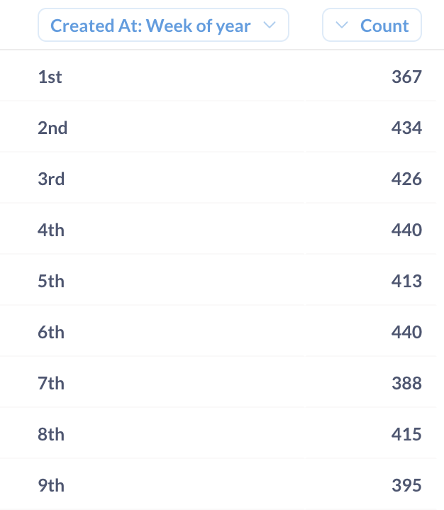

# Week of year

Weeks of the year are numbered from 1 to 52, 53, or 54 (depending on how the first week of the year is determined). Metabase supports multiple algorithms for determining the first week of the year.

In the query builder, you can group summaries by week of year, or extract the week of year from a date column using a custom expression.

Grouping summaries by Week of year is useful when making period-over-period comparisons - for example, when comparing a metric from the first week this year to the metric from the first week in the previous year.

## Summarize by Week of year in the query builder

You can choose to group a metric by week of year in the query builder.

1. In the Summarize section, click on **Pick a column to group by** and select a date field:
2. Click on the dropdown with date granularity (for example, "by month") to the right of the field name;
3. In the popup with date granularity options, click **More...** to see additional options, and select **Week of year**.

The result will be summarized by week number (as opposed to week _dates_, like when you select "by week" option):



## How Metabase numbers weeks of the year

By default, when you group by Week of year in the query builder, Metabase will find the first Sunday of the year and call that week “week 1”. Any day before the first Sunday is considered to be part of the last week of the previous year (week 52 or 53).

### Using a different first week of the year

Even if your instance has a different first day of the week set in [localization settings](../../../configuring-metabase/localization.md), the query builder's default week of year grouping will _always_ use Sunday as the start of the week.

The way to use your instance's localization settings is to use the `week` function in a custom expression with the `"Instance"` mode, like so: `week([Created At], "Instance")` (see below).

The `week` custom expression provides three alternative algorithms for computing first week of the year. To use an alternative algorithm for summarizing, you can create a custom column that extracts the week number from a date column using the `week` expression, then group by that custom column.

## `week` custom expression

The `week` custom expression extracts the week of the year as an integer.

Syntax:

```
week(column, mode)
```

Examples:

```
week([Created At])
week([Created At], "US")
week([Created At], "Instance")
```

Where:

- `column` is the date column you want to extract the week number from.
- `mode` is optional and specifies the algorithm to use to determine the first week of the year. It can be one of the following:
  - `"ISO"` (default): the first week of the year is the week containing the first Thursday of the year. Weeks start on Monday. This is the ISO 8601 standard.
  - `"US"`: The first week of the year starts on January 1. Weeks start on Sundays. In most years, the first week will be a partial week.
  - `"Instance"`: The first week of the year starts on January 1. Weeks start on the day of the week specified in [localization settings](../../../configuring-metabase/localization.md). In most years, the first week will be a partial week.

Note that none of the three currently available modes match the first week algorithm used in summarizing by week of the year in the query builder.

### Comparing how different algorithms calculate the first and last weeks

- In the query builder when using **Group by Week of year**:

  

- `week(column)` or `week(column, "ISO")`:

  

- `week(column, "US")`:

  

- `week(column, "Instance")` if the instance's first day of the week is Monday:

  

## SQL

Different SQL databases have different approaches and functions for extracting week of the year. Some engines offer multiple functions for extracting week of the year and multiple algorithms for computing week of year using SQL. Refer to the documentation for your database.

Here's an incomplete list of example functions:

| Database | Example                                   | First week algorithm                                                                                                  |
| -------- | ----------------------------------------- | --------------------------------------------------------------------------------------------------------------------- |
| Postgres | `EXTRACT(WEEK FROM TIMESTAMP created_at)` | ISO algorithm                                                                                                         |
| MySQL    | `WEEKOFYEAR("2017-06-15")`                | The first day of the week is Monday and the first week of the year has more than 3 days. Alternative functions exist. |
| BigQuery | `EXTRACT(WEEK FROM DATE ticreated_at)`    | Weeks numbered from 0. Dates prior to the first Sunday of the year are in week 0. Alternative functions exist.        |
| Redshift | `DATE_PART(week, TIMESTAMP created_at)`   | ISO algorithm                                                                                                         |
