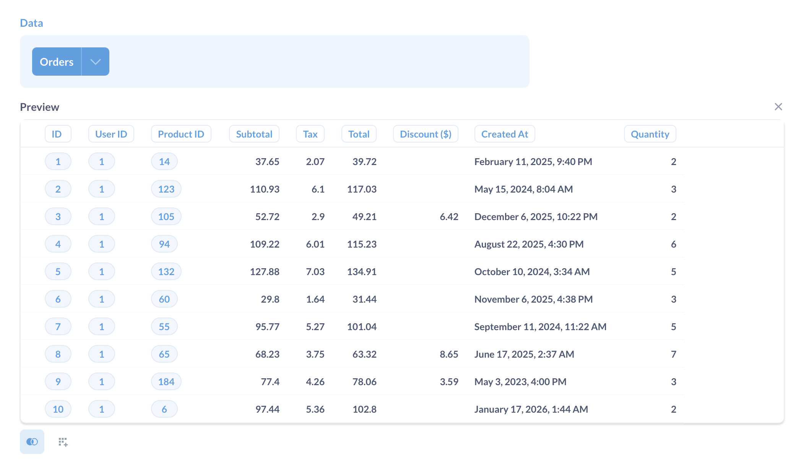
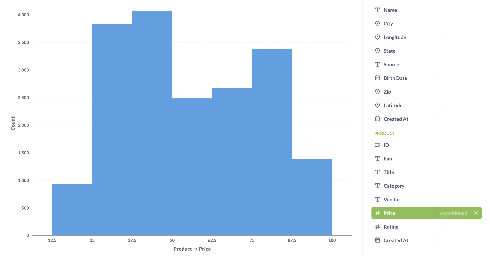
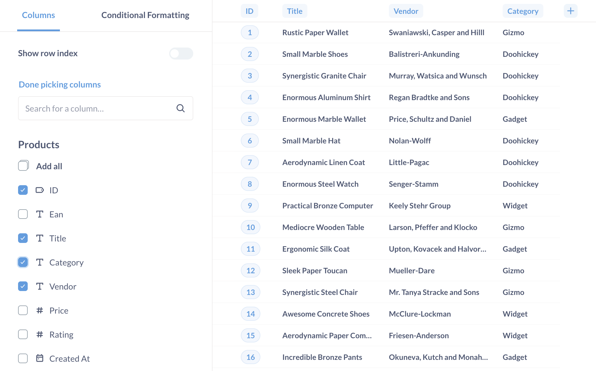

# Asking questions

Metabase's two core concepts are questions and their corresponding answers. To ask a question in Metabase, click the **+ New** button in the upper right of the main navigation bar, and select either:

- Question
- [SQL query](../native-editor/writing-sql.md)

This page covers how to ask a question using Metabase's graphical query builder, the "Question" option.

## Creating a new question with the query builder

From the **+ New** dropdown, select **Question**, then pick your starting data:

You can start a question from:

- **A model**. A [model](../../data-modeling/models.md) is a special kind of saved question meant to be used as a good starting point for questions. Sometimes these are called derived tables, as they usually pull together data from multiple raw tables.
- **Tables**. You'll need to specify the database and the table in that database as the starting point for your question.
- A **saved question**. You can use the results of any question as the starting point for a new question.

Note that there are some kinds of saved questions that can't be used as source data:

- Druid questions
- Mongo questions
- Questions that use `Cumulative Sum` or `Cumulative Count` aggregations
- Questions that have columns that are named the same or similar thing, like `Count` and `Count 2`

## The query builder

Once you select your data, Metabase will take you to the query builder. Say you selected **Tables** > **Sample database** > **Orders**, then you'll see something like this:

This is the query builder's editor. It has three default steps.

- [Picking data](#picking-data)
- [Filtering](#filtering)
- [Summarizing and grouping by](#summarizing-and-grouping-by)

To the right of each completed step is a **Preview** button (looks like a Play button - a triangle pointing to the right) that shows you the first 10 rows of the results of your question up to that step.

## Picking data

The data section is where you select the data you want to work with. Here you'll pick a [model](../../data-modeling/models.md), a table from a database, or a saved question. You can click on a table to select which columns you want to include in your results. See also [adding or removing columns in a table](#adding-or-removing-columns-in-a-table).

## Joining data

You can also select multiple tables from the same database by [joining them](./join.md).

## Filtering

Filtering just means narrowing things down based on certain criteria. You're probably already familiar with filtering when looking for something online, like when shopping. Maybe you only want to see olive-colored pants, or books where the author's last name is "Borges," or pictures of people wearing olive-colored pants reading Jorge Luis Borges.

When you add a filter step, you can select one or more columns to filter on. Depending on the [data type](https://www.metabase.com/learn/databases/data-types-overview) of the column you pick, you'll get different [filter types](#filter-types), like a calendar for date columns.

You can add subsequent filter steps after each summarize step. This lets you do things like summarize by the count of rows per month, and then add a filter on the `count` column to only include rows where the count is greater than 100. (This is basically like a SQL `HAVING` clause.)

Once you're happy with your filter, click **Add filter**, and visualize your results. Your data will be updated with the filter applied.

If you want to edit your filter, just click the little purple filter at the top of the screen. If you click on the X, you'll remove your filter. You can add as many filters as you need.

## Filter types

Depending on the data type of the column, Metabase will present different filtering options.

- **Numeric columns** let you add filters to only include rows in your table where this number is between two specific values, or is greater or less than a specific value, or is exactly equal to something.
- **Text or category columns** let you specify that you only want to include data where this column is or isn't a specific option, whether it contains, starts with, or ends with a substring, or whether the row is empty or not.
- **Date columns** give you a lot of options to filter by specific date ranges, relative date ranges, and more.
- **Structured data columns**, typically JSON or XML, can only be filtered by "Is empty" or "Not empty". Some databases, however, support [JSON unfolding](../../data-modeling/json-unfolding.md), which allows you to split up JSON data into separate columns, which you can then filter on.

## Filter multiple columns

When viewing a table or chart, clicking on the **Filter** will bring up the filter modal.

Here you can add multiple filters to your question in one go (which can save you a lot of loading time). Filter options will differ depending on the [field type](../../data-modeling/field-types.md). Any tables linked by foreign keys will be displayed in the left tab of the modal.

When you're done adding filters, hit **Apply filters** to rerun the query and update its results. To remove all the filters you've applied, click on **Clear all filters** in the bottom left of the filter modal. Any filters you apply here will show up in the editor, and vice versa.

### Filtering by date

One important thing to understand when filtering on a date column is the difference between specific and relative dates:

- **Specific dates** are things like November 1, 2010, or June 3 – July 12, 2017; they always refer to the same date(s).
- **Relative dates** are things like "the past 30 days," or "the current week;" as time passes, the dates these options refer to _change_. Relative dates are a useful way to set up a filter on a question so that it stays up-to-date by showing you, for example, how many people visited your website in the last 7 days. You can also click on the **...** to specify a **Starting from** option, which lets you offset the relative date range. For example, you could set the range as the "Previous 7 days, starting from 2 days ago".

### Filtering by a segment

If your Metabase administrators have created special named filters for the table you're viewing, they’ll appear at the top of the filter dropdown in purple text with a star next to them. These are called [**Segments**](../../data-modeling/segments-and-metrics.md), and they're shortcuts to a combination of filters that are commonly used in your organization. They might be called things like “Active Users,” or “Most Popular Products.”

### Filter with custom expressions

If you have a more complex filter you're trying to express, you can pick [Custom Expression](./expressions.md) from the add filter menu to create a filter expression. You can use comparison operators like greater than, `>`, or less than ,`<`, as well as spreadsheet-like functions. For example, `[Subtotal] > 100 OR median([Age]) < 40`.

Learn more about writing [expressions](./expressions.md) or skip right to the [list of expressions](./expressions-list.md).

## Summarizing and grouping by

When we have a question like "how many people downloaded our app each day last week?", we're asking for a **summary** of the data. A summary is usually made up of two parts: one or more _numbers_ we care about (called a "metric" in data-speak), and how we want to see that number _grouped_ or _broken out_. To answer that example question of "How many people downloaded our app each day last week?"

- The metric would be the count of people who downloaded the app (the count of rows).
- We want that metric to be grouped by "each day."
- And we want to filter the rows for "last week."

There are two common ways you'll tend to summarize your data:

- Counting the number of rows in your table
- Getting the sum or average of a numeric column

And a lot of the time, you'll then **group** that metric by:

- Time
- Place
- Category

Adding a summarize step lets you choose how to aggregate the data from the previous step. You can pick one or more metrics, and optionally group those metrics by one or more dimensions (columns). When picking your metrics you can choose from basic functions like `sum`, `average`, and `count`; or you can pick a common metric defined by an admin; or you can create a [custom expression](./expressions.md) by writing a formula.

Common metrics include:

- **Count of rows:** the total of number of rows in the table, after any filters have been applied. If you're looking at your `Orders` table and want to know how many orders were placed with a price greater than \$40, you’d filter by “Price greater than 40,” and then select `Count of rows`, because you want Metabase to count how many orders matched your filter.
- **Sum of …:** the sum of all the values in a specific column.
- **Average of …:** the average of all the values in a single column.
- **Number of distinct values of…:** the number of unique values in all the cells of a single column. This is useful when trying to find out things like how many different _types_ of products were sold last month (not how many were sold in total).
- **Cumulative sum of…:** This gives you a running total for a specific column. In order for this metric to be useful you'll need to group it by a date column to see it across time.
- **Cumulative count of rows:** This gives you a running total of the number of rows in the table over time. Just like `Cumulative sum of…`, you'll need to group this by a date column in order for it to be useful.
- **Standard deviation of …:** A number which expresses how much the values of a column vary, plus or minus, from the average value of that column.
- **Minimum of …:** The minimum value present in the selected field.
- **Maximum of …:** The maximum value present in the selected field.

If you summarize and add a grouping you can then summarize _again_. You can also add steps to filter and/or join in between. For example, your first summarization step could be to get the count of orders per month, and you could then add a second summarization step to get the average monthly order total by selecting the `Average of…` your `count` column.

You can also add metrics and groupings on the results page in a sidebar: the top of the sidebar where you pick the number ("metric") you want to see, and the part below is where you pick how to group that number (or how to "break it out").

If your admins have created any named metrics that are specific to your company or organization, they will be in this dropdown under the **Common Metrics** section. These might be things like your company’s official way of calculating revenue.

## Grouping your metrics

Depending on the grouping column you select, Metabase will show you what it thinks is the best default visualization or chart for this summary. So if you select a date column, you'll see a line chart like this (you can click the green **Summarize** button to view the summarize sidebar).

When you click on a different grouping column than the one you currently have selected, the grouping will switch to use that column instead. But if you want to _add_ an additional grouping, just click the plus (+) icon on the right side of the column. To remove a grouping, click on the X icon.

Some grouping columns will give you the option of choosing how big or small to make the groupings. So for example, if you've picked a Date column to group by, you can click on the words `by month` to change the grouping to day, week, hour, quarter, year, etc. If you're grouping by a numeric column, like age, Metabase will automatically "bin" the results, so you'll see your metric grouped in age brackets, like 0–10, 11–20, 21–30, etc. Just like with dates, you can click on the current binning option to change it to a specific number of bins. It's not currently possible to choose your own ranges for bins, though.

Once you're done setting your metrics and groupings, click **Visualize** to see your results in all their glory.

## Visualizing your data

If you want to jump ahead and learn about [how to change the visualization](../sharing/visualizing-results.md) of your results, by all means, feel free.

## Drill-through menu

When viewing a chart, you can also click through questions to explore the data in greater detail.

The drill-through menu will present different options depending on what you click on. You can then optionally save any exploration as a new question. The drill-through menu is only available for questions built using the query builder. For more on how drill-through works, check out [Creating interactive charts](https://www.metabase.com/learn/questions/drill-through).

## Column heading drill-through

When viewing a [table](../sharing/visualizations/table.md), clicking on the heading of a column gives you different options, depending on the columns data type. See [table](../sharing/visualizations/table.md#column-heading-options-for-filtering-and-summarizing).

## Returning to the editor

To return to the editor for a question, click on the **Show editor** button in the upper right.

## Viewing an individual record's details

To see more info about a given record (a user account, order, venue, etc.), click on a record's ID number (or primary key). You can see all fields related to that one record and all connected tables that are hidden in the table view for the sake of readability. To page through the other records in the current table, press the right or left arrow keys, or click on the arrows to the right or left of the screen.

## Custom expressions

Custom expressions allow you to use spreadsheet-like functions and simple arithmetic within or between aggregation functions.

 For example, you could do `Average(sqrt[FieldX]) + Sum([FieldY])` or `Max(floor([FieldX] - [FieldY]))`, where `FieldX` and `FieldY` are fields in the currently selected table. [Learn more about writing expressions](./expressions.md).

### Creating custom columns

Custom columns are helpful when you need to create a new column based on a calculation, such as subtracting the value of one column from another, or extracting a portion of an existing text column. Custom columns that you add aren't permanently added to your table; the columns will only be present in the given question.

You can use the following math operators in your formulas: `+`, `–`, `*` (multiplication), and `/` (division), along with a whole host of spreadsheet-like functions. You can also use parentheses to clarify the order of operations.

## Adding or removing columns in a table

When viewing tables, you can click on the **gear** icon in the bottom left to bring up the columns picker. Click **Add or remove columns** to search for and pick columns, including columns from related tables.

## Sorting results

The sorting step lets you pick one or more columns to sort your results by. For each column you pick, you can also choose whether to sort ascending or descending; just click the arrow to change from ascending (up arrow) to descending (down arrow).

## Setting a row limit

The row limit step lets you cap how many rows you want from the previous results. When used in conjunction with sorting, limits can let you do things like create a top-10 list, by first sorting by one of the columns in your result, then adding a row limit of 10. Unlike other steps, the row limit step can only be added at the end of your question. If you do want to add more steps to limited results, you can always save the limited results as a question, then start a _new_ question based on those results.

## Viewing the SQL that powers your question

Under the hood, all Metabase questions are SQL (gasp!). To view the SQL that Metabase will run when you click **Visualize**, click the little **Console** icon in the top right of the query builder. Metabase will preview the SQL in a sidebar:

To view the SQL, you must have [query builder and native permissions](../../permissions/data.md).

### Convert query builder question to SQL

You can also convert the question to a [native editor question](../native-editor/writing-sql.md). From the query builder screen:

1. Click the **Console** icon in the upper right of the query builder.
2. Click **Convert the question to SQL** option in the bottom right below the SQL code.

Conversion is a one-way street: you can't convert a SQL question back into a query builder question.

## Caching question results

See [Caching question results](../../configuring-metabase/caching.md#question-caching-policy).

## Play around with saved questions

Each time you start modifying a saved question, Metabase will create a new question for you. The query builder will display the name of your starting question under **Data**.

Feel free to play around with any saved question, as you won't have any effect on the existing question. When you hit **Save** on the question, you can choose either to save as a new question (the default), or you can overwrite the existing question you started from.

If you find yourself using the same saved question as a starting point for multiple questions, you may want to turn it into a [model](../../data-modeling/models.md) to let others know it's a good starting place.

## Question version history

For questions, [dashboards](../../dashboards/start.md), and [models](../../data-modeling/models.md), Metabase keeps a version history for the previous fifteen versions of that item.

See [History](../../exploration-and-organization/history.md).

## Further reading

- [Visualize results](../sharing/visualizing-results.md).
- [Sharing answers](../sharing/answers.md).
- [Asking questions](https://www.metabase.com/learn/questions)
