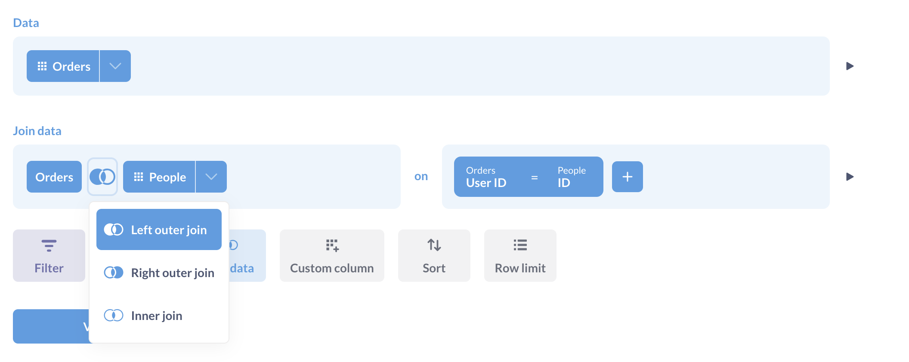
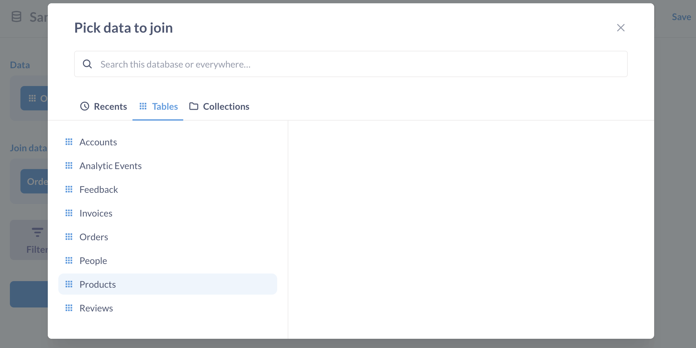
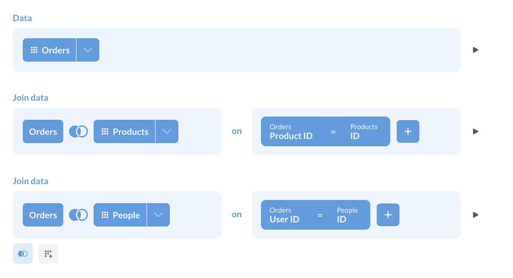
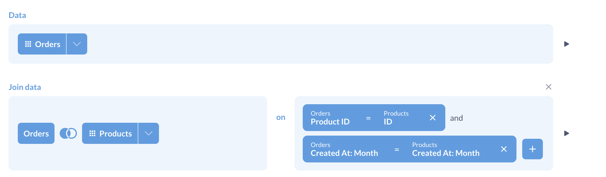
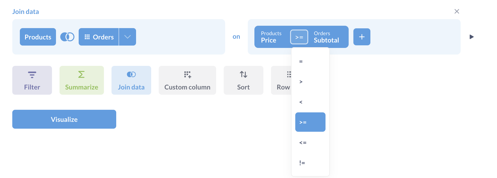
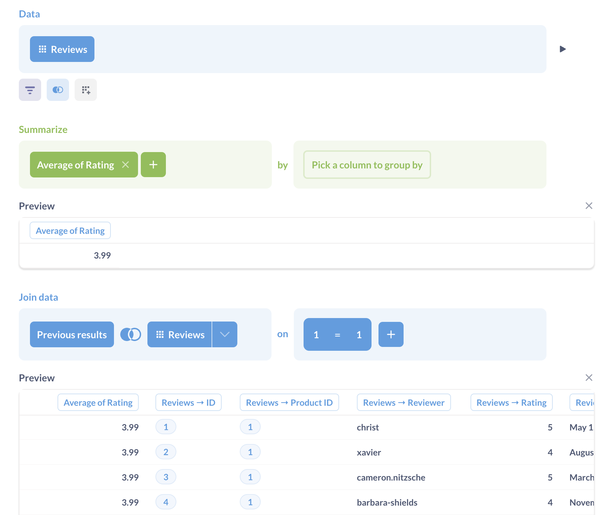

# Joining data



You can [join data][join] to combine your current data with another table, or even with a saved question.

After you click the "Join Data" button to add a join step, you'll need to pick the data (from the same database) that you want to join. You can only pick tables and saved questions that are from the same database as your starting data.



Next, you'll need to pick the columns you want to join on. This means you pick a column from the first table and a column from the second table, and the join will stitch rows together where the value from the first column equals the value in the second column. A very common example is joining on an ID column in each table. If you pick a table to join where there's a foreign key relationship between the tables, Metabase will automatically pick those corresponding ID columns for you. At the end of your join step, there's a "Columns" button you can click to choose which columns you want to include from the joined data.

By default, Metabase will do a left outer join, but you can click the Venn diagram icon to select a different type of join. Not all databases support all types of joins, so Metabase will only display the options supported by the database you're using.

Here are the basic types of joins:

- **Left outer join:** Select all records from Table A, along with records from Table B that meet the join condition, if any.
- **Right outer join:** Select all records from Table B, along with records from Table A that meet the join condition, if any.
- **Inner join:** Only select the records from Table A and B where the join condition is met.
- **Full outer join:** Select all records from both tables, whether or not the join condition is met.

**A left outer join example:** If Table A is Orders and Table B is Customers, and you do a join where the `customer_id` column in Orders equals the `ID` column in Customers, when you do a left outer join your results will be a full list of all your orders, and each order row will also display the columns of the customer who placed that order. Since a single customer can place many orders, a given customer's information might be repeated many times for different order rows. If there isn't a corresponding customer for a given order, the order's information will be shown, but the customer columns will just be blank for that row.

## Multiple stages of joins

In many cases you might have tables A, B, and C, where A and B have a connection, and B and C have a connection, but A and C don't. If you want to join A to B to C, all you have to do is add multiple join steps. Click "Join Data," join table A to table B, then click the "Join Data" step below that completed join block to add a second join step, and join the results of your last join to table C.



## Joining on multiple conditions

Your joins can also include multiple conditions to refine your results. Metabase will combine multiple conditions using the `AND` operator.



## Joining with different operators

You can join tables on comparison conditions like:

- `=` (equals)
- `≠` (not equals) 
- `>` (greater than)
- `≥` (greater than or equal to)
- `<` (less than)
- `≤` (less than or equal to)



## Joins with custom expressions

Sometimes you want to join data using constant values, relative dates, or some other custom conditions.

For example, let's say you have a table of reviews and want to add a column that includes the average rating for all products.

You could first calculate the average rating, then join the result to the reviews table on `1=1`.



To use a custom expression to define a join key:

1. Click on one of the join keys.
2. Select **custom expression**.
3. Enter your expression (including a constant like `1`).
4. Click **Done**.

Another example: Let's say you have:
 
 - A `customers` table that stores names under `first_name` and `last_name`
 - An `accounts` table that stores first and last names in a single column, `full_name`
 
You could join those tables using a custom expression. The join key for the `customers` table would look something like:

```
concat([first_name], " ", [last_name])
```

And the join key for the `accounts` table would simply be the `full_name` column.

Take a look at our [list of expressions](./expressions-list.md).

## Further reading

- [Joins in Metabase][join]
- [Types of joins][join-types]

[join]: https://www.metabase.com/learn/metabase-basics/querying-and-dashboards/questions/joins-in-metabase
[join-types]: https://www.metabase.com/learn/sql/working-with-sql/sql-join-types
