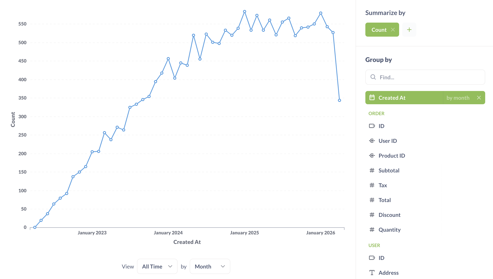

# Summarizing and grouping

When we have a question like "how many people downloaded our app each day last week?", we're asking for a **summary** of the data. A summary is usually made up of two parts: one or more _numbers_ we care about (called a "metric" in data-speak), and how we want to see that number _grouped_ or _broken out_. To answer that example question of "How many people downloaded our app each day last week?"

- The metric would be the count of people who downloaded the app (the count of rows).
- We want that metric to be grouped by "each day."
- And we want to filter the rows for "last week."

There are two common ways you'll tend to summarize your data:

- Counting the number of rows in your table
- Getting the sum or average of a numeric column

And a lot of the time, you'll then **group** that metric by:

- Time
- Place
- Category

Adding a summarize step lets you choose how to aggregate the data from the previous step. You can pick one or more metrics, and optionally group those metrics by one or more dimensions (columns). When picking your metrics you can choose from basic functions like `sum`, `average`, and `count`; or you can pick a common metric defined by an admin; or you can create a [custom expression](./expressions.md) by writing a formula.

Common metrics include:

- **Count of rows:** the total of number of rows in the table, after any filters have been applied. If you're looking at your `Orders` table and want to know how many orders were placed with a price greater than \$40, you’d filter by “Price greater than 40,” and then select `Count of rows`, because you want Metabase to count how many orders matched your filter.
- **Sum of …:** the sum of all the values in a specific column.
- **Average of …:** the average of all the values in a single column.
- **Number of distinct values of…:** the number of unique values in all the cells of a single column. This is useful when trying to find out things like how many different _types_ of products were sold last month (not how many were sold in total).
- **Cumulative sum of…:** This gives you a running total for a specific column. In order for this metric to be useful you'll need to group it by a date column to see it across time.
- **Cumulative count of rows:** This gives you a running total of the number of rows in the table over time. Just like `Cumulative sum of…`, you'll need to group this by a date column in order for it to be useful.
- **Standard deviation of …:** A number which expresses how much the values of a column vary, plus or minus, from the average value of that column.
- **Minimum of …:** The minimum value present in the selected field.
- **Maximum of …:** The maximum value present in the selected field.

If you summarize and add a grouping you can then summarize _again_. You can also add steps to filter and/or join in between. For example, your first summarization step could be to get the count of orders per month, and you could then add a second summarization step to get the average monthly order total by selecting the `Average of…` your `count` column.

You can also add metrics and groupings on the results page in a sidebar: the top of the sidebar where you pick the number ("metric") you want to see, and the part below is where you pick how to group that number (or how to "break it out").

If your admins have created any named [metrics](../../data-modeling/metrics.md) that are specific to your company or organization, they will be in this dropdown under the **Common Metrics** section. These might be things like your company’s official way of calculating revenue.

## Grouping your metrics

Depending on the grouping column you select, Metabase will show you what it thinks is the best default visualization or chart for this summary. So if you select a date column, you'll see a line chart like this (you can click the green **Summarize** button to view the summarize sidebar).

When you click on a different grouping column than the one you currently have selected, the grouping will switch to use that column instead. But if you want to _add_ an additional grouping, just click the plus (+) icon on the right side of the column. To remove a grouping, click on the X icon.

Some grouping columns will give you the option of choosing how big or small to make the groupings:

- For datetime columns, you can click on the words `by month` to change the grouping to day, week, hour, quarter, year, etc. You'll also be able to add multiple breakouts by the same datetime column with different time granularities (for example, group by week and day of the week).
- For numeric columns like age, Metabase will automatically "bin" the results, so you'll see your metric grouped in age brackets, like 0–10, 11–20, 21–30, etc. Just like with dates, you can click on the current binning option to change it to a specific number of bins. Currently, you can't choose your own ranges for bins.

  

  If you select a fixed number of bins, Metabase will break the range of the data into that number of equal size intervals. Some intervals might end up having no data, and Metabase will not display them.

