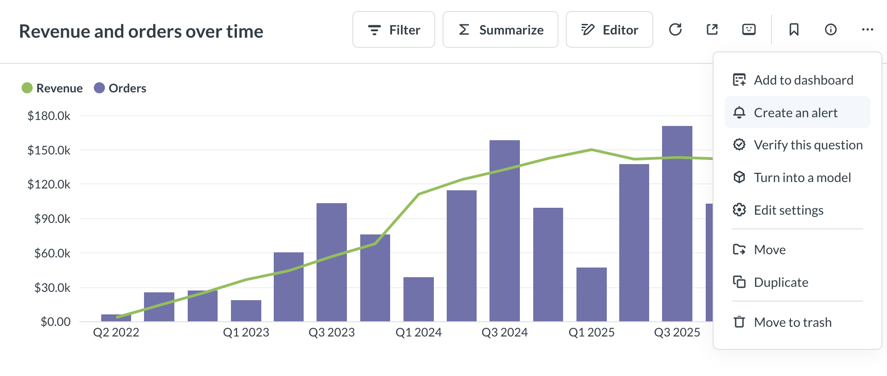
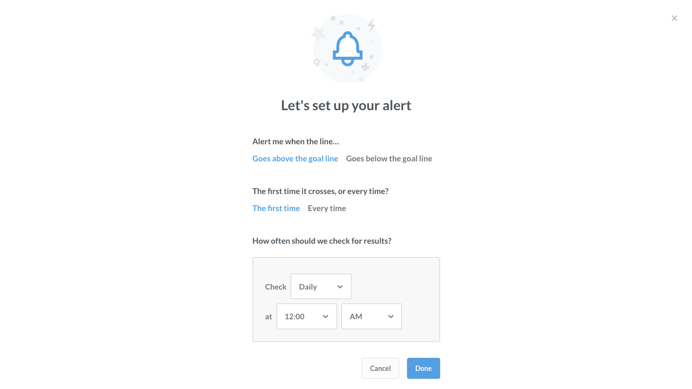

# Alerts

Set up an alert on a question to send the results of questions to people via email or Slack.

## Prerequisite for alerts

To start using alerts, an administrator will need to make sure that either [email](../../configuring-metabase/email.md) or [Slack](../../configuring-metabase/slack.md) is set up for your Metabase.

## Setting up an alert

Go to a question and click on the **bell** icon in the bottom right of the screen.

## Types of alerts

There are three kinds of things you can get alerted about in Metabase:

- [Goal line alerts](#goal-line-alerts) when a time series crosses a goal line.
- [Progress bar alerts](#progress-bar-alerts): when a progress bar reaches or goes below its goal.
- [Results alerts](#results-alerts): when a question returns any result.

## Goal line alerts

Goal line alerts are useful when you're doing things like tracking daily active users and you want to know when you reach a certain number of DAU, or when you're tracking orders per week and you want to know whenever the number of orders ever goes below a certain threshold.

To start, you'll need a line, area, or bar chart displaying a number over time.

Next, you need to set up a goal line on your chart. Open up the visualization settings by clicking the **gear** icon in the bottom-left. Then click on the **Display** tab, and turn on the **Show goal** setting. Choose a value for your goal (and optionally a label) and click Done.

Save your question, then click on the bell icon in the bottom-right of the screen.

This is where you'll get to choose a few things:

- Whether you want to be alerted when the time series goes above the goal line or when it goes below it.
- Whether you only wanted to be alerted every time this happens or only the first time.
- How often you want Metabase to check to see if the goal line has been crossed.

Click Done, and your alert will be all set up! You'll get an email confirmation, too. If you need to edit or unsubscribe from the alert you set up, just click that same icon. You'll see the Edit and Unsubscribe buttons. This is also where you'll see alerts about this question that administrators might have added you to.

## Progress bar alerts

Setting up this kind of alert is really similar to setting up a goal line alert. First, create a question that returns a single number as its result, then choose the Progress Bar chart type from the Visualization menu. Open the settings menu to select a goal value, click Done, then save your question.

Next, click the bell icon in the bottom-right and you'll see that same screen of options for when you want to get alerts about this progress bar.

## Results alerts

Lastly, you can get an alert when one of your saved questions returns _any_ result. This kind of alert is the most useful if you have a question that doesn't _usually_ return any results, but you just want to know when it _does_ return results.

For example, you might have a table called `Reviews`, and you want to know any time a customer leaves a bad review, which you consider to be anything below three stars. To set up an alert for this situation, you'd go and create a raw data question (i.e., a question that returns a list of reviews), and add a filter to only include results with one or two stars.

You probably don't want to be alerted about all the bad reviews you've _ever_ gotten, but just recent ones. So you can add a filter to only include results from yesterday or today, depending on how often you want to check for these bad reviews. At this point, when you check the results of this question, it probably won't return any results, which is a good thing.

Save the question, the click on the bell icon in the bottom-right of the screen, and select how often you want Metabase to check this question for results. That's it!

## Editing and deleting alerts

Admins get special privileges with alerts.

### Admins

- Admins can edit and delete any alert. This can't be undone, so be careful!
- Admins can add or remove recipients on any alert, even ones that they did not create themselves.

### Everyone

- Everyone can edit alerts that they've set up (but not alerts set up by other people).
- Everyone can view and unsubscribe from all alerts they receive by clicking on the **gear** icon in the upper right and navigating to **Account settings** > **Notifications**.

## Avoid changing the name of the alerted channel in Slack

Once you set up an alert to a Slack channel, avoid changing the name of that channel in Slack. If you rename the channel in Slack, but you want Metabase to continue to send alerts to that renamed channel, you'll need to update the alert in Metabase to point to the new channel name.

## Alert expiration

Some circumstances will automatically delete alerts:

- Renaming the alerted channel in Slack. Well, technically the alert won't get deleted, but Metabase will no longer have anywhere to send the alerts to. You'll need to update the alert's target channel in Metabase to the new channel's name.
- If a saved question that has an alert gets edited in such a way that the alert doesn't make sense anymore, the alert will get deleted. For example, if a saved question with a goal line alert on it gets edited, and the goal line is removed entirely, Metabase will delete the alert.
- If a question gets archived, Metabase will delete any alerts set up for that question.

Alerts will continue to work even if the person who set up the alert no longer has an active account. For example, if an alert with multiple recipients (or to a Slack channel) was set up by someone whose account has since been deactivated, that alert will continue to work (though Metabase will stop sending the alerts to the deactivated account).

## Admins can see all alerts



Admins can view a list of all alerts and dashboard subscriptions that people have set up in your Metabase in the **Metabase analytics** collection. See [Usage analytics](../../usage-and-performance-tools/usage-analytics.md#alerts-model).

## How permissions work with alerts

See [Notification permissions](../../permissions/notifications.md).

### Sending alerts to private Slack channels

See [Sending alerts and subscriptions to private Slack channels](../../configuring-metabase/slack.md#sending-alerts-and-subscriptions-to-private-slack-channels).

## Further reading

- [Dashboard subscriptions](../../dashboards/subscriptions.md)
- [Setting up email](../../configuring-metabase/email.md)
- [Setting up Slack](../../configuring-metabase/slack.md)
- [Usage analytics](../../usage-and-performance-tools/usage-analytics.md)
