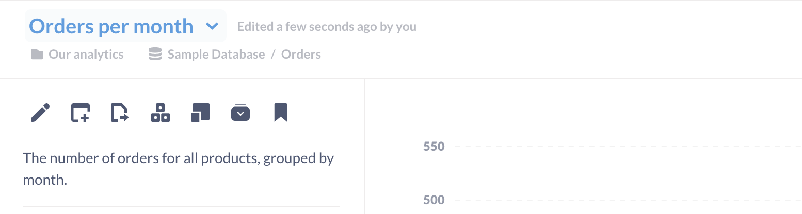

# Sharing answers

## How to save a question

Whenever you’ve arrived at an answer that you want to save for later, click the **Save** button in the top right of the screen. This will also save the visualization option you’ve chosen for your answer.

A modal will appear, prompting you to give your question a name and description, and to pick which [collection][collections] to save it in. Note that your administrator might have set things up so that you're only allowed to [save questions in certain collection][collection-permissions], but you can always save things in your Personal Collection. After saving your question, you'll be asked if you want to add it to a new or existing dashboard.

Now, whenever you want to refer to your question again you can find it by searching for it in the search bar at the top of Metabase, or by navigating to the collection where you saved it.

You can also convert a question to a [model][model].

## Downloading Your Results

You can export the results of a question by clicking on the __Download arrow__ (a down arrow in a cloud) in the lower right of the screen. Results can be downloaded into .csv, .xlsx, or .json files. The maximum download size is 1 million rows. Exported .xlsx files preserve the formatting defined in the question: date and currency formats are kept throughout, as well as column ordering and visibility. Files names for the exported question will include a slug of the question title, so you can easily distinguish files when exporting multiple questions.

## Editing your question

Once you save your question, a down arrow will appear to the right of the question's title. Clicking on the down arrow will bring up the **Question detail sidebar**, which gives you some options:

- **Edit details** (Pencil icon). Change the title of the question, and add some description for context. Adding a description will also make the question easier to find using the search bar. You can also select more options to [cache the results of the question](#caching-results).
- **Add to dashbboard** (Dashboard icon with plus symbol). See [dashboards][dashboards].
- **Move** (Document icon with right arrow). Relocate the question to a different [collection][collections].
- **Turn this into a model**. See [Models][model].
- **Duplicate** (Square with little square). Create a copy of the question. Keep in mind that whenever you start editing a saved question, Metabase will create a copy of the question. You can either save your edits as a new question, or overwrite the original saved question.
- **Archive** (Folder with down arrow). See [Archiving items][archiving-items].
- **Bookmark** Save the question as a favorite, which will show up in the bookmarks section of your navigation sidebar. See [Bookmarks](../../users-guide/03-basic-exploration.md#bookmarks).

### Caching results



If your results don't change frequently, you may want to cache your results, that is: store your results in Metabase so that the next time you visit the question, Metabase can retrieve the stored results rather than query the database again. For example, if your data only updates once a day, there's no point in querying the database more than once a day, as they data won't have changed. Returning cached results can be significantly faster, as the database won't have to redo the work to answer your query.

Administrators can set global caching controls, but if you're using a paid version of Metabase you can set caching per question. To cache results, click on the down arrow next to the question's title to open the __Question detail sidebar__, then click on the __Pencil icon__ to __Edit details__. In the Modal that pops up, in the bottom left, select __More options__. There you'll be able to tell Metabase how long it should cache the question's results. This caching will only apply to this specific question; admins can [configure database-wide caching settings][caching] in the __Admin panel__.

Admins can still set global caching, but setting a cache duration on a specific question will override that global setting–useful for when a particular question has a different natural cadence.

### Question moderation



Administrators can **Verify** a question by clicking on the **Verify checkmark** in the **Moderation** section of the **Question detail sidebar**. Verifying a question is a simple way for an administrator to signal that they've reviewed the question and deemed it to be trustworthy. That is: the question is filtering the right columns, or summarizing the right metrics, and querying records from the right tables.

Once verified, the question will have a verified icon next to the question's title.

Verified questions are also more likely to show up higher in search suggestions and search results.

If someone modifies a verified question, the question will lose its verified status, and an administrator will need to review and verify the question again to restore its verified status.

### Question and model histories

You can see the history of a question or [model][model], including edits and verifications, in the **History** section of the **Question detail sidebar**.

Below each edit entry in the timeline, you can click on **Revert** to reinstate the question at the time of the edit.

## Sharing questions with public links

If your Metabase administrator has enabled [public sharing](../../embedding/public-links.md) on a saved question or dashboard, you can go to that question or dashboard and click on the sharing icon to find its public links. Public links can be viewed by anyone, even if they don't have access to Metabase. You can also use the public embedding code to embed your question or dashboard in a simple web page or blog post.

To share a question, click on the arrow pointing up and to the right in the bottom right of the question.

## Setting up alerts

You can set up questions to run periodically and notify you if the results are interesting. Check out [Alerts][alerts].

[alerts]: ./alerts.md
[archiving-items]: ../../users-guide/collections.md#archiving-items
[caching]: ../../administration-guide/14-caching.md
[collections]: ../../users-guide/collections.md
[collection-permissions]: ../../administration-guide/06-collections.md
[dashboards]: ../../dashboards/start.md
[model]: ../../data-modeling/models.md
