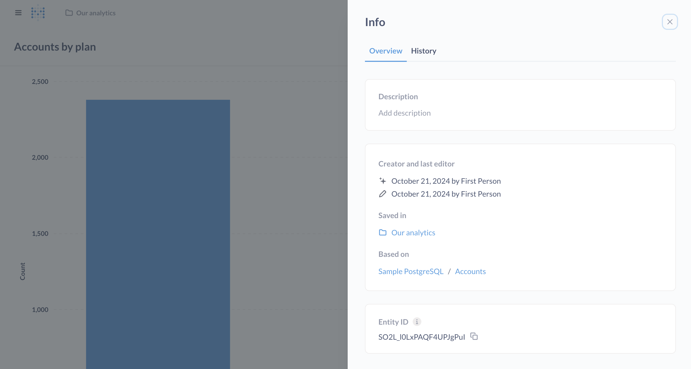

# Sharing answers

## How to save a question

Whenever you’ve arrived at an answer that you want to save for later, click the **Save** button in the top right of the screen. This will also save the visualization option you’ve chosen for your answer.

A modal will appear, prompting you to give your question a name and description, and to pick which [collection](../../exploration-and-organization/collections.md) to save the question in. Note that your administrator might have set things up so that you're only allowed to [save questions in certain collection](../../permissions/collections.md), but you can always save items in your Personal Collection. After saving your question, you'll be asked if you want to add the question to a new or existing dashboard.

Now, whenever you want to refer to your question again you can find it by searching for it in the search bar at the top of Metabase, or by navigating to the collection where you saved it.

## Info about your question

Once you save a question, you can click on the **info** icon in the upper right to see some metadata about your question:

### Overview tab

- Description, which you can add–it even supports Markdown!
- Who created the question, and who edited it last
- The collection the question is saved in
- The data the question is based on.
- The question's Entity ID (which you can use with [Serialization](../../installation-and-operation/serialization.md) to keep IDs consistent across multiple Metabases).

### History tab

See [History](../../exploration-and-organization/history.md).

## Downloading your question's results

See [exporting results](./exporting-results.md).

## Editing your question

Click into the question's title to edit the name of your question.

Open the **three dot** (...) menu to:

- [Verify](../../exploration-and-organization/content-verification.md) this question
- Add to [dashboard](../../dashboards/start.md)
- Move to another [collection](../../exploration-and-organization/collections.md)
- Turn into a [model](../../data-modeling/models.md)
- Duplicate
- [Move to Trash](../../exploration-and-organization/delete-and-restore.md)

Click the **info** icon to:

- Add a description
- Edit the [cache duration](../../configuring-metabase/caching.md#question-caching-policy)\*
- View [revision history](../../exploration-and-organization/history.md)

\* Available on [Pro and Enterprise plans](https://www.metabase.com/pricing/).

## Bookmark a question

Click the **bookmark** icon to pin a question to your Metabase sidebar. See [Bookmarks](../../exploration-and-organization/exploration.md#bookmarks).

## Building on saved questions

To use a saved question as the basis for another question, you can:

- Open the **three dot** (...) menu > **Turn into a [model](../../data-modeling/models.md)**.
- [Create a new question](../query-builder/introduction.md#creating-a-new-question-with-the-query-builder) and search for your saved question under **Pick your starting data**.
- [Refer to the question in a SQL query](../native-editor/referencing-saved-questions-in-queries.md).

## Caching question results



See [Caching per question](../../configuring-metabase/caching.md#question-caching-policy).

## Sharing questions with public links

If your Metabase administrator has enabled [public sharing](../../questions/sharing/public-links.md) on a saved question or dashboard, you can go to that question or dashboard and click on the sharing icon to find its public links. Public links can be viewed by anyone, even if they don't have access to Metabase. You can also use the public embedding code to embed your question or dashboard in a simple web page or blog post.

To share a question, click on the arrow pointing up and to the right in the bottom right of the question.

## Setting up alerts

You can set up questions to run periodically and notify you if the results are interesting. Check out [Alerts](./alerts.md).
