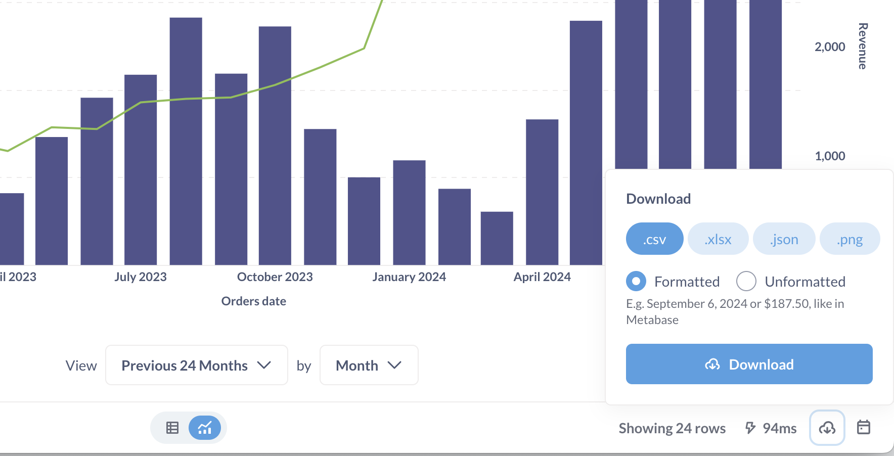
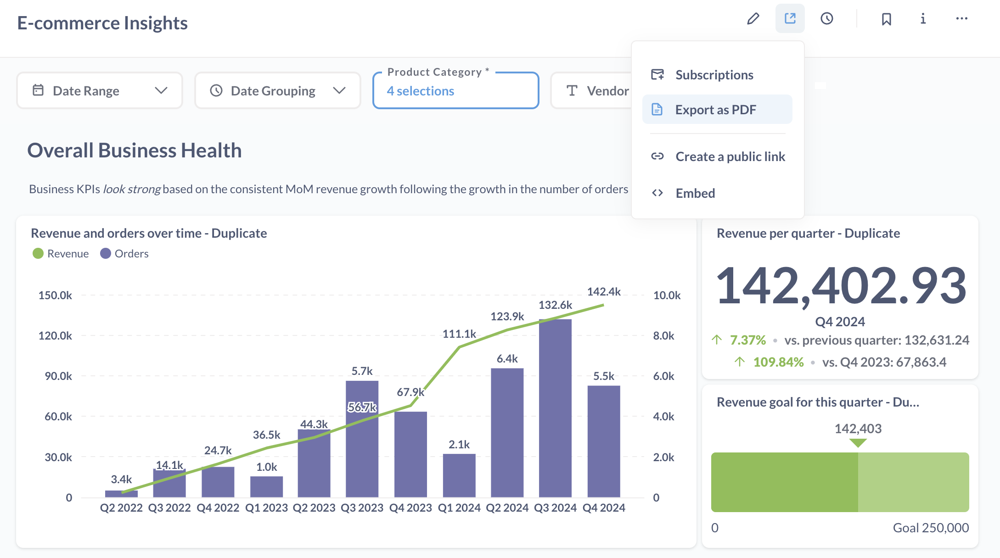
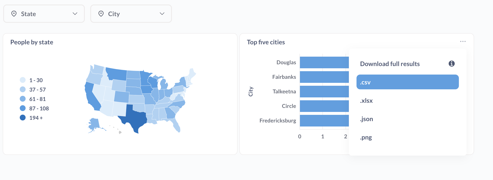

# Exporting results

You can export the results of a question or dashboard.

## Exporting results of a question

To export the results of a questions, click on the **Download** button in the lower right of a question.

You can export the results of a question as:

- .csv
- .xlsx
- .json
- .png (if a chart)

You can choose between downloading the results as:

- **Formatted**: With any [formatting changes](../../data-modeling/formatting.md) you've applied in Metabase.
- **Unformatted**: Metabase will export the raw results of the question without applying any of the [formatting you applied](../../data-modeling/formatting.md) to the columns in the question. For example, if you formatted a floating point number to display only the first two decimal digits in the table results, exporting the unformatted results would include additional decimal digits (if any) found in the raw results.

If you don't see the option to export results, you may not have [permissions to download results](../../permissions/data.md#download-results-permissions).

### Exporting pivot tables

If you're exporting a pivot table, you'll have the option to keep the table pivoted. By default, Metabase will export the unpivoted results.

### Maximum number of rows you can download

You can download up to 1 million rows.

You can change this limit with an environment variable: [`MB_DOWNLOAD_ROW_LIMIT`](../../configuring-metabase/environment-variables.md).

## Exporting data via a public link

You can also create a [public link](../sharing/public-links.md#public-link-to-export-question-results-in-csv-xlsx-json) that people can use to download data in a specific format, as well as [raw, unformatted question results](public-links.md#exporting-raw-unformatted-question-results).

## Exporting question data via alerts

You can also export data by setting up an [alert](../sharing/alerts.md).

## Exporting results of a dashboard

You can export the results of a dashboard and its cards in different ways.

- [Export dashboard as PDF](#export-dashboard-as-pdf)
- [Exporting dashboard card](#exporting-results-of-a-dashboard-card)
- [Exporting via dashboard subscriptions](#exporting-results-of-a-dashboard-via-dashboard-subscriptions)

### Export dashboard as PDF

You can export a dashboard as a PDF. Click on the **Sharing** button, then select **Export as PDF**.

The PDF will only include screenshots of the charts as they are visible on the dashboard.

### Exporting results of a dashboard card

To export the results of a particular card, hover over the dashboard card, click on the three dot menu (**...**), and select **Download results**.

From here you can select:

- .csv
- .xlsx
- .json
- .png (if a chart)

To export the raw, unformatted results, hold down the `option` key for Macs, or `Alt` key for Windows, then click on the download file format.

If you don't see this option, you may not have [permissions to download results](../../permissions/data.md#download-results-permissions).

### Exporting results of a dashboard via dashboard subscriptions

You can use [dashboard subscriptions](../../dashboards/subscriptions.md) to regularly export data from all questions on a dashboard, and include those results as an attachment.

## Further reading

- [Alerts](../sharing/alerts.md)
- [Dashboard subscriptions](../../dashboards/subscriptions.md)
- [Tables](../sharing/visualizations/table.md)
