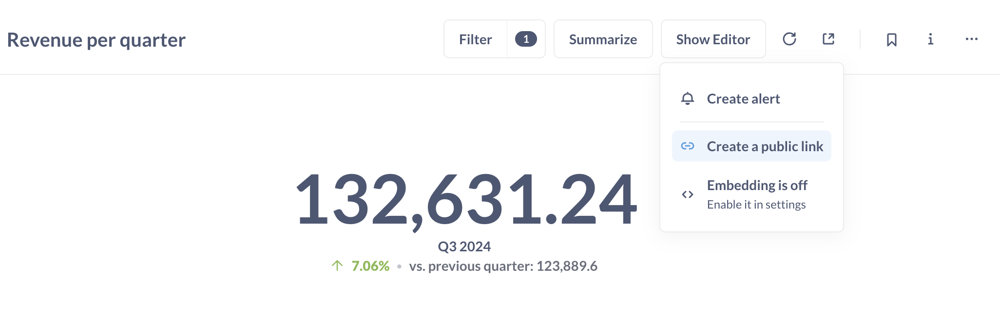
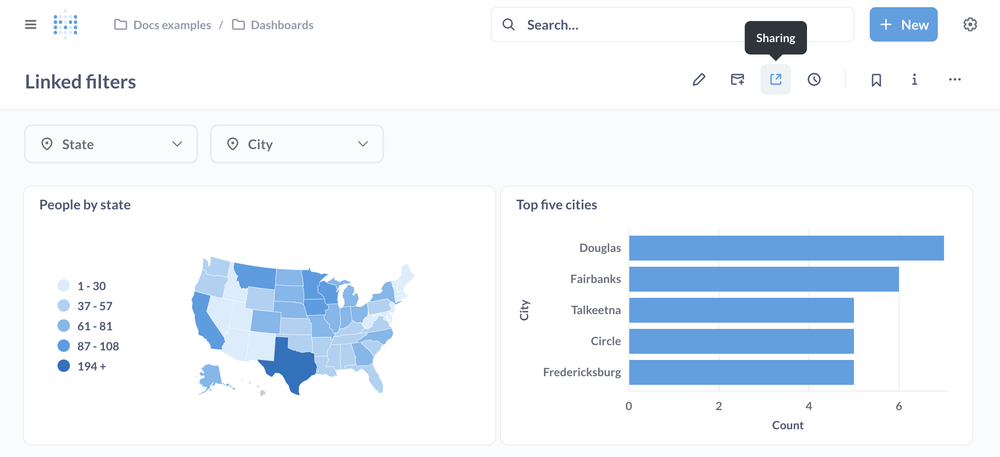
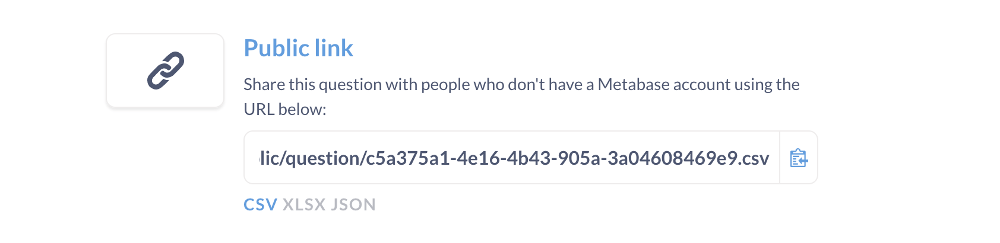
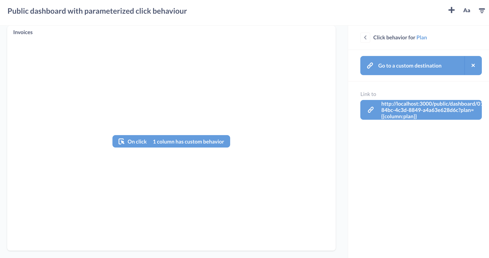
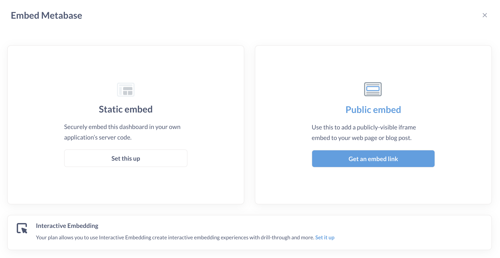
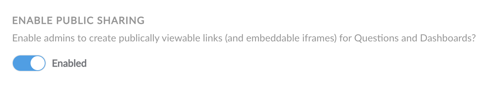
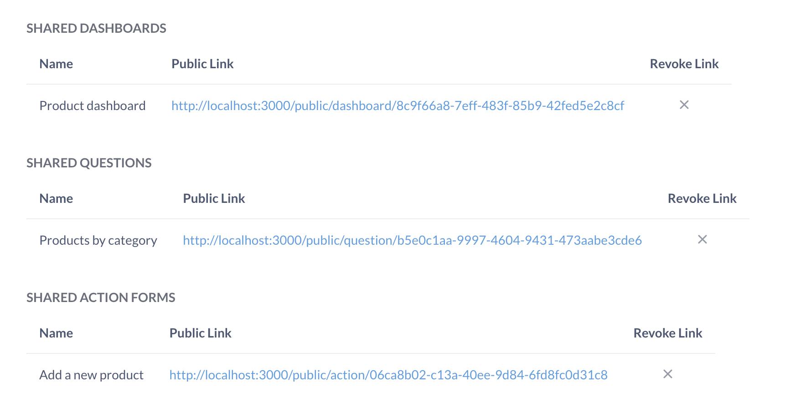

# Public sharing

You can create and share public links (URLs) for questions and dashboards. You can view them as standalone destinations (URLs) or as embedded iframes in another page or app. In both cases, the public item will display static (view-only) results of your question or dashboard, so visitors won't be able to drill-down into the underlying data on their own.

## Create a public link for a question



You can find the **Sharing** icon at the bottom right corner of a question. You can create a link to view the question as is, or to [export the results of a question](#public-link-to-export-question-results-in-csv-xlsx-json).

## Create a public link for a dashboard

To share a dashboard via a public link, click on the **Sharing** button in the top right menu.



To embed a dashboard, see [static embedding](../../embedding/static-embedding.md).

## Public link to export question results in CSV, XLSX, JSON

The export option is only available for questions, not dashboards.

To create a public link that people can use to download the results of a question:

1. Click on the **Sharing** icon for the question.
2. Select **Public link**.
3. Click on the file format you want (below the **Public link** URL): CSV, XLSX, or JSON.



Open the public link in a new tab to test the download.

### Exporting raw, unformatted question results

To export the raw, unformatted rows, you'll need to append `?format_rows=false` to the URL Metabase generates. For example, if you create a public link for a CSV download, the URL would look like:

```html
https://www.example.com/public/question/cf347ce0-90bb-4669-b73b-56c73edd10cb.csv?format_rows=false
```

By default, Metabase will export the results of a question that include any formatting you added (for example, if you formatted a column with floats to display as a percentage (0.42 -> 42%)).

See docs for the [export format endpoint](https://www.metabase.com/docs/latest/api/public#get-apipubliccarduuidqueryexport-format).

## Simulating drill-through with public links

Metabase's automatic [drill-through](https://www.metabase.com/learn/questions/drill-through) won't work on public dashboards because public links don't give people access to your raw data.

You can simulate drill-through on a public dashboard by setting up a [custom click behavior](../../dashboards/interactive.md) that sends people from one public link to another public link.

1. Create a second dashboard to act as the destination dashboard.
2. [Create a public link](#create-a-public-link-for-a-dashboard) for the destination dashboard.
3. Copy the destination dashboard's public link.
4. On your primary dashboard, create a [custom destination](../../dashboards/interactive.md#custom-destinations) with type "URL".
5. Set the custom destination to the destination dashboard's public link.
6. Optional: pass a filter value from the primary dashboard to the destination dashboard by adding a query parameter to the end of the destination URL:

```

/public/dashboard/?child_filter_name={{parent_column_name}}

```

For example, if you have a primary public dashboard that displays **Invoices** data, you can pass the **Plan** name (on click) to a destination public dashboard that displays **Accounts** data:



## Public embeds



If you want to embed your question or dashboard as an iframe in a simple web page or app:

1. Click on the **Sharing** icon for your question or dashboard.
2. Click **Embed**.
3. Click **Public embed**.
4. Copy the iframe snippet Metabase generates for you.
5. Paste the iframe snippet in your destination of choice.

To customize the appearance of your question or dashboard, you can update the link in the `src` attribute with [public embed parameters](#public-embed-parameters).

## Public embed parameters

To apply appearance or filter settings to your public embed, you can add parameters to the end of the link in your iframe's `src` attribute.

Note that it's possible to find the public link URL behind a public embed. If someone gets access to the public link URL, they can remove the parameters from the URL to view the original question or dashboard (that is, without any appearance or filter settings).

If you'd like to create a secure embed that prevents people from changing filter names or values, check out [static embedding](../../embedding/static-embedding.md).

### Appearance parameters

To toggle appearance settings, add _hash_ parameters to the end of the public link in your iframe's `src` attribute.

| Parameter name        | Possible values                                  |
| --------------------- | ------------------------------------------------ |
| bordered              | true, false                                      |
| titled                | true, false                                      |
| theme                 | null, transparent, night                         |
| hide_parameters       | [filter name](#filter-parameters)                |
| font¹                 | [font name](../../configuring-metabase/fonts.md) |
| hide_download_button² | true, false                                      |

¹ Available on [Pro and Enterprise plans](https://www.metabase.com/pricing).

² Available on [Pro and Enterprise plans](https://www.metabase.com/pricing) and hides the download button on questions only (not dashboards).

For example, to embed a dashboard with multiple appearance parameters:

```
/dashboard/42#theme=night&titled=true&bordered=false
```

To embed a question without filter widgets and without the download button:

```
/question/42#hide_parameters=filter_name&hide_download_button=true
```

For more info about hiding filter widgets with `hide_parameters`, see the next section on [Filter parameters](#filter-parameters).

### Filter parameters

You can display a filtered view of your question or dashboard in a public embed. Make sure you've set up a [question filter](../query-builder/introduction.md#filtering) or [dashboard filter](../../dashboards/filters.md) first.

To apply a filter to your embedded question or dashboard, add a _query_ parameter to the end of the link in your iframe's `src` attribute, like this:

```
/dashboard/42?filter_name=value
```

For example, say that we have a dashboard with an "ID" filter. We can give this filter a value of 7:

```
/dashboard/42?id=7
```

To set the "ID" filter to a value of 7 _and_ hide the "ID" filter widget from the public embed:

```
/dashboard/42?id=7#hide_parameters=id
```

To specify multiple values for filters, separate the values with ampersands (&), like this:

```
/dashboard/42?id=7&name=janet
```

You can hide multiple filter widgets by separating the filter names with commas, like this:

```
/dashboard/42#hide_parameters=id,customer_name
```

Note that the name of the filter in the URL should be specified in lower case, and with underscores instead of spaces. If your filter is called "Filter for User ZIP Code", you'd write:

```
/dashboard/42?filter_for_user_zip_code=02116
```

## Disable public sharing in Metabase

Public sharing is enabled by default.



To disable public sharing:

1. Click on the **Gear** icon in the upper right.
2. Select **Admin settings**.
3. In the **Settings** tab, select **Public sharing**.
4. Toggle off **Public sharing**.

Once toggled on, the **Public sharing** section will display Metabase questions, dashboards, and actions with active public links.

If you disable public sharing, then re-enable public sharing, all your previously generated public links will still work (as long as you didn't deactivate them).

## Deactivating public links and embeds

### Individual question or dashboard links and embeds

1. Visit the question or dashboard.
2. Click on **Sharing** icon.
3. Select **Public link** or **Embed**.
4. Click **Remove public link**.

## Deactivating multiple public links and embeds

Admins can view and deactivate all public links for a Metabase.

1. Click on the **gear** icon in the upper right.
2. Select **Admin settings**.
3. Go to the **Settings** tab.
4. Go to the **Public sharing** tab in the left sidebar.
5. For each item you want to deactivate, click on the **X** to revoke its public link.

## See all publicly shared content

Admins can see all publicly shared questions, dashboards, and actions in **Admin Settings > Public Sharing**.



## Further reading

- [Publishing data visualizations to the web](https://www.metabase.com/learn/embedding/embedding-charts-and-dashboards).
- [Customizing Metabase's appearance](../../configuring-metabase/appearance.md).
- [Embedding introduction](../../embedding/start.md).
