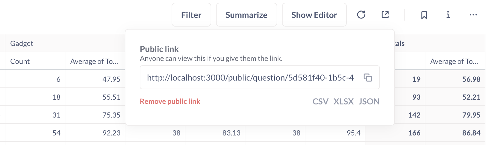

# Public sharing

Sometimes you'll want to share a dashboard or question with someone who isn't a part of your organization or company. To share your work with people who don't need access to your full Metabase instance, you can create public links and public embeds.

## Enable public sharing in Metabase


In order to share Metabase items like questions and dashboards via a public link or an embedded iframe, an admin needs to enable public sharing for that Metabase instance by going to **Settings gear icon** > **Admin settings** > **Public sharing**.

Once toggled on, the **Public sharing** section will display Metabase questions, dashboards, and actions with active public links. To deactivate a public link, click the **X** in the **Revoke link** column for that item.

## Enable sharing on your saved question or dashboard

Once [public sharing](#enable-sharing-on-your-saved-question-or-dashboard) is enabled for your Metabase, you'll find the **Sharing and embedding icon** on saved questions and dashboards (it looks like a box with an arrow pointing to the upper right). 

You can find the **Sharing and embedding icon** icon at the bottom right corner of a question, or the top right corner of a dashboard.

To enable public sharing on a question or dashboard, click on the **Sharing and embedding icon** icon to bring up the sharing settings modal, then click on the toggle.


For more information about the option to **Embed this item in an application**, see the docs on [signed embedding](../../embedding/signed-embedding.md).

## Public links

Once you've [enabled sharing on your question or dashboard](#enable-sharing-on-your-saved-question-or-dashboard), you can copy and share the public link URL with whomever you please. The public link URL will display static (view-only) results of your question or dashboard, so visitors won't be able to drill-down into the underlying data on their own.

## Public link to export question results in CSV, XLSX, JSON

The export option is only available for questions, not dashboards.

To create a public link that people can use to download the results of a question:

1. Click on the **Sharing and embedding** icon for the question.
2. Click the toggle to [enable sharing](#enable-sharing-on-your-saved-question-or-dashboard).
3. Click on the file format you want (below the **Public link** URL).
4. Open the public link in a new tab to test the download.



## Simulating drill-through with public links

Metabase's automatic [drill-through](https://www.metabase.com/learn/questions/drill-through) won't work on public dashboards because public links don't give people access to your raw data.

You can simulate drill-through on a public dashboard by setting up a [custom click behaviour](../../dashboards/interactive.md) that sends people from one public link to another public link.

1. Create a second dashboard to act as the destination dashboard.
2. [Enable sharing](#enable-sharing-on-your-saved-question-or-dashboard) on the destination dashboard.
3. Copy the destination dashboard's public link.
4. On your primary dashboard, create a [custom destination](../../dashboards/interactive.md#custom-destinations) with type "URL".
5. Set the custom destination to the destination dashboard's public link.
6. Optional: pass a filter value from the primary dashboard to the destination dashboard by adding a query parameter to the end of the destination URL:
  ```
  /public/dashboard/?child_filter_name={{parent_column_name}}
  ```

For example, if you have a primary public dashboard that displays **Invoices** data, you can pass the **Plan** name (on click) to a destination public dashboard that displays **Accounts** data:


## Public embeds

If you want to embed your question or dashboard in a simple web page or blog post:

1. Click on the **Sharing and embedding** icon for your question or dashboard.
2. Click the toggle to [enable sharing](#enable-sharing-on-your-saved-question-or-dashboard).
3. Copy the **Public embed** iframe snippet.
4. Paste the iframe snippet in your destination of choice.

To customize the appearance of your question or dashboard, you can update the link in the `src` attribute with [public embed parameters](#public-embed-parameters).

## Public embed parameters

To apply appearance or filter settings to your public embed, you can add parameters to the end of the link in your iframe's `src` attribute.

Note that it's possible to find the public link URL behind a public embed. If someone gets access to the public link URL, they can remove the parameters from the URL to view the original question or dashboard (that is, without any appearance or filter settings).

If you'd like to create a secure embed that prevents people from changing filter names or values, check out [signed embedding](../../embedding/signed-embedding.md).

### Appearance parameters

To toggle appearance settings, add _hash_ parameters to the end of the public link in your iframe's `src` attribute.

| Parameter name          | Possible values                                  |
| ----------------------- | ------------------------------------------------ |
| bordered                | true, false                                      |
| titled                  | true, false                                      |
| theme                   | null, transparent, night                         |
| hide_parameters         | [filter name](#filter-parameters)                |      
| font¹                   | [font name](../../configuring-metabase/fonts.md) |
| hide_download_button²   | true, false                                      |

¹ Available on [paid plans](https://www.metabase.com/pricing).

² Available on [paid plans](https://www.metabase.com/pricing) and hides the download button on questions only (not dashboards).

For example, to embed a dashboard with multiple appearance parameters:

```
/dashboard/42#theme=night&titled=true&bordered=false
```

To embed a question without filter widgets and without the download button:

```
/question/42#hide_parameters=filter_name&hide_download_button=true
```

For more info about hiding filter widgets with `hide_parameters`, see the next section on [Filter parameters](#filter-parameters).

### Filter parameters

You can display a filtered view of your question or dashboard in a public embed. Make sure you've set up a [question filter](../query-builder/introduction.md#filtering) or [dashboard filter](../../dashboards/filters.md) first.

To apply a filter to your embedded question or dashboard, add a _query_ parameter to the end of the link in your iframe's `src` attribute, like this:

```
/dashboard/42?filter_name=value
```

For example, say that we have a dashboard with an "ID" filter. We can give this filter a value of 7:

```
/dashboard/42?id=7
```

To set the "ID" filter to a value of 7 _and_ hide the "ID" filter widget from the public embed:

```
/dashboard/42?id=7#hide_parameters=id
```

To specify multiple values for filters, separate the values with ampersands (&), like this:

```
/dashboard/42?id=7&name=janet
```

You can hide multiple filter widgets by separating the filter names with commas, like this:

```
/dashboard/42#hide_parameters=id,customer_name
```

Note that the name of the filter in the URL should be specified in lower case, and with underscores instead of spaces. If your filter is called "Filter for User ZIP Code", you'd write:

```
/dashboard/42?filter_for_user_zip_code=02116
```

## Further reading

- [Publishing data visualizations to the web](https://www.metabase.com/learn/embedding/embedding-charts-and-dashboards).
- [Customizing Metabase's appearance](../../configuring-metabase/appearance.md).
- [Embedding introduction](../../embedding/start.md).
