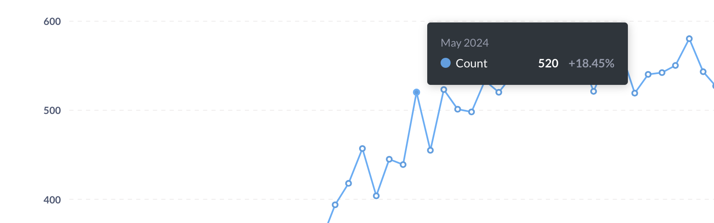
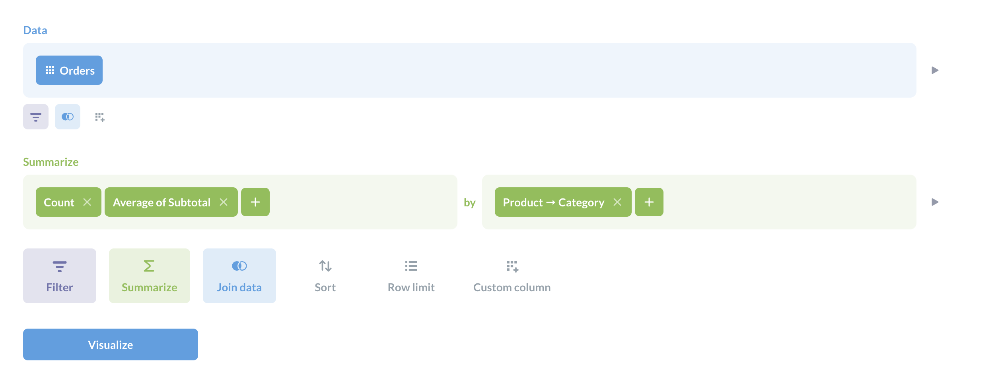
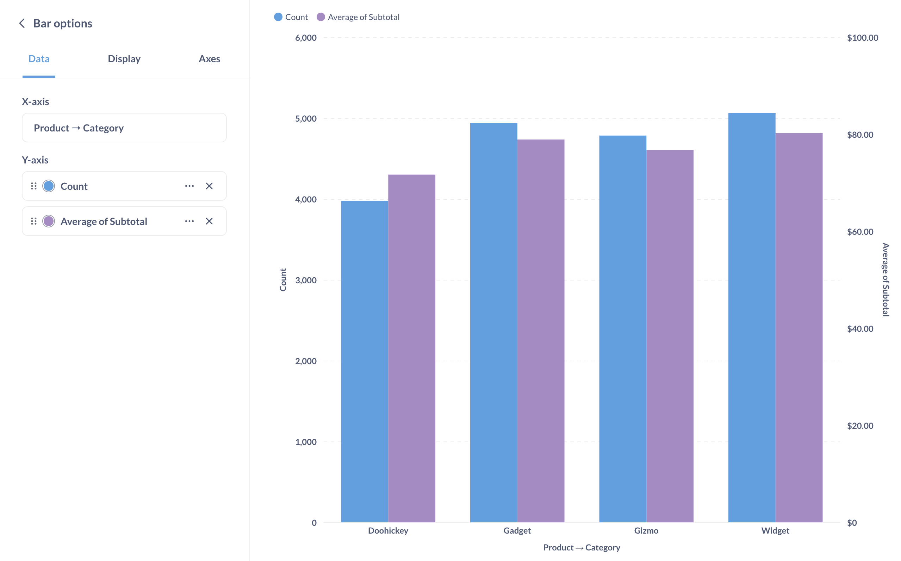
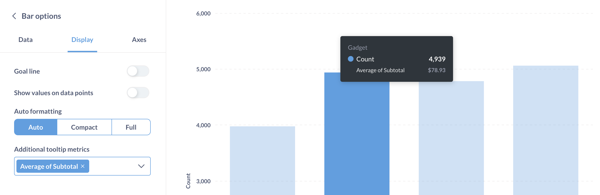

# Tooltips

When you hover over a data point on a chart in Metabase, you'll see a tooltip about that data.

## Customizing tooltips with multiple metrics

On line, bar, and area charts, you can display the values from multiple metrics either on the chart, or in the tooltips that Metabase adds to the data points on hover.

For example, if you have a question with two metrics (i.e., two summarizations - they don't have to be Metabase [metrics](../../data-modeling/metrics.md)), like this question that has both the count and average of subtotal:

You can display the summarizations like so, with both the count and average on the chart.

Or you could display one of the metrics on the chart, and include the other metric(s) in the tooltip. To do this, remove one of the metrics from the chart by going to the **Data** tab in the visualization settings and clicking the X on the metric(s) you want to remove.

Removing a metric will give you the option to add it as an additional metric to the tooltip. In the visualization settings, click on the **Display** tab, and add **Additional tooltip metrics**. Only metrics included in the summarization step of the question are available to add to the tooltip.

Here we've kept the count on the chart, but now when you hover over a bar on the chart, the tooltip also includes the relevant average.
