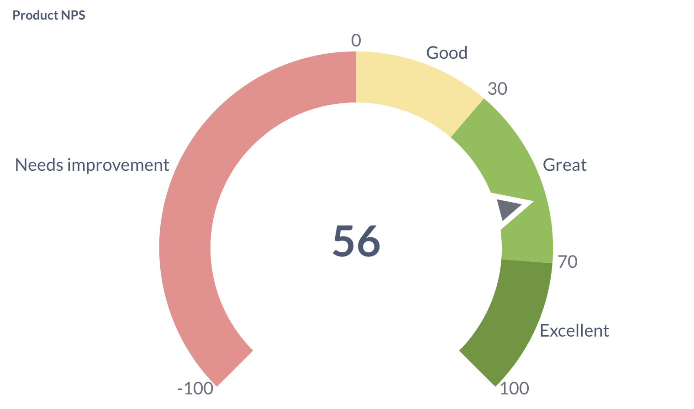
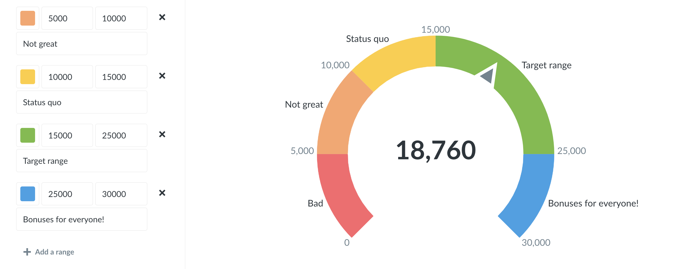

# Gauge chart

Ah, **gauges**: you either love 'em or you hate 'em. …Or you feel "meh" about them, I guess. Whatever the case, gauges allow you to show a single number in the context of a set of colored ranges that you can specify. By default, when you choose the Gauge visualization, Metabase will create red, yellow, and green ranges for you.

Open up the visualization settings to define your own ranges, choose colors for them, and optionally add labels to some or all of your ranges:

