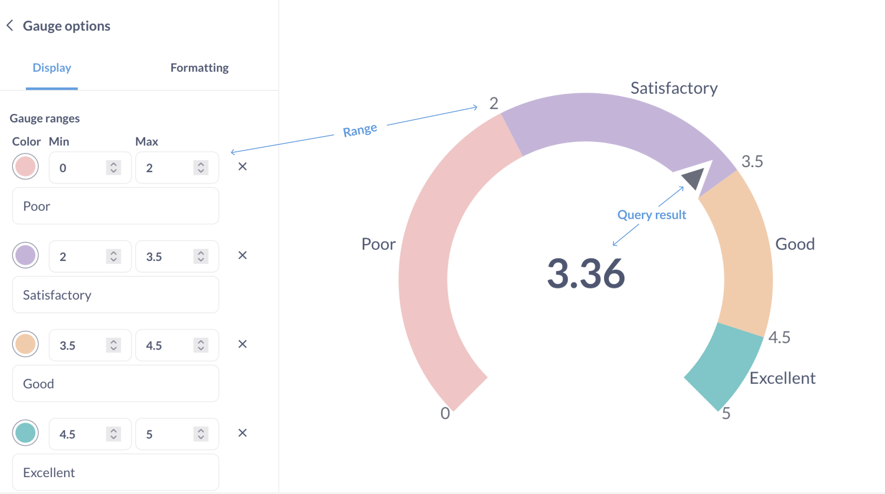
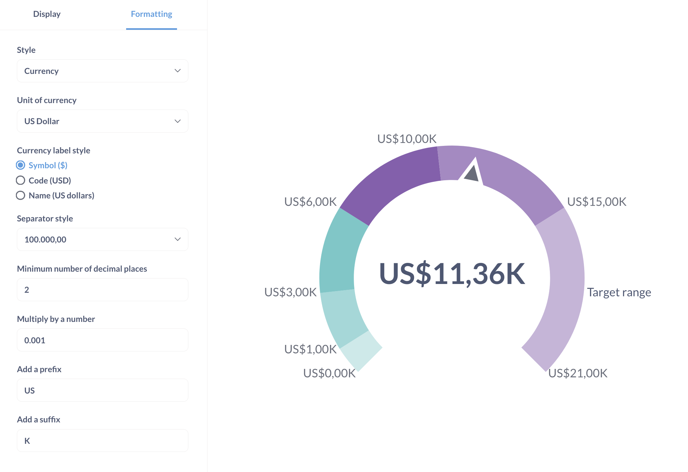

# Gauge chart

Ah, **gauges**: you either love 'em or you hate 'em. …Or you feel "meh" about them, I guess. Whatever the case, gauges allow you to show a single number in the context of a set of colored ranges that you can specify.

## When to use a gauge chart

A gauge chart is useful when you want to show progress or status across different categories.
They're helpful for performance metrics, risk assessments, or any metric that has distinct thresholds.

## How to create a gauge chart

To build a gauge chart, you'll need:

- A query that returns a single number:

  | Sum of Quantity |
  | --------------- |
  | 4910            |

  You can also use a query that returns several metrics in a single row:

  | Sum of Quantity | Average Quantity | Max Quantity |
  | --------------- | ---------------- | ------------ |
  | 4910            | 17.32            | 173          |

  In this case only the metric in the first column will be used for the gauge chart. To change which number is used for the gauge, rearrange the metrics (for example, by dragging them in the Summarize block in the query builder).

- One or more ranges for the metric, for example "Low", "Medium", "High". Currently, Metabase only supports defining static ranges (you can't set range boundaries based on another query).

You can set the ranges, their colors, and optional labels in [chart settings](#gauge-chart-options).

## Gauge chart settings

To open the chart setting, click on the gear icon at the bottom left of the screen.

Format options will apply to both the result of the query and the range boundaries:

In particular, "Multiply by a number" option will be applied to the range boundaries, so if you want to show a range from 2000 to 4000 on the chart, and you use "Multiply by a number: 1000", then the underlying range should be from 2 to 3.

Selecting “Style: Percent” in format options will only change how the result of the query is formatted: for example, `17` will be formatted as `1700%`. If you instead want to display the query result as a percentage of the total range of the chart, you’ll need to calculate that percentage in your query. For example, to display the count of orders as a percentage of 20, use custom expressions to return “Count of orders divided by 20”, and format the result as a percentage.

## Limitations and alternatives

- Metabase does not currently support setting alerts for when a metric moves from one region of the gauge chart to another. Consider using a progress bar to create an alert when your metric reaches a certain value.

- Gauge charts don't support breakouts. Depending on your use case, you could consider using a bar chart with a goal line.

- Gauge chart ranges can't be set based on results of another query.
