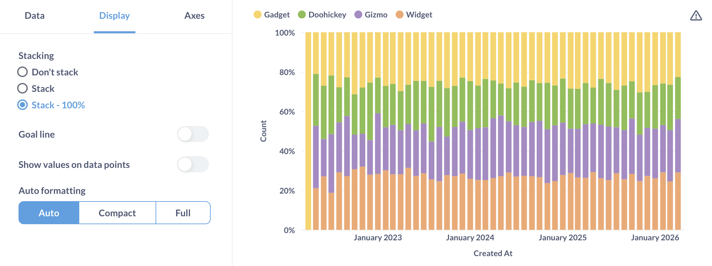

# Line charts, bar charts, and area charts

They're pretty useful.

## Line charts

**Line charts** are best for displaying the trend of a number over time, especially when you have lots of x-axis values. For more, check out our [Guide to line charts](https://www.metabase.com/learn/basics/visualizing-data/line-charts.html) and [Time series analysis](https://www.metabase.com/learn/time-series) tutorials.

## Bar charts

If you're trying to group a number by a column that has a lot of possible values, like a Vendor or Product Title field, try visualizing it as a **row chart**. Metabase will show you the bars in descending order of size, with a final bar at the bottom for items that didn't fit.

If you have a bar chart like Count of Users by Age, where the x-axis is a number, you'll get a special kind of chart called a **[histogram](https://www.metabase.com/learn/basics/visualizing-data/histograms.html)**, where each bar represents a range of values (called a "bin"). Note that Metabase will automatically bin your results any time you use a number as a grouping, even if you aren't viewing a bar chart. Questions that use latitude and longitude will also get binned automatically.

## Combo line and bar charts

See [Combo charts](./combo-chart.md).

## Histograms

By default, Metabase will automatically choose a good way to bin your results. But you can change how many bins your result has, or turn the binning off entirely, by clicking on the area to the right of the column you're grouping by:

## Area charts

**Area charts** are useful when comparing the proportions of two metrics over time. Both bar and area charts can be stacked.

## Settings for line, bar, and area charts

These three charting types have very similar options, which are broken up into the following tabs. You can access these chart settings by clicking the **gear** icon in the lower left of the chart.

- [Data settings](#data-settings)
- [Display settings](#display-settings)
- [Axes settings](#axes-settings)

## Data settings

Here you can configure settings for the how the data is displayed.

For each series on the chart, you can:

- Whether to show or hide the series.
- Determine how to display the series: as a line, bar, or area chart.
- Determine the order Metabase displays the series in the chart's legend.

### Line chart and Area chart options

- Line color
- Line shape
- Line style
- Line size: Small, Medium, or Large
- Whether to show docs on the lines (the dots represent the actual data points plotted on the chart)
- Whether to show values for the series. This option is only available if you've toggled on [Show value on data points](#values-on-data-points).
- How to replace missing values: Zero, Nothing (just a break in the line), or Linear interpolated

You can also rearrange series (which determines their order in the chart's legend).

### Bar chart options

For bar charts, you can configure:

- Bar color
- Y-axis position (which side of the chart to display the y-axis labels)

## Display settings

Here you set things like:

- [Goal line](#goal-lines)
- [Stack a bar chart](#stacked-bar-chart)
- [Whether to show values on data points](#values-on-data-points)

### Goal lines

Goal lines can be used in conjunction with [alerts](../alerts.md) to send an email or a Slack message when your metric cross this line.

### Trend lines

**Trend lines** are another useful option for line, area, bar, and scatter charts. If you have a question where you're grouping by a time field, open up the visualization settings and turn the **Show trend line** toggle on to display a trend line. Metabase will choose the best type of line to fit to the trend of your series. Trend lines will even work if you have multiple metrics selected in your summary. But trend lines won't work if you have any groupings beyond the one time field.

### Stacked bar chart

If you have multiple series, you can stack them on bar chart.

As well as stack them as a percentage:

### Values on data points

You can show some values (Metabase will pick some values to make the chart more legible), all values, or no values.

If you toggle on values on data points, you can toggle values for individual series on the [Data](#data-settings) tab of the chart's settings. For example, if you have four series, and only want to display values for one of the series.

### Autoformatting

For displaying numbers on the chart, Metabase can truncate the numbers to make the chart more legible. For example, Metabase will truncate 42,000 to 42K.

## Axes settings

Here you'll find additional settings for configuring your x and y axes (as in axis, not battle axe).

### X-axis

- Show label (the legend label for the axis).
- Rename the axis
- Show line and marks
- Scale: Timeseries or Ordinal.

### Y-axis

- Show label (the legend label for the axis).
- Rename the axis
- Split y-axis when necessary
- Auto y-axis range. When not toggled on, you can set the y-axis range (it's min and max values).
- Unpin from zero. Allows you to "Zoom in" on charts with values well above zero. Here's an example (note the y-axis starts at 20,000):

- Scale: Linear, power, or log.
- Show lines and marks

## Further reading

- [Guide to line charts](https://www.metabase.com/learn/visualization/line-charts)
- [Master the bar chart](https://www.metabase.com/learn/visualization/bar-charts)
- [Visualize your data as a histogram](https://www.metabase.com/learn/visualization/histograms)
